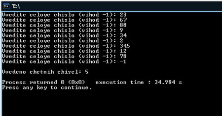

[Содержание](index.md)

# Глава 11. Оператор Continue в С++ - Введение в программирование
В этой главе разберем назначение оператора `continue`. Затем на примере посмотрим как он применяется в программах. Итак, вы уже хорошо знакомы с циклическими структурами языка программирования С++, знакомы с оператором `break`, который служит для выхода из цикла (к примеру, при наступлении какого-либо условия, отличного от условия завершения цикла). Оператор `continue`, также как и оператор `break` служит для прерывания цикла. Разница в том, что при выполнении оператора `break` мы вообще выходим из цикла и программа продолжает выполняться со следующей после цикла строки кода, а при выполнении оператора `continue` происходит переход на новую итерацию цикла, т.е переходим на его начало.

И теперь конечно же практика и еще раз практика, т.к. без практики в программировании понять суть того или иного оператора (да и не только оператора) очень сложно. Давайте напишем программу, которая будет у пользователя запрашивать целые числа, подсчитывать количество четных и в конце выводить результат. Вот что у нас получится:

```cpp
// Программа запрашивает у пользователя целые числа,
// подсчитывает количество четных и в конце выводит результат

#include <iostream>

using namespace std;

// главная функция программы, с нее начинается выполнение
int main()
{
    // объявляем необходимые переменные
    int var, counter = 0;
    // начинаем цикл ввода чисел и подсчета четных
    // условие выхода из цикла - ввод пользователем -1
    do
    {
        // запрашиваем число и сохраняем в переменную var
        cout << "Vvedite celoye chislo (vihod -1): ";
        cin >> var;
        // если число нечетное, то возвращаемся на начало
        // цикла не дойдя до конца
        if (var % 2 != 0)
            continue;
        // если число было четным, то выполнение программы
        // доходит до этого оператора и счетчик кол-ва
        // четных увеличивается на единицу
        counter++;
    }
    while (var != -1);
    // выводим результат подсчета четных чисел на экран
    cout << endl << "Vvedeno chetnih chisel: " << counter << endl;
    // если программа отработала без ошибок, то функция main()
    // возвращает windows число нуль
    return 0;
}
```

Результат работы программы:



Объявляем две переменные: `var` - будет запоминать, введенное пользователем число, `counter` - будет подсчитывать количество четных чисел.
Начинаем цикл `while` с постусловием, условием выхода из цикла служит ввод пользователем числа `-1`. Т.к. это число само по себе нечетное, то его можно использовать в качестве метки выхода из цикла.
Теперь рассмотрим вот этот участок кода программы

```cpp
if (var % 2 != 0)
    continue;
```

Здесь мы проверяем, введенную пользователем переменную, на четность (нечетность). Мы уже знаем такие арифметические операции, применяемые в программировании, как сложение `+`, вычитание `-`, умножение `*`, деление `/`. Арифметическая операция `%`, которую мы используем в нашей программе, находит остаток от деления. А мы знаем, что если число делится на 2 без остатка то оно четное, иначе - нечетное. Чтобы лучше понять сделаем это нагляднее: к примеру, пользователь ввел число 23. Подставим значение:

```cpp
if (23 % 2 != 0)
    continue;
```

Вот что происходит в скобках условия оператора `if`: находим остаток от деления на 2 (11.5 результат деления, остаток 0.5), выясняем, что число нечетное. Далее сравниваем его с условием проверки (условие 0). В случае, если не равно (у нас 0.5 не равно 0) выполняем тело оператора `if` (у нас это оператор `continue`). Переходим на начало цикла (на новую итерацию цикла `while`).

Если бы число у нас оказалось четным, то, соответственно, тело цикла `if` не выполнилось и на начало цикла мы бы перешли только после выполнения остального содержимого цикла `while`, а это оператор

```cpp
counter++;
```

который бы увеличил на единицу количество четных чисел.

Думаю, что теперь вам все стало ясно и понятно.

[Перейти к практике программирования](practice-11-1.md)
