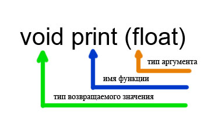

[Содержание](index.md)

# Функции и программирование на С++
Я надеюсь, что вы полностью закончили с практикой, выполнив все, либо большую часть заданий из трех практических частей - теперь мы можем смело приступать к такой важной теме программирования на С++, как функции. Почему эта тема важна? Давайте попробуем поразмыслить: мы с вами писали программы и пока что они были не слишком велики по размеру, но придет время и мы будем с вами писать программы, которые будут длиной в 100, 200...300 строк и так далее. Как вы думаете, если этот весь код содержится в главной функции программы `main()`, то его легко будет читать и понимать!? А если пройдет достаточно времени и вы вообще подзабудете, чем занимались в этом проекте и как именно реализовывали его алгоритм!? Вывод напрашивается сам - в этом случае целесообразно использовать функции. Что же это такое? Функция - это самостоятельный элемент кода программы, иными словами фрагмент или кусок кода программы (как вам удобнее, так и называйте - не в этом суть), который выполняет свою отдельную небольшую задачу. Выделим еще раз то, для чего она служит? Для того, чтобы программу можно было разделить на так называемые логические элементы, каждый из которых делает свою задачу. В связи с этим код программы значительно упрощается, т.к. он уже будет разбит на логические элементы (функции), которые делают свою работу (т.е. выполняют свое назначение) в программе. Например, одна функция может выводить массив на печать (забегаю немного вперед: массив - это так называемый набор переменных одного типа (например, `int`)), другая, к примеру, сортировать этот же массив, третья еще что-либо. Ну а теперь, конечно же, все это нужно прочувствовать при работе с кодом, здесь то вы и поймете суть и разберетесь с функциями в программировании на С++.

В примере, конечно же, не будет рассматриваться слишком сложная программа, т.к. на данном этапе нам нужно понять принципы использования функций в программировании на С++, их синтаксис и так далее, поэтому для примера я взял пятое задание из [Практики программирования. Часть первая](practice-11-1.md#задание--5).

```cpp
// Функции и программирование на С++
// Программа считывает радиус круга и печатает
// диаметр круга, длину окружности и площадь

#include <iostream>

using namespace std;

int main()
{
    const float p = 3.14159;
    float radius;
    cout << "Vvedite radius kruga: \n";
    cin >> radius;
    cout << "Diametr kruga raven " << 2 * radius << endl;
    cout << "Dlina okrushnosti ravna " << 2 * p * radius << endl;
    cout << "Ploshad' kruga ravna " << p * radius * radius << endl;
    return 0;
}
```

Итак, вот исходная программа, но сейчас мы выделим из нее логический элемент и определим его в качестве функции. Этим логическим элементом у нас будет вывод результатов на экран, т.е. вот эти строки кода

```cpp
cout << "Diametr kruga raven " << 2 * radius << endl;
cout << "Dlina okrushnosti ravna " << 2 * p * radius << endl;
cout << "Ploshad' kruga ravna " << p * radius * radius << endl;
```

Назовем эту функцию, к примеру, `print`, т.к. она выполняет печать результатов. Рекомендую всегда осмысленно именовать функции (так же, как и переменные), чтобы потом понимать для чего она была создана и какая роль ей отведена в вашей программе. Итак, смотрим, что получилось в итоге

```cpp
// Функции и программирование на С++
// Программа считывает радиус круга и печатает
// диаметр круга, длину окружности и площадь

#include <iostream>

using namespace std;

// определяем прототип функции
void print (float);

int main()
{
    float radius;
    cout << "Vvedite radius kruga: \n";
    cin >> radius;
    // вызываем функцию
    print (radius);
    return 0;
}

// определение самой функции
void print (float r)
{
    cout << "Diametr kruga raven " << 2 * r << endl;
    cout << "Dlina okrushnosti ravna " << 2 * 3.14159 * r << endl;
    cout << "Ploshad' kruga ravna " << 3.14159 * r * r << endl;
}
```

Смотрим код - что мы видим нового... Вы, наверное, заметили, что теперь на том месте, где у нас выводились результаты работы программы (диаметр круга, длина окружности и площадь), теперь есть всего лишь одна строка кода

```cpp
print (radius);
```

это вызов нашей функции `print`. Т.е. что получается...получается то, что в этом месте управление переходит к функции, которая определена ниже

```cpp
// определение самой функции
void print (float r)
{
    cout << "Diametr kruga raven " << 2 * r << endl;
    cout << "Dlina okrushnosti ravna " << 2 * 3.14159 * r << endl;
    cout << "Ploshad' kruga ravna " << 3.14159 * r * r << endl;
}
```

и она выполняется, делает свою работу. После того, как она завершит свое выполнение (выполнятся все строки кода, написанные в функции), управление опять перейдет в основную часть программы и продолжится уже, привычное нам, построчное выполнение программы, т.е. управление перейдет от этой строки кода к оператору `return`

```cpp
return 0;
```

В самом начале программы мы видим еще одну новую для нас строку кода

```cpp
void print (float);
```

В этой строке мы определяем прототип нашей функции. Что это и для чего он нужен мы рассмотрим далее, но сначала давайте усвоим еще один очень важный момент, который поможет нам понять и суть прототипа и самой функции в целом. Запоминайте: Функции в языке программирования С++ могут принимать значения в качестве аргументов и возвращать значение (результат своей работы). Для того, чтобы определить эти входящие значения (аргументы) и определить тип возвращаемого значения, мы используем прототип функции, которые обычно помещают в начале программы до блока `main()`. Саму функцию в таком случае размещают после блока `main()`. Другими словами, использование прототипа функции позволяет избежать ошибок при работе с функциями.



Как видите, на рисунке, в самом начале перед именем определяемой функции мы указываем тип возвращаемого ею значения. Тут, я думаю, что все понятно: если мы возвращаем целое число типа `int`, то и указывать нужно в качестве возвращаемого функцией значения тип `int`. В нашем случае мы видим тип `void` и это значит, что наша функция ничего не возвращает. Запомните это ключевое слово `void`. Еще раз повторю, что в случае, если нам не нужно ничего возвращать из функции, мы должны указать тип `void` (ничего не возвращать). Просто ничего не указывать нельзя, компилятор в этом случае при компиляции выдаст ошибку. Во всех иных случаях, кроме `void` функция будет что-то возвращать (то, что мы укажем). Возврат результата работы функции происходит с помощью ключевого слова `return`, после которого указывается значение и ставится точка с запятой.

Далее смотрим на рисунок и видим, что после определения типа возвращаемого функцией значения, следует имя самой функции. По этому имени мы будем к ней обращаться в программе.

После имени функции в круглых скобках указываются аргументы, принимаемые ею. В нашем случае функция принимает один аргумент типа `float`. Функция может принимать сколь угодно аргументов, типы которых нужно перечислять через запятую. Если функция не принимает аргументов, то круглые скобки оставляем пустыми (вот так `print()`). Не забывайте про скобки, иначе будет ошибка. Функция в любом случае содержит пару скобок после своего имени, будь они с аргументами или без них. Итак, с прототипом разобрались, для чего он нужен тоже понятно. Теперь смотрим на саму функцию.

```cpp
void print (float r)
{
    cout << "Diametr kruga raven " << 2 * r << endl;
    cout << "Dlina okrushnosti ravna " << 2 * 3.14159 * r << endl;
    cout << "Ploshad' kruga ravna " << 3.14159 * r * r << endl;
}
```

Вот это само определение функции, т.е. здесь уже задается то, что она будет делать. Эти инструкции находятся в теле функции, т.е. между фигурными `{}` скобками. Теперь мы видим, что начало функции повторяет ее прототип. Разница здесь только лишь в том, что мы принимаемому ей значению в качестве аргумента задаем имя (у нас оно `r`). Теперь мы эту переменную можем использовать в теле функции. С этим тоже понятно. Возвращаемся теперь опять в вызову функции в программе

```cpp
print (radius);
```

Вот так устроен вызов функции: мы указываем ее имя (его мы знаем - оно у нас определено в прототипе), и отправляем ей в качестве аргумента переменную типа `float` (это у нас тоже указано в прототипе). Очень часто ошибки возникают именно с аргументами, принимаемыми функцией. Здесь все строго: если указано в прототипе, что принимается одна переменная, то и передавать нужно одну (ни больше, ни меньше - именно одну). Также обязательно нужно соблюдать тип (если указан в прототипе тип `float`, то только он и никакой иначе).

### Функции, как средство увеличить читабельность программ и уменьшить их размер за счет повторно используемых участков кода
Теперь давайте рассмотрим второй момент, где оправдано использование функций. Представьте себе ситуацию, что в программе какой-то отдельно взятый участок кода нужно выводить не один раз, а несколько. Тогда здесь будет разумно вынести этот кусок кода в отдельную функцию, а в местах, где нужно его выполнять - вставлять только вызов на функцию. Для примера рассмотрим вот такую простенькую программу

```cpp
// Функции и программирование

#include <iostream>
#include <math.h>

using namespace std;

void print (double);

int main()
{
    double var, temp;
    cout << "Vvedite celoye chislo: ";
    cin >> var;
    temp = sqrt(var);
    print(temp);
    temp = fabs(var);
    print(temp);
    temp = cos(var);
    print(temp);
    return 0;
}

void print (double v)
{
    cout << "Result: " << v << endl;
}
```

Программа довольно-таки примитивная, но суть в ней понять легко. При изучении массивов в последующих главах учебника вы более наглядно поймете этот момент использования функций. В данной программе есть функция print, которая выводит результат работы на экран. В самой программе мы запрашиваем у пользователя дробное число с двойной точностью (тип `double` - точность 13-14 знаков после запятой) и выполняем с этим числом различные операции: находим корень, абсолютный модуль, косинус и так далее. Для вывода результата нужна всегда одна и та же строка кода, которую мы не будем переписывать много раз, а определим в функцию и в нужных местах программы будем ее вызывать. В нашем случае функция содержит всего лишь одну строку кода, но на практике, конечно же, повторяющиеся фрагменты будут более объемными. Итак, суть, я думаю, что вы поняли и теперь давайте подведем итог по функциям.

### Запомнить:
1. Функция в программировании - это отдельный самостоятельный фрагмент кода, выполняющих свою отдельную небольшую задачу.
2. Функции служат для логического разбиения длинной программы на отдельные самостоятельные фрагменты. Иногда целесообразно разбивать на фрагменты и не очень большие программы. С опытом вы все это обязательно поймете сами, когда и как лучше разбить программу.
3. Функции служат также для экономии сил программиста и хорошего стиля программирования: когда в программе есть отдельные фрагменты кода, которые неоднократно повторяются в коде программы, их целесообразно вынести в отдельную функцию, которую можно затем будет вызывать в необходимых частях программы.
4. Функция должна иметь свой прототип, в котором указывается тип ее возвращаемого значения, типы и количество принимаемых ею аргументов.
5. Если функция не должна ничего возвращать, то для указания этого компилятору используется специальное ключевое слово `void`. Если функция ничего не принимает в качестве аргументов, то двойные скобки остаются пустыми `имя_функции();`, либо в них также указывается ключевое слово void (в некоторых компиляторах нужно оставлять скобки пустыми, а в некоторых нужно писать `void`).

### Типичные ошибки при использовании функций:
1. Забывают определить прототип функции.
2. Тип возвращаемого функцией значения не соответствует тому, который указан в прототипе.
3. Тип (типы) принимаемого функцией аргумента не соответствует тому, который указан в прототипе.
4. Не соответствует количество аргументов функции, описанных в прототипе, и передаваемых ей в программе.
5. Забывают возвращать результат работы функции с помощью ключевого слова `return`, когда указано, что функция должна возвращать результат.
6. Забывают в вызове функции, не принимающей никаких аргументов, добавлять две круглые скобки после имени.
7. Забывают в описании самой функции в скобках приема аргументов указывать их тип перед именем.

[Практика по функциям. Часть первая](practice-12-1.md)
