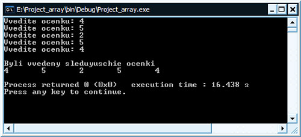
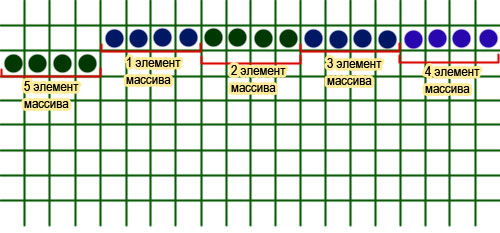

[Содержание](index.md)

# Урок: массивы
В этом уроке я начинаю очень важную и обширную тему программирования - массивы. Без них трудно представить себе программирование, на каком бы то ни было языке. Итак, урок "массивы" начнется с того, что мы разберемся с понятием, что такое массив, дав ему подробное определение. Затем мы выясним какие бывают массивы, рассмотрев их типы и в завершении рассмотрим С++ массивы, т.е. узнаем как объявить массив в С++, узнаем как выполняется инициализация массива.

### Что такое массив?
В этом подразделе я попытаюсь дать ответ на вопрос, что такое массив. В шестом уроке учебника, мы с вами рассматривали [понятие переменной](chapter-6.md), как самостоятельного контейнера, хранящего значение определенного типа (`int` - целые, `float` - дробные с точностью 6-7 знаков после запятой, `double` - дробные с точностью 13-14 знаков, `char` - символьные и так далее). Каждый тип переменной хранит данное своего типа и занимает определенный объем оперативной памяти компьютера. К примеру, `int` занимает в памяти 4 байта. В программировании часто приходится сталкиваться с однотипными объектами-переменными. Любое высказывание лучше понять на примере. Например, вот такая программа:

```cpp
// Программа запрашивает оценки по экзамену,
// сохраняет их и затем выводит на печать

#include <iostream>

using namespace std;

int main()
{
    int point1, point2, point3, point4, point5;
    cout << "Vvedite ocenku: ";
    cin >> point1;
    cout << "Vvedite ocenku: ";
    cin >> point2;
    cout << "Vvedite ocenku: ";
    cin >> point3;
    cout << "Vvedite ocenku: ";
    cin >> point4;
    cout << "Vvedite ocenku: ";
    cin >> point5;
    cout << endl << "Byli vvedeny sleduyuschie ocenki" << endl;
    cout << point1 << "\t" << point2 << "\t" << point3
         << "\t" << point4 << "\t" << point5 << endl;
    return 0;
}
```

Результат работы программы:



Программа, приведенная выше, запрашивает у пользователя пять оценок, которые сохраняются в пяти переменных, которые мы предварительно объявили

```cpp
int point1, point2, point3, point4, point5;
```

В конце мы выводим эти оценки на экран, табулируя результаты с помощью оператора `\t`.

А теперь, я ниже приведу вариант этой же программы, но с использованием массива. Вот, что получится:

```cpp
// Программа запрашивает оценки по экзамену,
// сохраняет их и затем выводит на печать

#include <iostream>

using namespace std;

int main()
{
    int point[5];
    for(int i = 0; i < 5; i++)
    {
        cout << "Vvedite ocenku: ";
        cin >> point[i];
    }
    cout << endl << "Byli vvedeny sleduyuschie ocenki" << endl;
    for(int i = 0; i < 5; i++)
        cout << point[i] << "\t";
    return 0;
}
```

Эта программа выведет абсолютно такой же результат, но вот построена она уже иначе. Такой вариант реализации более удобный и компактный за счет того, что мы используем массив. Вот его объявление

```cpp
int point[5];
```

И оно логически равноценно этому

```cpp
int point1, point2, point3, point4, point5;
```

Почему? Потому что массив `point` содержит в себе пять элементов типа `int`.

Вот как это будет выглядеть в памяти компьютера:



Как видите, переменные, размером в четыре байта (тип int) идут в оперативной памяти компьютера подряд. Совокупность этих переменных одного типа и есть массив. И переменные эти именуются как элементы массива.

Важно!

Нумерация элементов массива начинается с нуля!!! То есть, если мы имеем массив, состоящий из пяти элементов, то доступ к ним можно получить таким образом:

```cpp
point[0];
point[1];
point[2];
point[3];
point[4];
```

Рассмотрев, применение массива на небольшом практическом примере, я все же хочу дать определение и ответить на вопрос: что такое массив?

Массив - это совокупность переменных, содержащих данные одного типа (например, `int`), объединенных одним общим именем. Каждая отдельно взятая переменная, называется элементом (ячейкой) массива. В памяти элементы массива всегда располагаются строго последовательно, благодаря чему повышается скорость доступа к данным. Доступ к элементам массива осуществляется через указание индексов, которые указываются после имени в квадратных скобках и обязательно нумеруются, начиная с нуля.

### Типы массивов
В продолжении урока о массивах рассмотрим основные типы массивов, применяемые в программировании, в том числе и в С++.

По размерности массивы бывают таких типов:

- одномерные
- двумерные или матрицы
- трехмерные и т.д.

На практике редко используют массивы, размерностью более трех (хотя и трехмерные используются не очень часто). Трехмерный массив - это некое подобие куба, который мы еще как-то можем представить и уложить в своей голове. К примеру, четырехмерный массив, нам уже будет довольно сложно представить в своем воображении, а работать с ним - так тем более.

Массивы, размерностью более одного (одномерные массивы), по-другому еще называют - многомерными (двумерные, трехмерные массивы и т.д.).

Также вы часто будете встречать такие типы массивов, как статические и динамические. Подробно все это будет рассматриваться позже, в общих чертах лишь скажу, что размер статического массива определяется еще на стадии разработки и компиляции программы, динамического же массива размер изначально неизвестен, а определяется уже во время работы программы.

Это были основные типы массивов, о которых вам нужно знать на этом этапе обучения. Работа с одномерными и двумерными массивами будет рассмотрена в следующих уроках.

### С++ массивы
#### Как объявить массив
Для того, чтобы объявить массив, нужно также, как и для объявления переменной указать тип, имя. Но для объявления массива также еще нужно указать количество элементов. Например, объявим массив, состоящий из 10 элементов типа `double`

```cpp
double massiv[10];
```

Теперь его можно использовать в программе, обращаясь к элементам массива через индексы от 0 до 9. Но, как вы уже знаете, объявить массив - это значит дать команду выделить под него память. Выделив память, нужно еще и задать значения этим элементам памяти, т.е. нужно выполнить инициализацию.

#### Инициализация массива
После того, как мы объявим массив, мы, конечно же, можем его уже использовать в своей программе, вот только, если мы его не проинициализировали (не задали начальные значения его элементам), то толку с этого будет мало. Инициализацию массива можно выполнить несколькими способами. Например, при объявлении:

```cpp
int mas[8] = {2, 5, 11, 8, 77, 39, 3, 71};
```

Если нужно, чтобы изначально все элементы массива были нулевыми, то есть такой способ

```cpp
int mas[8] = {0};
```

Но это только для нулей. Если нужно сделать то же, но, к примеру, для единиц, то правильнее будет использовать цикл. Вот так

```cpp
int mas[8];

for(int i = 0; i < 8; i++)
    mas[i] = 1;
```

Можно даже так выполнять инициализацию массива

```cpp
int mas[3];

mas[0] = 10;
mas[1] = 16;
mas[2] = 21;
```

В принципе, я думаю понятно, остальное будет рассмотрено в последующих уроках и практике.

[Глава 14. Одномерные массивы](chapter-14.md)
