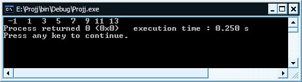
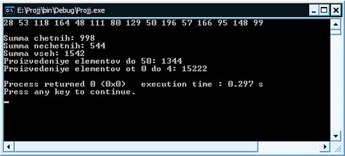
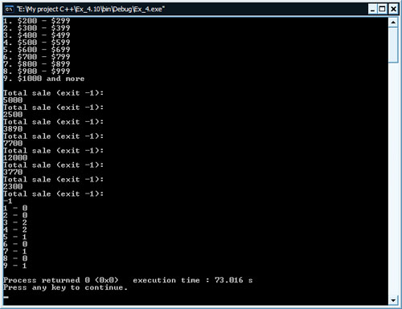

[Содержание](index.md)

# Одномерные массивы в С++
В этой главе учебника поговорим об одномерных массивах, как о самых простых. Что такое одномерный массив? Это массив, у которого есть лишь один параметр - это количество элементов. Эти элементы расположены последовательно, т.е. идут друг за другом.

Еще раз повторим то, как объявляются и инициализируются массивы, в нашем случае одномерные массивы.

Допустим, что нам нужно объявить одномерный массив, состоящий из 8-ми элементов и присвоить его элементам значения, вычисленные по формуле: номер элемента массива, умноженный на 2 и минус 1. Т.е. для 3-го элемента будет 3 * 2 - 1 = 5. Смотрим

```cpp
// Одномерный массив

#include <iostream>
#include <iomanip>

using namespace std;

int main()
{
    // объявляем массив из 8-ми элементов
    int array[8];
    // инициализируем массив данными по формуле
    for(int i = 0; i < 8; i++)
        array[i] = i * 2 - 1;
    // выводим массив на экран
    for(int i = 0; i < 8; i++)
        cout << setw(3) << array[i];
    return 0;
}
```



Как видите, ничего сложного в работе с одномерными массивами нет. 

```cpp
// объявляем массив из 8-ми элементов
int array[8];
```

Объявляется массив путем указания типа его элементов, в нашем случае это целые (`int`), затем указывается его имя, в нашем случае это `array`, а затем в квадратных скобках указывается количество элементов, в нашем случае их восемь. Итак, память для массива мы зарезервировали и на этапе компиляции программы она будет выделена (8 * 4 байта = 32 байта, т.к один элемент типа `int` занимает в памяти 4 байта). Но в массиве на данный момент содержится различный "мусор", т.е. различные значения, которые возможно применялись в других программах и так далее. Нужно изменить (задать) эти значения, т.е. выполнить инициализацию массива. Проще всего ее выполнять с помощью цикла, в котором мы последовательно проходим по всем элементам массива. Инициализируем, применяя формулу `i * 2 - 1`, где `i` - значение индекса массива.

```cpp
// инициализируем массив данными по формуле
for(int i = 0; i < 8; i++)
    array[i] = i * 2 - 1;
```

Теперь каждый элемент нашего одномерного массива содержит свое заданное значение. Хотелось бы их просмотреть, а для этого нам нужно подумать, как вывести их на экран. Для этого опять же проще всего использовать цикл, в котором мы будет последовательно проходить по всем элементам массива, выводя их на экран в одну строку. Для каждого значения мы выделим на экране место в 3 ячейки, для этого будем использовать манипулятор вывода потока setw с параметром 3.

```cpp
// выводим массив на экран
for(int i = 0; i < 8; i++)
    cout << setw(3) << array[i];
```

Давайте теперь, для закрепления материала, выполним несколько небольших упражнений

Нужно написать несколько операций с массивом array

1. Объявите массив типа `float` с числом элементов `arraySize = 10` и присвойте ему нулевые начальные значения.
2. Выведите на печать четвертый элемент массива.
3. Присвойте девятому элементу массива значение 1.345.
4. Увеличьте значение последнего элемента массива на 1.
5. Присвойте тем элементам массива, значения которых нулевые, значение их индекса.

Итак, вот такие пять небольших заданий, которые вы должны выполнить самостоятельно. Ниже привожу решение этих задач, с помощью которых вы можете проверить результаты выполнения.

1.

```cpp
const int arraySize = 10;
float array[arraySize] = {0};
```
2.

```cpp
cout << array[3];
```
3.

```cpp
array[8] = 1.345;
```
4.

```cpp
array[9]++;
```
5.

```cpp
for(int i = 0; i < arraySize; i++)
    if(array[i] == 0)
      array[i] = i;
```

Важно! И помните, что нумерация элементов массива начинается с нуля, т.е. если элементов всего 5, то именоваться они будут как 0, 1, 2, 3, 4.

### Одномерные массивы - решение задач
Теория - это хорошо, но практика лучше. Немного теории об одномерных массивах я вам рассказал, а теперь давайте займемся практикой решения задач.

#### Одномерные массивы - задача № 1
Создать одномерный массив, содержащий 15 элементов, наполнить его случайными значениями в интервале от 1 до 200. Посчитать и вывести:
1. Сумму всех четных элементов массива.
2. Сумму всех нечетных элементов массива.
3. Сумму всех элементов массива.
4. Произведение всех элементов массива, значения которых меньше 50.
5. Произведение элементов массива с индексами от 2 и 7.
Давайте во всех тонкостях программы разбираться по порядку, даже, несмотря на то, что некоторые моменты нам знакомы, заодно и повторим выученное.

Итак, для начала объявим массив и пять переменных, которые будут нам служить для хранения результатов работы с элементами массива

```cpp
const int size = 15;
int massiv[size];
int sumChet = 0, sumNechet = 0, sum = 0, proizv1 = 1, proizv2 = 1;
```

Как мы увидим позже, размер массива часто используется в различных моментах кода программы (например, в циклах прохода по массиву), поэтому удобнее его объявлять не конкретным числом в самом объявлении массива, а отдельно, как константу. Почему как константу? Потому что размер массива не может изменяться во время работы программы, на то он и статический, а не динамический (работа с динамическими массивами будет рассматриваться позже, это отдельная тема). Для того, чтобы компилятор знал о том, что это константа и не выдавал ошибку во время компиляции программы, нужно обязательно объявлять константное значение, в частности размер массива, со спецификатором `const`.

Массив мы объявили, теперь нужно выполнить его инициализацию. По заданию его нужно заполнить случайными значениями от 1 до 200. Естественно, для этого нам нужно использовать функцию рандомизации (`rand()` - вырабатывающую случайным значения по определенному алгоритму). Для того, чтобы функция работала правильно ее нужно использовать в паре с другой функцией (`srand()`), позволяющей задавать начальную точку отчета для работы функции рандомизации `rand()`. Эти две функции описаны в заголовочном файле `stdlib.h`. Для начальной точки отчета функция `srand()` использует системное время, поэтому подключаем заголовочный файл `time.h`.

```cpp
srand(time(NULL));
```

Задаем нашему одномерному массиву случайные значения

```
for(int i = 0; i < size; i++)
    massiv[i] = 1 + rand() % 200;
```

Естественно, это удобнее всего делать в цикле, проходя по всем элементам массива последовательно и присваивая каждому свое случайное значение. Для того, чтобы функция `rand()` генерировала случайные величины в интервале от 1 до 200, нужно использовать вот такой синтаксис: начальная точка плюс `rand()`, остаток от деления (знак `%`) конечная точка.

Теперь начинается самая важная работа - это подсчет нужных сумм и произведений. Опять же для прохода по массиву используем цикл `for`

```cpp
for(int i = 0; i < size; i++)
{
    if(massiv[i] % 2 == 0)
     sumChet += massiv[i];
    if(massiv[i] % 2 != 0)
      sumNechet += massiv[i];
    sum += massiv[i];
    if(massiv[i] < 50)
      proizv1 *= massiv[i];
    if(i == 2 || i == 7)
      proizv2 *= massiv[i];
}
```

Как обычно, для прохода по всему одномерному массиву мы используем цикл `for` в интервале от 0 до `size`, где `size` является размером массива. Условие используется строгое, без включения самого `size`, т.к. нумерация элементов массива начинается с нуля. Т.е., если размер массива равен 15, то индексы его будут от 0 до 14 включительно, что есть 15 штук.

Далее нам по условию нужно найти сумму всех четных элементов массива. Для этого мы будем использовать соответствующее условие выборки

```cpp
if(massiv[i] % 2 == 0)
    sumChet += massiv[i];
```

Думаю здесь все понятно: если остаток от деления значения элемента на 2 равен нулю, то значит значение этого элемента массива четное и, соответственно, его можно приплюсовывать в общую сумму. Т.к. переменную `sumChet` мы используем для накопления общей суммы, то при объявлении мы сразу ее инициализировали значением 0. Если вы забыли, то напомню, что это сокращенное выражение `sumChet += massiv[i];` в полной форме будет таким `sumChet = sumChet + massiv[i];`

Далее по условию нам нужно найти сумму всех нечетных элементов массива

```cpp
if(massiv[i] % 2 != 0)
    sumNechet += massiv[i];
```

Для нахождения этой сумму используется обратное условие, т.е. если остаток от деления не равен 0, то выполняем приплюсовывание суммы в общую переменную накопления.

Сумма всех элементов одномерного массива считается довольно просто

```cpp
sum += massiv[i];
```

Нет никаких условий, все элементы массива просто последовательно, поочередно складываются.

```cpp
if(massiv[i] < 50) 
    proizv1 *= massiv[i];
```

Для подсчета произведения всех элементов, значения которых менее 50 используем соответствующее условие выборки.

И последнее, что нам осталось сделать, это найти произведение элементов массива с индексами 2 и 7. Задаем условие, что если в данный момент мы находимся на элементах массива 2 или (`||`) 7, то выполнить умножение

```cpp
if(i == 2 || i == 7) 
    proizv2 *= massiv[i];
```

Ниже привожу полный код данной программы:

```cpp
// Работа с одномерным массивом

#include <iostream>
#include <stdlib.h>
#include <time.h>

using namespace std;

// прототип функции для печати массива
void printArray(int[], const int);

int main()
{
    // объявляем необходимые переменные
    const int size = 15;
    int massiv[size];
    int sumChet = 0, sumNechet = 0, sum = 0, proizv1 = 1, proizv2 = 1;
    // задаем начало отчета для рандомизатора rand()
    srand(time(NULL));
    // наполняем массив случайными величинами
    for(int i = 0; i < size; i++)
        massiv[i] = 1 + rand() % 200;
    // выводим содержимое массива на экран
    printArray(massiv, size);
    // выполняем необходимые подсчеты в цикле
    for(int i = 0; i < size; i++)
    {
        if(massiv[i] % 2 == 0)
            sumChet += massiv[i];
        if(massiv[i] % 2 != 0)
            sumNechet += massiv[i];
        sum += massiv[i];
        if(massiv[i] < 50)
            proizv1 *= massiv[i];
        if(i == 2 || i == 7)
            proizv2 *= massiv[i];
    }
    // выводим результаты работы программы
    cout << "\nSumma chetnih: " << sumChet << endl;
    cout << "Summa nechetnih: " << sumNechet << endl;
    cout << "Summa vseh: " << sum << endl;
    cout << "Proizvedeniye elementov do 50: " << proizv1 << endl;
    cout << "Proizvedeniye elementov ot 0 do 4: " << proizv2 << endl;
    return 0;
}

// функция вывода массива на экран
void printArray(int a[], const int s)
{
    for(int k = 0; k < s; k++)
        cout << a[k] << " ";
    cout << endl;
}
```

Результат работы программы будет таким



Далее займемся двумя задачами, которые уже будут несколько сложнее начинающему.

#### Одномерные массивы - задача № 2
Используйте одномерный массив для решения следующей задачи. Компания платит своим продавцам на комиссионной основе. Продавцы получают 200 долларов в неделю плюс 9 процентов от валовой продажи за эту неделю. Например, продавец, валовая продажа которого за неделю составила 5000 долларов, получает 200 долларов плюс 9 процентов от 5000 долларов, или всего 650 долларов. Напишите программу (используя массив счетчиков), которая определяет, сколько продавцов получили заработную плату в каждом из следующих диапазонов (примем допущение, что зарплата каждого продавца округляется до целого значения):

1. $200 - $299
2. $300 - $399
3. $400 - $499
4. $500 - $599
5. $600 - $699
6. $700 - $799
7. $800 - $899
8. $900 - $999
9. $1000 и более.

Попробуйте решить эту задачу самостоятельно, а затем сравнить с моим решением, которое для удобства будет скрыто

```cpp
// Программа определяет количество продавцов,
// получивших заработную плату из определенного интервала

#include <iostream>

using namespace std;

// определяем прототипы функций
void intervals();
void printArray(int[], int);

int main()
{
    // определяем константное число, определяющее размер массива
    const int size = 9;
    // объявляем массив, инициализируем его нулями
    // totalSale - будет запоминать валовую продажу служащего
    // general - будет запоминать заработную плату служащего
    int array[size] = {0}, totalSale, general;
    // выводим интервалы заработков служащих для наглядности
    intervals();
    // запрашиваем валовую продажу и сохраняем значение
    cout << "Total sale (exit -1): " << endl;
    cin >> totalSale;
    // в цикле запрашиваем количества валовых продаж служащих
    while(totalSale != -1)
    {
        // подсчитываем заработную плату служащего
        general = 200 + (totalSale * 9 / 100);
        // организуем подсчет, используя счетчики
        if(general >= 200 && general <= 299)
            ++array[0];
        else if(general >= 300 && general <= 399)
            ++array[1];
        else if(general >= 400 && general <= 499)
            ++array[2];
        else if(general >= 500 && general <= 599)
            ++array[3];
        else if(general >= 600 && general <= 699)
            ++array[4];
        else if(general >= 700 && general <= 799)
            ++array[5];
        else if(general >= 800 && general <= 899)
            ++array[6];
        else if(general >= 900 && general <= 999)
            ++array[7];
        else if(general >= 1000)
            ++array[8];
        // запрашиваем валовую продажу и сохраняем значение
        cout << "Total sale (exit -1): " << endl;
        cin >> totalSale;
    }
    printArray(array, size);
    return 0;
}

// описываем функцию, выводящую на экран интервалы заработков
void intervals()
{
    cout << "1. $200 - $299" << endl
         << "2. $300 - $399" << endl
         << "3. $400 - $499" << endl
         << "4. $500 - $599" << endl
         << "5. $600 - $699" << endl
         << "6. $700 - $799" << endl
         << "7. $800 - $899" << endl
         << "8. $900 - $999" << endl
         << "9. $1000 and more" << endl << endl;
}
// описываем функцию, служащую для вывода значений массива
void printArray(int a[], int size)
{
    for(int i = 0; i < size; i++)
        cout << (i + 1) << " - " << a[i] << endl;
}
```

Результат работы программы



Решим еще одну задачу на одномерные массивы

#### Одномерные массивы - задача № 3
Используйте одномерный массив для решения следующей задачи. Прочитайте 20 чисел, каждое из которых находится в диапазоне от 10 до 100 включительно. После того, как прочли очередное число, напечатайте его, но только в том случае, если оно не дублирует ранее прочитанные числа. Предусмотрите "наихудший" случай, когда все 20 чисел различны. Используйте наименьший возможный массив для решения этой задачи.

```cpp
// Работа с одномерным массивом

#include <iostream>

using namespace std;

int main()
{
    // объявляем необходимые переменные
    const int size = 20;
    int array[size], var;
    bool label = true;
    // выводим подсказку пользователю
    cout << "Enter 20 numbers in an interval from 10 up to 100" << endl << endl;
    // начинаем ввод 20-и чисел в цикле
    for(int i = 0; i < size; i++)
    {
        // запрашиваем число, запоминаем его в переменную var
        cout << "Enter: ";
        cin >> var;
        // если число находится в нужном интервале
        if(var >= 10 && var <= 100)
        {
            // записываем его в массив
            array[i] = var;
            // проверяем, не дублирует ли оно
            // введенное ранее число
            for(int j = 0; j < i; j++)
            {
                // если найдено соответствие, то меняем флаг переменной label
                if(array[j] == array[i])
                    label = false;
            }
            // если соответствия не было найдено, то печатаем число
            if(label == true)
                cout << array[i] << endl;
        }
        // в случае, если было введено число не из интервала 10 - 100
        else
        {
            cout << "Error! Incorrect interval" << endl;
            i--;
        }
        // меняем флаг перед входом в новую итерацию
        label = true;
    }
    return 0;
}
```

[Глава 15. Двумерные массивы](chapter-15.md)
