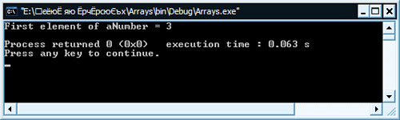
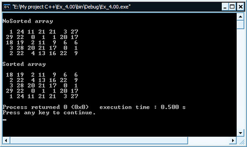

[Содержание](index.md)

# Двумерные массивы в С++
### Повторяем массивы

Продолжаем изучать массивы и в этой статье поговорим о двумерных массивах, особенностях работы с ними. Повторение - мать учения, поэтому немного вспомним определение массива, в общем.

Что такое массив? Все достаточно просто: если вы четко понимаете, что такое переменная, то и с понятием массива сложностей не должно возникнуть. А как вы знаете, переменная - это объект, который способен хранить в себе значение определенного типа. В С++ используется строгая типизация данных, поэтому каждая переменная (объект) может хранить данное (значение) только определенного типа. Тип, для которого будет предназначаться переменная, указывается при ее объявлении. Типы, как мы уже говорили, могут быть целочисленными (`int` со всеми его разновидностями, такими как `short int`, `long int, unsigned`), дробными (`float`, `double`), символьными и строковыми (`char` и `string` соответственно), булевыми или, как еще иногда говорят, логическими (`bool`).

Теперь отвечу на вопрос, который задал в начале предыдущего абзаца. Массив, в свою очередь - это, так сказать, оболочка, объединяющая определенное количество переменных строго одного типа. То количество переменных, которое созданный массив будет объединять, задается при объявлении и указывается в квадратных скобках.

```cpp
int aNumbers[7];
```

Выше мы видим объявление массива - оболочки, объединяющей определенное количество переменных в одно имя. В нашем случае общее имя этих переменных, т.е. массива - `aNumbers`. В данном случае я используя для указания имени префикс a, сообщающий о том, что мы работаем с массивом (на англ. массив - array). Это делается для удобства. Встречаясь в коде с переменными, имеющими в своем имени подобный префикс, вы будете четко понимать, что она из себя представляет. Само имя тоже нужно задавать, исходя из того, какую "миссию" этот объект будет выполнять в программе. Подробнее об этом можно почитать в статье "Оформление кода программ".

Немного отвлекся - продолжаем. В нашем случае массив в себе объединяет ровно семь переменных, типа int (целые числа). Переменные, содержащиеся в массиве, обычно называют ячейками массива или просто элементами. Для доступа к элементам массива, используется доступ по индексу. Т.е. для того, чтобы, к примеру, обратиться ко второму элементу массива `aNumbers`, нужно использовать такую запись

```cpp
aNumbers[1] = 4;
```

Мы обратились ко второму элементу массива `aNumbers` и присвоили ему значение 4. Если подзабыли, то напомню, что счет элементов массива в любом языке программирования начинается с нуля. Т.е., если элементов семь, то для обращения к ним нужно использовать индексы: 0, 1, 2, 3, 4, 5, 6. Эту особенность работы с массивами нужно запомнить раз и навсегда. Довольно часто новички допускают ее, тем самым выходя в своих программах за пределы массива (эта ошибка получила название - "ошибка на единицу"). Дело в том, что язык С++ настолько гибкий, что позволяет в своих программах выходить за границы массива, не выдавая при этом явной ошибки при компиляции программ. Некоторые профессионалы пользуются этой возможностью в определенных случаях. Для новичков же эта возможность выхода за границы, является причиной большого количества ошибок, допускаемых при работе с массивами. Поэтому здесь нужно быть осторожным. Порой можно сидеть целый день с программой и не понимать, что в ней не так и почему она выдает совершенно непредсказуемый результат. Причина тривиальна - выход за пределы массива. Таким образом, можно залезть в иные переменных, которые хранят свои значения по соседству в памяти, и ненароком повредить их, вызвав тем самым дополнительные ошибки.

Также напомню, что само имя массива, является указателем на его первый элемент. А так как все элементы массива расположены в памяти компьютера строго последовательно, то имя массива указывает на начало массива в памяти компьютера. Индекс, как я уже сказал, указывает на тот элемент, в этой последовательности, к которому мы хотим обратиться (будь-то считать его значение, либо задать иное).

Для наглядности набросал вот такую небольшую программку, которая демонстрирует то, что имя массива, указывает на его начало, т.е. на его первый элемент. Смотрим код

```cpp
#include <iostream>

using namespace std;

int main()
{
    int aNumber[10] = {3, 5, 11, 15, 18, 21, 22, 28, 36, 43};
    int element;
    element = *aNumber;
    cout << "First element of aNumber = " << element << endl;
    return 0;
}
```

Результат работы программы:



 Я не зря сказал - указывает. Т.е. имя массива - это указатель на место в памяти, в котором находится первая переменная массива. Указатель содержит не саму переменную, а лишь адрес ее ячейки, по которому она расположена в памяти компьютера. Не будем углубляться в это, т.к. это отдельная тема про указатели. Скажу лишь, что в нашем примере указатель разыменовывается с помощью ( `*` ). Благодаря чему, он передает значение, на которое указывает. В нашем случае он его присваивает переменной `element`, которую мы затем будем выводить на экран. Думаю здесь все относительно понятно.

Итак, основные моменты повторили. Теперь будем говорить непосредственно о двумерных массивах в С++.

### Говорим о двумерных массивах
Массивы в С++ могут быть не только одномерными, т.е. когда данные визуально выстроены в одну линию. Массивы также могут быть и двумерными, трехмерными и так далее. С++ компиляторы поддерживают как минимум 12-ти мерные массивы!!! Естественно, что такими большими массивами на практике никто не пользуется, т.к. человеку сложно их визуально представить у себя в голове, не то что написать программу, которая оперирует таким сложными массивами. На практике редко применяют массивы, более трехмерного. Одномерный - это строка, двумерный - матрица (таблица), трехмерный - куб, а вот дальше уже сложно, поэтому дальше, обычно, никто и не идет... Вот такие дела. 

Двумерный массив - это так называемая матрица (или таблица), у которой есть строки и столбцы. По соглашению программистов первый индекс массива будет указывать на строки, а второй на столбцы. Вот пример объявления и инициализации двумерного массива, состоящего из трех строк и пяти столбцов.

```cpp
int aMatrix[3][5] =
{
    {3, 5, 5, 7, 8},
    {4, 1, 1, 2, 9},
    {3, 8, 8, 9, 7}
};
```

Как видите, двумерный массив имеет два индекса (на то он, в принципе, так и называется). Сразу при объявлении мы его инициализируем целочисленными величинами. Для удобства мы их записываем в виде матрицы (таблицы): каждая строка с новой строки (их у нас 3), в каждой строке 5 столбцов.

Можно и так записать, как показано ниже. Разницы для компилятора не будет никакой. Разве лишь разница будет в визуальном восприятии для человека.

```cpp
int aMatrix[3][5] = { {3, 5, 5, 7, 8}, {4, 1, 1, 2, 9}, {3, 8, 8, 9, 7} };
```

Либо вообще так, без указания фигурных скобок, которые логически разделяют строки друг от друга.


```cpp
int aMatrix[3][5] = {3, 5, 5, 7, 8, 4, 1, 1, 2, 9, 3, 8, 8, 9, 7};
```

Кстати, последняя запись демонстрирует то, как на самом деле элементы массива размещаются в памяти компьютера. Как я уже писал в предыдущих главах, они идут последовательно.

Если инициализация двумерного массива происходит одновременно с объявлением, то можно даже не указывать первый индекс, т.е. количество строк массива.

```cpp
int aMatrix[][5] =
{
    {3, 5, 5, 7, 8},
    {4, 1, 1, 2, 9},
    {3, 8, 8, 9, 7}
};
```

Зная количество столбцов, компилятор при компиляции сам рассчитает количество строк двумерного массива.

Для доступа к элементам двумерного массива нужно, так же, как и для одномерного указать индекс. В данном случае нам нужно будет позаботиться об указании двух индексов. Например, чтобы перезаписать последний элемент второй строки, мы должны использовать такую запись

```cpp
aMatrix[1][4] = 0;
```

В этом случае мы перезапишем значение 9 на 0.

Для прохода по двумерному массиву удобнее всего использовать два цикла for, вложенных друг в друга. Ниже на примере мы выводим содержимое двумерного массива на экран.

```cpp
// Работа с двумерным массиво

#include <iostream>

using namespace std;

int main()
{
    int aMatrix[3][5] =
    {
        {3, 5, 5, 7, 8},
        {4, 1, 1, 2, 9},
        {3, 8, 8, 9, 7}
    };
    aMatrix[1][4] = 0;
    for(int i = 0; i < 3; i++)
    {
        for(int j = 0; j < 5; j++)
        {
            cout << aMatrix[i][j] << ", ";
        }
        cout << endl;
    }
    return 0;
}
```

### Решение задач на двумерные массивы
Для закрепления пройденного материала мы выполним решение задач на двумерные массивы. Первая задача будет такая:

1. Нужно создать двумерный массив, размером 5 х 7 (пять строк, семь столбцов). Заполнить его случайно целыми числами, в районе от 0 до 30. Вывести получившийся массив на экран. Затем нужно отсортировать строки массива так, чтобы первой шла строка, сумма элементов которой была меньше, чем остальных. И так далее, по возрастанию. Для сортировки удобно использовать, алгоритм сортировки отбором. Вот только в этом случае этот алгоритм сортировки уже будет сортировать не отдельные числа одномерного массива, а строки двумерного массива, исходя из суммы ее элементов.

Попытайтесь сами реализовать программу, выполняющую эту задачу. В случае необходимости можете посмотреть мой вариант решения этой задачи, который привожу ниже.

```cpp
// Двумерные массивы - решение задач

#include <iostream>
#include <iomanip>
#include <stdlib.h>
#include <time.h>

using namespace std;

void initMatrix(int[][7], const int, const int);
void replaceColumn(int[][7], const int, int, int);
void printMatrix(int[][7], const int, const int);

int main()
{
    const int column = 5, row = 7;
    int matrix[column][row];
    int counter, result, columnMin;
    srand(time(NULL));
    // инициализируем двумерный массив случайными величинами,
    // затем печатаем его
    initMatrix(matrix, column, row);
    cout << "\nNoSorted array" << endl << endl;
    printMatrix(matrix, column, row);
    // делаем проходы столько раз, сколько строк в массиве
    for(int N = 0; N < column - 1; N++)
    {
        result = row * 30;
        // анализируем массив и находим строку,
        // сумма элементов которой минимальная
        for(int i = N; i < column; i++)
        {
            // обнуляем счетчик суммы элементов строки
            counter = 0;
            // проходим по элементам данной строки
            // и считаем сумму
            for(int j = 0; j < row; j++)
                counter += matrix[i][j];
            // result в итоге будет хранить значение минимальной суммы
            // columnMin будет хранить значение строки, в которой
            // была найдена минимальная сумма
            if(result > counter)
            {
                result = counter;
                columnMin = i;
            }
        }
        replaceColumn(matrix, row, N, columnMin);
    }
    // печатаем отсортированный массив
    cout << "\nSorted array" << endl << endl;
    printMatrix(matrix, column, row);
    return 0;
}

// инициализация двумерного массива
void initMatrix(int matrix[][7], const int column, const int row)
{
    for(int i = 0; i < column; i++)
        for(int j = 0; j < row; j++)
            matrix[i][j] = rand() % 30;
}

// меняем строки массива местами
void replaceColumn(int matrix[][7], const int row, int N, int columnMin)
{
    int buffer[row];
    for(int j = 0; j < row; j++)
    {
        buffer[j] = matrix[columnMin][j];
        matrix[columnMin][j] = matrix[N][j];
        matrix[N][j] = buffer[j];
    }
}

// печать двумерного массива
void printMatrix(int matrix[][7], const int column, const int row)
{
    for(int i = 0; i < column; i++)
    {
        for(int j = 0; j < row; j++)
            cout << setw(3) << matrix[i][j];
        cout << endl;
    }
}
```

Результат работы программы:



2. В качестве второй задачи, предлагаю повторить задумку первой задачи, только на этот раз сортировать не строки по возрастанию, а столбцы двумерного массива. Для начала этого будет достаточно, остальные задачи на двумерные массивы вынесу в практику.

[Практика. Задачи на массивы](practice-15-1.md)
