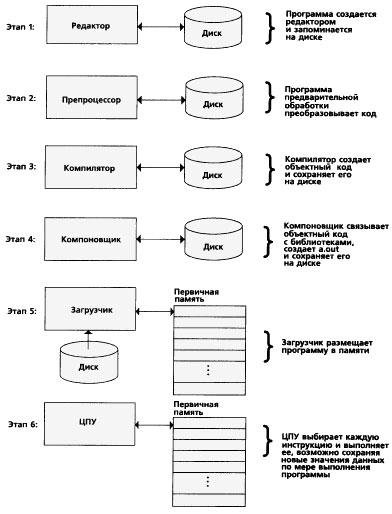
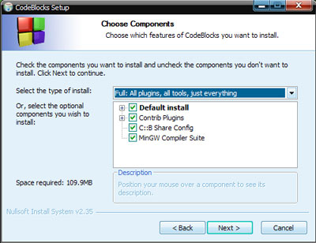
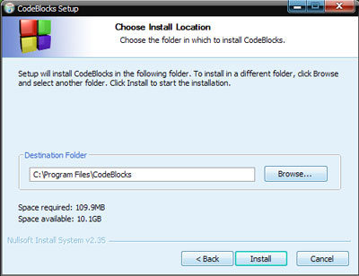
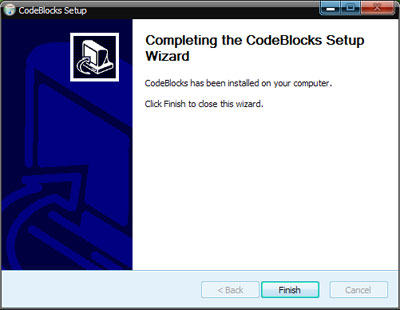

[Содержание](index.md)

# Глава 4. Что такое среда программирования - Введение в программирование
Среды программирования (или как их еще называют, среды разработки) - это программы, в которых программисты пишут свои программы. Иными словами, среда программирования служит для разработки ( написания) программ и обычно ориентируется на конкретный язык или несколько языков программирования (в этом случае языки, обычно, принадлежат одной языковой группе, например, Си-подобные). Интегрированная среда программирования содержит в себе все необходимое для разработки программ:
- редактор с подсветкой синтаксиса конкретного языка программирования. В нем программист пишет текст программы, так называемый программный код;
- компилятор. Он, как мы уже с вами знаем, транслирует программу, написанную на высокоуровневом языке программирования в машинный язык (машинный код), непосредственно понятный компьютеру. Язык С++ относится к компилируемым языкам, поэтому для обработки текстов его программ служит компилятор, иногда вместо компилятора (либо вместе с ним) используется интерпретатор, для программ, написанных на интерпретируемых языках программирования;
- отладчик. Служит для отладки программ. Как мы все знаем, ошибки в программах допускают абсолютно все: и новички, и профессионалы - они могут быть синтаксическими (обычно они выявляются еще на стадии компиляции) и логическими. Для тестирования программы и выявления в ней логических ошибок служит отладчик.

Мы рассмотрели базовую комплектацию среды программирования, но иногда в них присутствуют еще и такие компоненты, как система управления версиями, различные инструменты для конструирования графического интерфейса программы, браузер классов, инспектор объектов и другие.

### Общее описание работы среды программирования
Давайте сейчас подробно рассмотрим процесс разработки программы в среде программирования, от момента начала написания кода программы до получения скомпилированного экзешника (файла с расширением .exe), который уже можно непосредственно запускать вне среды разработки. Как правило, для того, чтобы выполнить программу на С++, надо пройти шесть этапов:
- Первый этап - редактирование;
- Второй этап - предварительная (препроцессорная) обработка;
- Третий этап - компиляция;
- Четвертый этап - компоновка;
- Пятый этап - загрузка;
- Шестой этап - выполнение.

Мы остановимся на системе С++, ориентированной на UNIX, чтобы лучше понять этот процесс. В Windows некоторые из этих этапов будут проходить автоматически без участия программиста.

**Редактирование.** Это первый этап разработки программы в среде программирования и представляет он собой редактирование файла (исходного файла, который в последствии будет содержать код программы). Он выполняется с помощью редактора программ, который напоминает нам обычный текстовый редактор, такой как блокнот, word и т.д. Программист набирает в этом редакторе свою программу на С++ и, если это необходимо, вносит в нее различные изменения или исправления. Одним словом, работает с кодом программы как с обычным текстом. Имена файлов программ на С++ часто оканчиваются расширением .с или .срр. (это вы сами сможете пронаблюдать, когда загляните в папку с проектом).

**Предварительная (препроцессорная) обработка.** На этом этапе программист дает команду компилировать программу. Но прежде чем компилятор приступит к компиляции вашей программы, производится предварительная обработка программы. Что это значит? Любая программа в С++ подчиняется специальным командам, именуемым директивами препроцессора (обычно начинаются они со специального символа "#") , которые указывают, что в программе перед ее компиляцией нужно выполнить определенные преобразования. Обычно эти преобразования состоят во включении других текстовых файлов в файл, подлежащий компиляции, и выполнении различных текстовых замен. Создается файл с расширением .i .В нашей первой программе в следующей главе уже будет присутствовать подключение такого файла с помощью директивы препроцессора.

**Компиляция.** На этом этапе компилятором проверяется текст программы на наличие синтаксических ошибок и затем, если все хорошо, текст программы с подстановками, сделанными на предыдущем этапе, преобразуется в машинный код (код на языке, уже непосредственно понятный компьютеру). Иногда его еще называют объектным. На этом этапе создается файл с расширением .obj. Также в вашей программе могут использоваться кусочки уже готового машинного кода, расположенного в иных библиотеках (например, в файлах с расширением .lib). На этапе компиляции эти библиотеки еще не будут подключены к только что созданному машинному коду. Они подключаются на следующем этапе.

**Компоновка.** Следующий этап называется компоновка. Программы на С++ обычно содержат ссылки на функции, определенные где-либо вне самой программы, например, в стандартных библиотеках или в личных библиотеках групп программистов, работающих над данным проектом. Объектный код, созданный компилятором, обычно содержит «дыры» из-за этих отсутствующих частей. Компоновщик связывает объектный код с кодами отсутствующих функций, чтобы создать исполняемый загрузочный модуль (без пропущенных частей). Получаем в итоге файл с расширением .exe (для Windows), либо .out (для Linux).

**Загрузка.** Следующий этап называется загрузка. Перед выполнением программа должна быть размещена в оперативной памяти компьютера. Это делается с помощью загрузчика, который забирает исполняемый загрузочный модуль с диска (наш файл с расширением .exe) и перемещает его в оперативную память.

**Выполнение.** И наконец, рассмотрим самый последний этап - выполнение. С этого момента компьютер под управлением своего ЦПУ (центральное процессорное устройство) начинает последовательно выполнять в каждый момент времени по одной команде программы. Эти моменты времени носят название такт, каждый процессор имеет свою тактовую частоту, которую задает его внутренний тактовый генератор. Чем более высокая частота работы вашего процессора, тем, соответственно, лучше и тем быстрее выполняются ваши программы. На маленьких программах это, конечно же, не очень ощутимо, но когда запускаете какую-нибудь новомодную игрушку, то все очень даже заметно.

### Среда CodeBlocks
Для разработки своих программ лично я использую среду программирования CodeBlocks. Вам, как начинающим советую использовать именно ее, т.к. она проста в использовании и, соответственно, лучше приемлема для начинающего программиста. В этой среде есть минимально необходимый комплект (редактор, компилятор и отладчик) для разработки программ. А сейчас займемся установкой (скачать CodeBlocks на [официальном сайте](https://www.codeblocks.org/)):

- Распаковываем скачанный архив и запускаем инсталляционный файл, соглашаемся с лицензией. В окошке выбора компонентов для установки выбираем либо standart, либо full (принципиальной разницы нет).

- Выбираем путь установки, либо оставляем по умолчанию, ставим.

- Процесс установки благополучно завершен

Запомнить:
1. Среда программирования - это программа, в которой программисты разрабатывают свои программы.
2. Основные компоненты среды программирования - это редактор, компилятор и отладчик.
3. В редакторе набирается текст программы. Редактор имеет подсветку синтаксиса конкретного языка программирования.
4. Компилятор переводит программу, набранную в редакторе, в машинный язык, непосредственно понятный компьютеру.
5. Отладчик служит для нахождения ошибок в программе. А без ошибок в программах не бывает даже у очень опытных программистов.

[Глава 5. Первая программа](chapter-5.md)
