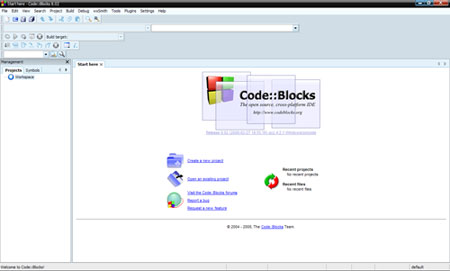
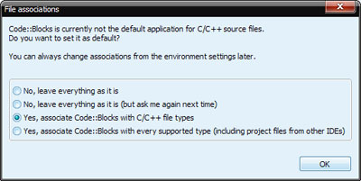
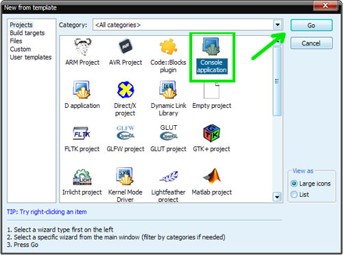
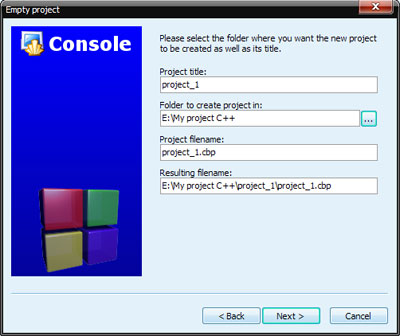
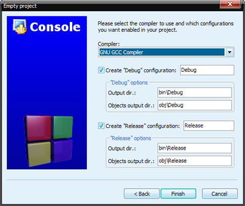
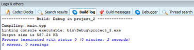
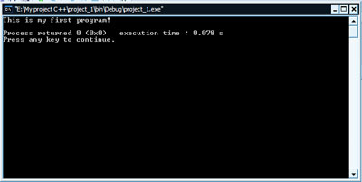

[Содержание](index.md)

# Глава 5. Первая программа или начинаем программировать - Введение в программирование
### Запуск среды и создание проекта
Запускаем нашу среду программирования CodeBlocks (через Пуск -> Все программы -> CodeBlocks -> CodeBlocks или путем щелчка по соответствующему ярлыку на рабочем столе). Главное окно программы после запуска будет иметь примерно такой вид:



При первом запуске программа выдаст сообщение-вопрос: "хотите ли вы ассоциировать файлы исходного кода на С и С++ со средой CodeBlocks", - выбираем третий вариант, т.е. ассоциировать. Впоследствии файлы с расширениями .c и .cpp будут автоматически открыты в этой среде.



Также при первом запуске может выскочить окошко-сообщение о выборе компилятора по умолчанию - оставляем все как есть по умолчанию, т.е. GNU GCC Compiler.

Итак, среда запущена и теперь можно приступать к созданию проекта. Давайте по ходу немного отвлечемся и определим для себя, что такое проект. Проект - это набор файлов, генерируемых средой программирования, необходимые для последующей компиляции программы (исходные, заголовочные, объектные файлы), а также различные вспомогательные файлы (сохраняющие рабочее пространство и др.). По умолчанию в CodeBlocks при запуске открывается стартовая страница, на которой располагаются кнопки для создания проектов, открытия через проводник, открытия последних проектов. Щелкаем по "Create a new project" (Создать новый проект). В появившемся окошке выбираем значок "Console application" и жмем GO. Таким образом мы будем с вами создавать наши проекты для построения консольных приложений на языке программирования С++.



Далее в следующем окошке жмем просто "Next" (чтобы следующий раз его не было ставим галочку), далее в следующем окне выбираем язык С++, жмем Next. Далее нас попросят ввести название проекта и папку в которой он у нас будет находиться. Предлагаю для всех проектов создать папку в корне какого-либо диска на вашем компьютере с названием "My project C++".



В следующем окошке выбора компилятора оставляем все как есть (если нет галочек, то ставим как на рисунке ниже) и жмем Finish.



Проект создан, все необходимые файлы добавлены. Структуру проекта вы можете посмотреть слева на панели "Management" (вкладка "Projects"). Здесь мы видим, что в проект (в папку "Sourses") средой автоматически добавлен файл "main.cpp" (файл, содержащий исходный код программы). В нем то мы и будем писать код нашей программы. Открываем его для редактирования в редакторе CodeBlocks (щелкаем по нему левой кнопкой мыши два раза). Заметим, что файл не пуст: среда программирования сама в него добавила заготовку программы. Делается это для облегчения работы программисту. Не будем пока что этим пользоваться, т.к. нам нужно сначала выучить как это делается самостоятельно, без помощи среды разработки.

### Ваша первая программа на С++ или начинаем программировать
Вот наконец-то и наступил тот момент истины: мы подошли вплотную к программированию и сейчас напишем свою первую программу на самом популярном и востребованном языке программирования С++. Итак, очищаем текстовое поле (Ctrl+A - выделяем все, а затем Del - удаляем). Набираем в редакторе CodeBlocks следующий текст программы (не в коем случае не копируйте текст, т.к. для того, чтобы запомнить это все, нужно ввести самому. В этом случае у вас работает еще и автоматическая память). Итак, начинаем программировать:

```cpp
#include <iostream>

using namespace std;

int main()
{
    cout << "This is my first program!" << endl;
    return 0;
}
```

Сразу привыкайте к ясности и четкости: делайте пропуски между строками (обычно отступами разделяются логические блоки программы), как показано выше и не забывайте про табуляцию. Таким образом, программа становится ясной и в ней все хорошо просматривается. Итак, набрали, это и есть текст нашей первой программы, инструкции компьютеру. Что же он должен сделать!? А давайте посмотрим. Как вы помните, программу нужно скомпилировать, построить, а затем запустить на выполнение. Все это можно сделать через меню программы, но удобнее все же делать через панель (она расположена сверху). Находим кнопочку, которая внешне напоминает шестеренку (при наведении курсора всплывает подсказка "build"), она служит для компиляции и построения проекта. Нажимаем и наблюдаем за процессом внизу на панели "Logs" (вкладка "build messages". Если панель у вас эта не видна, то нажмите клавишу F2). Если ошибок нет, то значит компиляция (проверка на синтаксические ошибки) и построение (объединение всех нужных файлов в единый объектный модуль для дальнейшего запуска) прошли успешно!



Теперь можно запустить программу на выполнение. Для этого жмем кнопочку рядом, в виде треугольника ("Run"). Должно появиться такое окошко программы, как изображено ниже.

Поздравляю вас! Это и есть ваша первая программа. Пока что она выводит всего лишь только строку на экран, но это только начало!

Можете поэксперементировать и с другими фразами, вводя их в коде программы вместо "This is my first program!".



### Устройство консольной программы на языке С++
Давайте рассмотрим устройство программы подробнее.

Первая строка - это `#include <iostream>`

`#include` - это директива препроцессора, она подключает заголовочный файл (файл с расширением .h) `iostream.h`, который содержит объявления функций и переменных для потокового ввода и вывода. Имя подключаемого модуля указывается в `<>` (когда заголовочный файл находится в каталоге \INCLUDE\ конкретной среды разработки), либо в `""` (когда заголовочный файл находится в том же каталоге, где и включающий его модуль разрабатываемой программы с расширением .cpp. Сильно не вникайте пока что в подробности, просто запомните, что заголовочные файлы с помощью директивы препроцессора будут у вас подключаться всегда, в зависимости от того, что вам нужно. В данном случае нам нужна была функция вывода на экран, которая будет рассматриваться ниже.

Вам, наверное, стало интересно, для чего так придумано. Попытаюсь объяснить...т.к. язык С++ относится к языкам высокого уровня, то многие инструкции (команды) процессору скрыты от нас, дабы облегчить жизнь программисту и ему не приходилось каждый раз программировать то, что уже придумано до него (как говорят "изобретать велосипед"). Поэтому в заголовочных файлах хранятся объявления функций (о функциях мы будем говорить в последующих главах), а мы просто пользуемся этой функцией, не зная ее реализации. Так вот и сейчас, мы будем пользоваться функцией `cout`, которая управляет потоковым выводом (в нашем случае выводит строку `"This is my first program!"` на экран).

Вторую строку (`using namespace std;`) пока что разбирать не будем, просто запомните, что она всегда должна быть.

Далее следует описание единственной в программе функции `main()`. Абсолютно любая консольная программа на языке С++ обязательно включает в себя эту функцию, именно с нее и начинается выполнение программы. Ключевое слово `int`, расположенное перед именем функции указывает на то, что по завершении своей работы функция `main` вернет операционной системе целочисленное значение. Это мы даже можем наблюдать в окне нашей с вами первой программы: ниже строки, которую мы запрограммировали на вывод, у нас среда выводит строку в которой мы видим returned 0, что означает нормальное завершение работы программы (функции `main`). Если это значение отличное от нуля, то значит, что в нашей программе есть ошибка.

Тело самой функции (оно всегда заключено между скобками `{}`) содержит строку `cout << "This is my first program! " << endl;`, в которой `cout <<` - это оператор консольного вывода последовательности символов (в нашем случае это предложение `"This is my first program!"`). И затем оператор `<< endl`, который переводит курсор на следующую строку.

Заметьте, что любая инструкция в языке С++ заканчивается точкой с запятой.

`return` - это оператор возврата из функции. `return 0` - означает, что по окончании своей работы, функция `main()` вернет значение 0.

### Запомнить:
1. Не забывайте в своих программах с помощью директивы препроцессора подключать необходимые заголовочные файлы. По мере обучения основные из них вы выучите. В конце этой строки точка с запятой не ставится, т.к. это не оператор!
2. Абсолютно любая программа на языке С++ содержит в себе функцию `main()`. Именно с нее и начинается построчное выполнение программы.
3. Тело функции `main()` (как и любых иных функций и управляющих структур в языке С++) обязательно заключается в фигурные скобки `{}`.
4. Любая инструкция в языке С++ заканчивается точкой с запятой.
5. `return` - это оператор возврата из функции.

### Выполнить самостоятельно:
Для того, чтобы лучше разобраться с функциями cout и endl предлагаю выполнить небольшое задание. Наберите программу, приведенную ниже, и попытайтесь сами разобраться со способами вывода чисел на экран. Для того, чтобы действительно разобраться с программированием, нужно как можно больше работать в среде программирования, экспериментировать, пробовать и тогда результат не заставит себя долго ждать. Проявите инициативу, измените код программы по-своему: напишите вместо цифр слова и т.д.

```cpp
// Печать чисел от 1 до 4 разными способами

#include <iostream>

using namespace std;

int main()
{
    cout << "1 2 3 4" << endl;                   // первый способ
    cout << "1 " << "2 " << "3 " << "4" << endl; // второй способ
    cout << "1 ";                                // третий способ
    cout << "2 ";
    cout << "3 ";
    cout << "4";
    return 0;
}
```

#### Примечание:
`//` - это однострочный комментарий. Он игнорируется компилятором, т.е. вы их можете писать сколь угодно и где угодно. Хороший стиль программирования обязательно предусматривает использование комментариев в программе. Первая строка программы также закомментирована и содержит в себе описание цели программы. Рекомендую всегда предерживаться этого правила в своих программах, дабы через время, не заглядывая в код, понимать цель ее написания и принципы работы отдельных частей кода программы. Другим программистам также будет понятнее разбираться в вашем коде, если в нем будут комментарии.

[Глава 6. Что такое переменная?](chapter-6.md)
