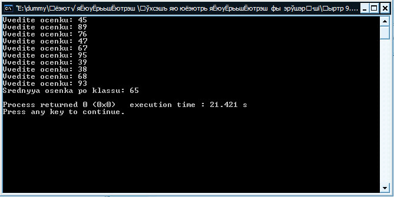

[Содержание](index.md)

# Глава 9. Все в нашей жизни циклично... цикл while, цикл for - Введение в программирование
Все в нашей жизни циклично...дни недели, месяцы, года... И в программировании тоже не обойтись без этого...

В этой главе мы с вами будем рассматривать, так называемые циклы , а именно цикл `while` и цикл `for` . Для чего они нужны? Для того, чтобы ответить на этот вопрос давайте представим себе такую ситуацию: ну к примеру вы хотите напечатать на экране свое имя ровно 20 раз. Как вы уже знаете для этого мы должны воспользоваться оператором консольного вывода (cout - поместить в поток). Вот такая строка кода должна выводить ваше имя:

```cpp
cout << "Your name" << endl;
```

Для того, чтобы вывести имя 20 раз нам нужно написать в своей программе эту строку ровно 20 раз! Хорошо, если вы решили вывести свое имя 20 раз, а не, к примеру, 100 или 1000! Конечно же, вы понимаете, что это очень накладно и нереально. В этом случае на помощь программисту приходят циклы `while` и `for`, которые позволяют выполнять определенный участок кода (в нашем случае это печать имени) столько раз, сколько мы укажем. Иными словами, пока не выполнится какое-либо условие, требуемое для завершения цикла. В нашем случае этим условием, как вы уже догадываетесь, является число 20, т.к. печатать нам нужно именно 20 раз. Рассмотрим цикл `while`.

### Операторы циклов: цикл while
#### Цикл while с предусловием
Синтаксис данного оператора цикла таков:

```cpp
while (/* условие выполнения цикла */)
{
  // оператор 1;
  // оператор 2;
  // ...
  // оператор n;
} 
```

А теперь давайте с вами запрограммируем эту программу. Итак, программа, печатающая имя, будет выглядеть так:

```cpp
#include <iostream>

using namespace std;

int main()
{
    int i;
    i = 1;
    while (i <= 20)
    {
        cout << "Your name" << endl;
        i = i + 1;
    }
    return 0;
}
```

Мы определяем переменную `i`, которая у нас будет служить счетчиком, задаем нашему счетчику начальное значение равное единице перед входом в цикл. В цикле определяем условие, при котором у нас будет он работать, т.е. выполняться заключенные в него операторы. После того, как условие перестанет выполняться, цикл завершится и программа выйдет из него и перейдет к выполнению следующих после цикла операторов (у нас это оператор `return 0;`). Как я уже сказал, для того, чтобы цикл работал должно выполняться указанное в нем условие (у нас это `i <= 20`), когда `i` становится равным 21, то операторы заключенные в тело цикла уже выполняться не будут. Естественно, программист должен обязательно позаботиться, чтобы это условие выхода из цикла когда-нибудь сработало, иначе произойдет зацикливание и программа никогда не завершиться (придется аварийно завершать ее). Для этого у нас есть счетчик, который в каждой итерации (одно выполнения цикла) увеличивает свое значение на единицу:

```cpp
i = i + 1;
```

(Небольшое отступление) Как видите здесь используется оператор присваивания. В предыдущих главах я объяснял как он работает, повторим: то, что находится от оператора присваивания (`=`) справа, считается и помещается в переменную, расположенную слева от оператора присваивания (`=`). То есть, если в предыдущей итерации (шаге выполнения цикла) `i` было равно 2, то новое значение будет с помощью данной строчки кода посчитано так:

```cpp
3 = 2 + 1;
```

Есть и сокращенная форма записи этой строки кода, которая увеличивает значение переменной на единицу:

```cpp
i++;
```

`++` - это оператор инкремента.

Рассмотренный способ использования оператора цикла `while`, называется цикл с предусловием.

#### Важно! Запомнить:
1. Циклы в программировании позволяют выполнять отдельный кусочек программы, заключенной в его тело (между `{}`), столько раз - сколько мы укажем, либо пока не наступит определенное условие его завершения.
2. Обязательно нужно предусмотреть условие выхода из цикла, иначе произойдет ошибка зацикливания программы.
3. В языке программирования С++ существует возможность увеличения значения переменной на единицу с помощью оператора инкремента (`++`).

### Операторы циклов: цикл while
#### Цикл while с постусловием
Цикл `while` с предусловием мы рассмотрели, но есть еще и второй вариант использования цикла `while` - это цикл с постусловием. Синтаксис его таков:

```cpp
do
{
  // оператор 1;
  // оператор 2;
  // ...
  // оператор n;
}
while (/* условие выполнения цикла */); // не забывайте про точку с запятой
```

В чем же разница!? Разница одна лишь в том, что тело (содержимое) такого цикла `while` выполниться как минимум один раз, т.к. условие теперь уже проверяется не в начале цикла, а в конце. Иногда в ваших программах нужно будет использовать именно такую разновидность цикла `while`. Перепишем нашу программу с использованием данной разновидности цикла `while`:

```cpp
// Операторы циклов - цикл while

#include <iostream>

using namespace std;

int main()
{
    // инициализируем переменную значением 1 при объявлении
    int i = 1;
    do
    {
        cout << "Your name" << endl;
        i++;
    }
    while (i <= 20);
    return 0;
}
```

#### Важно! Запомнить:
1. Цикл `while` бывает двух типов: с предусловием и постусловием. В первом варианте тело цикла может ни разу не выполниться, если условие начала цикла не выполняется. Во втором варианте тело цикла выполниться как минимум один раз, т.к условие начала уже второй итерации цикла проверяется не в начале, а в конце.
2. В конце цикла `while` с постусловием не забывайте ставить точку с запятой.

### Операторы циклов: цикл for
Теперь давайте рассмотрим вторую разновидность циклов, используемых в языке программирования С++ - это цикл `for`. Чем же он отличается? Главное его отличие в том, что в параметрах самого цикла можно инициализировать (объявить) переменную-счетчик, которая у нас будет считать итерации (повторения) циклов, и задать ей начальное значение, задать условие выполнения цикла и изменять значение счетчика. Синтаксис цикла for таков:

```cpp
for (/*начальное значение*/; /* условие выполнения */; /* приращение*/)
{
   // оператор 1;
   // оператор 2;
   // ...
   // оператор n;
}
```

Давайте теперь переиначим программу, печатающую ваше имя, под этот цикл. Вот что у нас получится:

```cpp
// Операторы циклов - цикл for

#include <iostream>

using namespace std;

int main()
{
    for (int i = 1; i <= 20; i++)
    {
        cout << "Your name" << endl;
    }
    return 0;
}
```

Как видите размер кода программы у нас уменьшился, стал более компактным. Легко просматриваются по параметрам цикла for наши начальные значения, условия и приращения, что очень удобно. Какими видами циклов вам удобнее пользоваться в своих программах и в каких ситуациях вы постепенно поймете на практике.

### Практические задачи по операторам циклов: цикл while
#### 1. Повторение, управляемое счетчиком. Чтобы лучше понять алгоритм работы цикла while, рассмотрим классическую задачу усреднения:
Проведен опрос класса из 10 студентов. Вам известны оценки по этому опросу (целые числа в диапазоне 0 - 100). Нужно определить среднюю оценку класса.

Конечно же, мы помним со школьного курса, что для определения среднего числа группы чисел, нужно найти общую сумму этих чисел и разделить ее на количество суммируемых чисел. Также мы поступим и с нашей задачей. Код программы смотрим ниже:

```cpp
// Проведен опрос класса из 10 студентов. Вам известны оценки по этому опросу
// (целые числа в диапазоне от 0до 100). Надо определить среднюю оценку класса

#include <iostream>

using namespace std;

int main()
{
    // объявляем необходимые переменные
    int total, counter, average, grade;
    // задаем начальные значения
    total = 0, counter = 1;
    // начинаем цикл ввода и суммирования оценок
    while (counter <= 10)
    {
        cout << "Vvedite ocenku: ";
        cin >> grade;
        if (grade <= 100)
        {
            total += grade;
            counter += 1;
        }
        else
            cout << "Vvedite osenke v intervale 0 - 100\n";
    }
    // считаем средний балл и выводим результат на экран
    average = total / 10;
    cout << "Srednyya osenka po klassu: " << average << endl;
    return 0;
}
```

Результат работы программы:



Разберем программу подробнее

Начинаем с объявления необходимых переменных: `total` - будет накапливать общую сумму баллов студентов; `counter` - является счетчиком итераций цикла `while` (в нашем случае число повторений цикла заранее известно, поэтому эту разновидность цикла еще называют повторением, управляемым счетчиком); `average` - будет содержать у нас наше искомое среднее значение; `grade` - в эту переменную будем записывать введенное пользователем значение балла.

На следующем шаге присваиваем начальные значения счетчику циклов и общей сумме баллов.

Затем организовываем цикл `while`, задав условие выполнения, в котором запрашиваем у студента его балл и сохраняем в переменную `grade`. Также в цикле предусматриваем проверку на правильность ввода данных студентами: в случае правильного ввода засчитываем балл и увеличиваем счетчик цикла на единицу, в обратном случае выводим пользователю подсказку, не засчитыаем балл и не увеличиваем счетчик, т.е. в любом случае у нас будет 10 "правильных" баллов.

Далее подсчитываем средний балл и запоминаем в переменную `average`, выводим результат на экран.

#### Примечание:

```cpp
total += grade;
counter += 1;
```

Здесь используется операция присваивания в сокращенном виде. Вначале в своих программах вы можете пользоваться полной записью присваивания, а потом уже переходить на сокращенную. Вот полная запись этих строк:

```cpp
total = total + grade;
counter = counter + 1;
```

Ну и конечно же последнюю строку, как мы уже говорили выше можно еще записать и так:

```cpp
counter++;
```

#### 2. Повторение, управляемое меткой. Давайте теперь немного модифицируем предыдущую программу, чтобы рассмотреть цикл while, управляемый не счетчиком, а меткой. В отличии от счетчика, когда количество повторений заранее известно, количество итераций цикла, управляемого меткой, заранее неизвестно. Т.е. мы можем использовать баллы скольких угодно студентов, пока не будет окончен ввод.

```cpp
// Проведен опрос класса из 10 студентов. Вам известны оценки по этому опросу
// (целые числа в диапазоне от 0до 100). Надо определить среднюю оценку класса

#include <iostream>

using namespace std;

int main()
{
    // объявляем необходимые переменные
    float average;
    int grade, counter, total;
    // задаем начальные значения
    total = 0, counter = 0;
    // запрашиваем у студента его оценку и запоминаем
    cout << "Vvedite ocenku, dlya vihoda vvedite -1\n";
    cin >> grade;
    // начинаем цикл, если не было введено -1
    while (grade != -1)
    {
        // накапливаем общее кол-во баллов
        // и засчитываем ввод
        total += grade;
        counter++;
        cout << "Vvedite ocenku, dlya vihoda vvedite -1\n";
        cin >> grade;
    }
    // проверка на ввод
    // если было введено хотя бы одно значение
    if (counter != 0)
    {
        // рассчитываем средний балл
        average = (float) total / counter;
        cout << "Srednee znacheniye: " << average << endl;
    }
    else
        // если не было введено ни одно значение
        cout << "Ocenki ne vvedeni\n";
    return 0;
}
```

В данном варианте этого алгоритма, в котором цикл `while` управляется меткой (ввод продолжается, пока метка не будет равной `-1`), студенты могут вводить сколь угодно своих оценок, пока не будет введена метка окончания ввода `-1`. Плюс в этой программе есть еще одно нововведение: теперь средний балл будет более точным, т.к. для его хранения мы объявили переменную average типа `float` (`float` - тип для хранения дробных чисел с точностью 6 - 7 знаков после запятой, в отличии от `double`, у которого 13 - 14 знаков).

(Еще раз небольшое отступление). Разберем по ходу еще один новый для вас момент:

```cpp
average = (float) total / counter;
```

В этой строке реализовано приведение типов. Что это такое и для чего служит? Мы объявили переменную `average` как `float`, но переменные `total` и `counter` у нас объявлены как `int`, а значит после операции деления, в случае, если получиться дробное число, дробная часть будет отброшена (потеряна). Для того, чтобы избежать потери нужно, чтобы делимое `total` было тоже типа `float`, а так как мы его не объявили изначально типа `float`, то приведем его сейчас к `float`.

#### 3. Теперь рассмотрим пример использования цикла while с постусловием. Запрограммируем решение вот такой задачи:
Одна большая химическая компания платит своим продавцам на основе комисионных. Продавец получает $200 в неделю плюс 9% от объема продаж за неделю. Например, продавец, который продал за неделю химикалий на $5000 получит $200 плюс 9% от $5000, то есть в итоге $650. Нужно разработать программу, которая будет вводить для каждого продавца его объем продаж за последнюю неделю, рассчитывать и выводить на экран его заработок. Данные должны вводиться поочередно для каждого продавца.

Приступим к программированию. Вот такая программа будет выполнять поставленную задачу:

```cpp
// Работаем с циклом while (вариант с постусловием)

#include <iostream>

using namespace std;

int main()
{
    // объявляем необходимые переменные
    float prodashi, zarabotok;
    // запрашиваем ввод и сохраняем значение
    cout << "Vvedite ob'yom prodash: $";
    cin >> prodashi;
    // начинаем цикл с постусловием
    do
    {
        // считаем заработок и выводим его на экран
        zarabotok = 200 + (prodashi * 9 / 100);
        cout << "Zarobotok: $" << zarabotok << endl << endl;
        // запрашиваем ввод и сохраняем значение
        cout << "Vvedite ob'yom prodash (dlya vihoda vvedite -1): $";
        cin >> prodashi;
    }
    while (prodashi != -1);
    return 0;
}
```

Результат работы программы:


#### 4. Цикл for. Решим вот такую вот задачу:
Программа последовательно запрашивает у пользователя десять чисел и находит максимальное из них. Выводит результат на экран

```cpp
// Программа последовательно запрашивает у пользователя десять чисел,
// находит максимальное и печатает результат

#include <iostream>

using namespace std;

int main()
{
    int counter;
    float number, largest;
    // запрашиваем первое число, запоминаем его
    cout << "Inter: ";
    cin >> largest;
    // запрашиваем остальные девять чисел в цикле for
    for (counter = 1; counter <= 9; counter++)
    {
        cout << "Inter: ";
        cin >> number;
        // если вновь введенное число больше, то перезаписываем max
        if (number > largest)
            largest = number;
    }
    cout << endl << "Max: " << largest << endl;
    return 0;
}
```

Результат работы программы:


[Глава 10. Оператор break](chapter-10.md)
