[Содержание](index.md)

# Практика программирования. Часть 1
Я Вас поздравляю! Вы подошли вплотную к самому важному этапу - это практика программирования. Надеюсь, что вы внимательно прочли первые одиннадцать глав моего учебника, поэксперементировали со всеми исходными кодами программ, описанными в этих главах и у вас получилось. Теперь мы закрепим пройденный материал практикой. Все задания по практике программирования построены по принципу от простого к сложному, поэтому выполнять их нужно строго последовательно. Итак, приступим.

#### Задание № 1
Напишите программу, которая просит пользователя ввести два числа, получает числа от пользователя и затем печатает сумму, произведение, разность и частное этих чисел.

```cpp
// Программа просит пользователя ввести два числа,
// получает числа от пользователя и затем печатает
// сумму, произведение, разность и частное этих чисел

#include <iostream>

using namespace std;

int main()
{
    // объявляем переменные для хранения двух чисел
    int a, b;
    // запрашиваем у пользователя ввод двух чисел
    cout << "Vvedite poshaluyasta dva chisla" << endl;
    // последовательно считываем их из потока ввода и сохраняем
    cin >> a >> b;
    cout << "Summa " << a << " i " << b << " ravna " << a + b << endl;
    cout << "Raznost' " << a << " i " << b << " ravna " << a - b << endl;
    cout << "Rroizvedeniye " << a << " i " << b << " ravno " << a * b << endl;
    cout << "Chastnoye " << a << " i " << b << " ravno " << a / b << endl;
    return 0;
}
```

Результат работы программы:

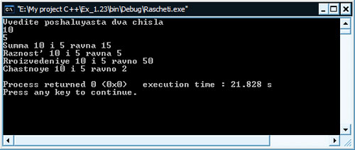

#### Задание № 2
Напишите программу, которая печатает числа от 1 до 4 на одной и той же строке, так что соседние числа разделены одним пробелом. Напишите программу, используя следующие способы:  
а) Используя один оператор вывода с одним оператором поместить в поток.  
b) Используя один оператор вывода с четырьмя операторами поместить в поток.  
c) Используя четыре оператора вывода.

```cpp
// Печать чисел от 1 до 4 различными способами

#include <iostream>

using namespace std;

int main()
{
    cout << "1 2 3 4" << endl; // первый способ;
    cout << "1 " << "2 " << "3 " << "4" << endl; // второй способ;
    cout << "1 "; // третий способ;
    cout << "2 ";
    cout << "3 ";
    cout << "4";
    return 0;
}
```

Результат работы программы:

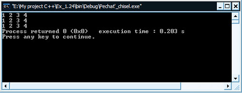

#### Задание № 3
Напишите программу, которая просит пользователя ввести два числа, получает числа от пользователя и затем печатает большее число после слова "больше". Если числа равны, напечатайте сообщение "Эти числа равны".

```cpp
// Программа просит пользователя ввести два числа,
// получает числа от пользователя и затем печатает
// большее число после слова "больше". Если числа равны,
// напечатайте сообщение "Эти числа равны"

#include <iostream>

using namespace std;

int main()
{
    int x, y;
    cout << "Vvedite dva chisla\n";
    cin >> x >> y;
    if (x > y)
        cout << "\nbolshe " << x << endl;
    if (y > x)
        cout << "\nbolshe " << y << endl;
    if (x == y)
        cout << "\nEti chisla ravni" << endl;
    return 0;
}
```

Результат работы программы:

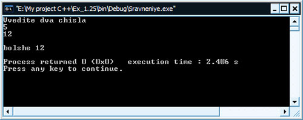

#### Задание № 4
Напишите программу, которая вводит три целых числа с клавиатуры и печатает сумму, среднее значение, произведение, меньшее и большее из этих чисел. Диалог на экране должен выглядеть следующим образом:

```
Введите три различных целых числа: 13 27 14  
Сумма равна 54  
Среднее значение равно 18  
Произведение равно 4914  
Наименьшее равно 13  
Наибольшее равно 27
```

```cpp
// Программа вводит три различных числа с клавиатуры,
// затем печатает сумму, среднее значение, произведение,
// меньшее и большее из этих чисел

#include <iostream>

using namespace std;

int main()
{
    int x, y, z;
    cout << "Vvedite tri razlichnig celih chisla: \n";
    cin >> x >> y >> z;
    cout << "Summa ravna " << x + y + z << endl;
    cout << "Srednee znacheniye ravno " << (x + y + z) / 3 << endl;
    cout << "Proizvedenie ravno " << x * y * z << endl;
    if (x > y)
        if (x > z)
            cout << "Naibolshee ravno " << x << endl;
    if (y > x)
        if (y > z)
            cout << "Naibolshee ravno " << y << endl;
    if (z > x)
        if (z > y)
            cout << "Naibolshee ravno " << z << endl;
    if (x < y)
        if (x < z)
            cout << "Naimenshee ravno " << x << endl;
    if (y < x)
        if (y < z)
            cout << "Naimenshee ravno " << y << endl;
    if (z < x)
        if (z < y)
            cout << "Naimenshee ravno " << z << endl;
    return 0;
}
```

Результат работы программы:

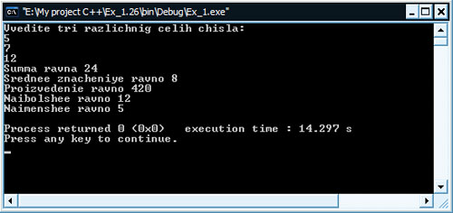

#### Задание № 5
Напишите программу, которая считывает радиус круга и печатает диаметр круга, длину окружности и площадь. Используйте значение константы `3.14159` для числа `p`. Выполните эти вычисления в операторе вывода. (Замечание: константа в отличие от переменной не может изменять свое значение на протяжении работы программы. Для этого в языке программирования С++ предусмотрен спецификатор `const`, которые запрещает изменение константного значения. В случае его изменения в коде программы, компилятор выдает ошибку еще на стадии компиляции программы. Константа объявляется также как и переменная, только перед объявлением добавляется ключевое слово `const`. Например:

```cpp
const float p = 3.14159
// значение p не может быть изменено
```

Константа дробного типа с обычной точностью (6-ть знаков после запятой)).

```cpp
// Программа считывает радиус круга и печатает
// диаметр круга, длину окружности и площадь

#include <iostream>

using namespace std;

int main()
{
    const float p = 3.14159;
    float radius;
    cout << "Vvedite radius kruga: \n";
    cin >> radius;
    cout << "Diametr kruga raven " << 2 * radius << endl;
    cout << "Dlina okrushnosti ravna " << 2 * p * radius << endl;
    cout << "Ploshad' kruga ravna " << p * radius * radius << endl;
    return 0;
}
```

Результат работы программы:

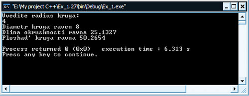

#### Задание № 6
Напишите программу, которая печатает прямоугольник, овал, стрелу и ромб в следующем виде

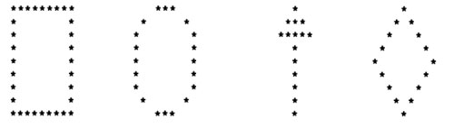

```cpp
// Программа печатает прямоугольник, овал, стрелу и ромб

#include <iostream>

using namespace std;

int main()
{
    cout << " ********* " << "    ***    " << "    *    " << "     *     " << endl;
    cout << " *       * " << "  *     *  " << "   ***   " << "    * *    " << endl;
    cout << " *       * " << " *       * " << "  *****  " << "   *   *   " << endl;
    cout << " *       * " << " *       * " << "    *    " << "  *     *  " << endl;
    cout << " *       * " << " *       * " << "    *    " << " *       * " << endl;
    cout << " *       * " << " *       * " << "    *    " << "  *     *  " << endl;
    cout << " *       * " << " *       * " << "    *    " << "   *   *   " << endl;
    cout << " *       * " << "  *     *  " << "    *    " << "    * *    " << endl;
    cout << " ********* " << "    ***    " << "    *    " << "     *     " << endl;
    return 0;
}
```

Результат работы программы:

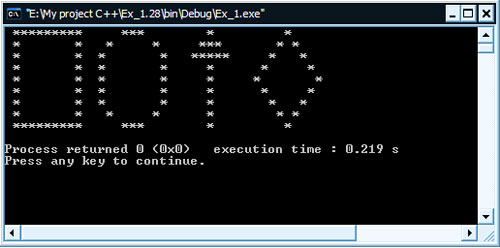

#### Задание № 7
Напишите программу, которая считывает пять целых чисел, определяет и печатает наибольшее и наименьшее из них. Используйте только те приемы программирования, которые мы с вами изучили в предыдущих главах учебника (Подсказка: используйте вложенные конструкции оператора `if`)

```cpp
// Программа считывает пять целых чисел,
// определяет и печатает наибольшее и наименьшее из них

#include <iostream>

using namespace std;

int main()
{
    int a, b, c, d, e;
    cout << "Vvedite 5 celih chisel\n";
    cin >> a >> b >> c >> d >> e;
    if (a > b)
        if (a > c)
            if (a > d)
                if (a > e)
                    cout << "Naibolshee chislo " << a << endl;
    if (b > a)
        if (b > c)
            if (b > d)
                if (b > e)
                    cout << "Naibolshee chislo " << b << endl;
    if (c > a)
        if (c > b)
            if (c > d)
                if (c > e)
                    cout << "Naibolshee chislo " << c << endl;
    if (d > a)
        if (d > b)
            if (d > c)
                if (d > e)
                    cout << "Naibolshee chislo " << d << endl;
    if (e > a)
        if (e > b)
            if (e > c)
                if (e > d)
                    cout << "Naibolshee chislo " << e << endl;
    if (a < b)
        if (a < c)
            if (a < d)
                if (a < e)
                    cout << "Naimenshee chislo " << a << endl;
    if (b < a)
        if (b < c)
            if (b < d)
                if (b < e)
                    cout << "Naimenshee chislo " << b << endl;
    if (c < a)
        if (c < b)
            if (c < d)
                if (c < e)
                    cout << "Naimenshee chislo " << c << endl;
    if (d < a)
        if (d < b)
            if (d < c)
                if (d < e)
                    cout << "Naimenshee chislo " << d << endl;
    if (e < a)
        if (e < b)
            if (e < c)
                if (e < d)
                    cout << "Naimenshee chislo " << e << endl;
    return 0;
}
```

Результат работы программы:

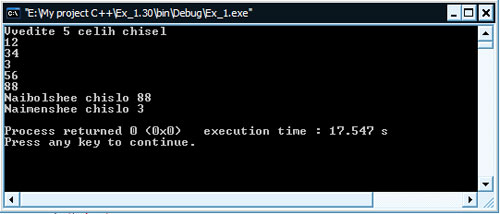

#### Задание № 8
Напишите программу, которая считывает целое число, определяет и печатает, четное оно или нечетное. (Подсказка: Используйте операцию вычисления остатка. Четное число кратно двум. Любое число, кратное двум, при делении на 2 дает в остатке нуль.).

```cpp
// Программа считывает целое число и опеределяет его четность либо нечетность

#include <iostream>

using namespace std;

int main()
{
    int chislo, ostatok;
    cout << "Vvedite celoe chislo: ";
    cin >> chislo;
    ostatok = chislo % 2;
    if (ostatok == 0)
        cout << "Chislo " << chislo << " chetnoye\n";
    if (ostatok != 0)
        cout << "Chislo " << chislo << " nechetnoye\n";
    return 0;
}
```

Результат работы программы:

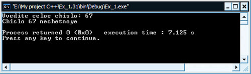

#### Задание № 9
Напишите программу, которая считывает два целых числа, определяет и печатает, является ли первое число кратным второму. (Подсказка: используйте операцию вычисления остатка)

```cpp
// Программа, определяющаяя кратность двух чисел

#include <iostream>

using namespace std;

int main()
{
    int intChislo1, intChislo2, ostatok;
    cout << "Vvedite dva celih chisla\n";
    cin >> intChislo1 >> intChislo2;
    if (intChislo1 > intChislo2)
        ostatok = intChislo1 % intChislo2;
    if (intChislo1 < intChislo2)
        ostatok = intChislo2 % intChislo1;
    if (ostatok == 0)
        cout << "Chisla kratniye\n";
    if (ostatok != 0)
        cout << "Chisla nekratniye\n";
    return 0;
}
```

Результат работы программы:

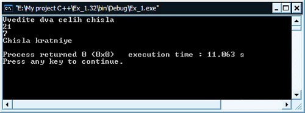

#### Задание № 10
Отобразите модель шахматной доски восемью операторами вывода и затем отобразите ту же модель наименьшим возможным количеством операторов вывода:

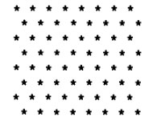

```cpp
// Отобразить модель шахматной доски двумя способами

#include <iostream>

using namespace std;

int main()
{
    cout << "* * * * * * * * " << endl;
    cout << " * * * * * * * * " << endl;
    cout << "* * * * * * * * " << endl;
    cout << " * * * * * * * * " << endl;
    cout << "* * * * * * * * " << endl;
    cout << " * * * * * * * * " << endl;
    cout << "* * * * * * * * " << endl;
    cout << " * * * * * * * * " << endl << endl;
    cout << "* * * * * * * *" << endl
         << " * * * * * * * *" << endl
         << "* * * * * * * *" << endl
         << " * * * * * * * *" << endl
         << "* * * * * * * *" << endl
         << " * * * * * * * *" << endl
         << "* * * * * * * *" << endl
         << " * * * * * * * *" << endl << endl;

    return 0;
}
```

Результат работы программы:

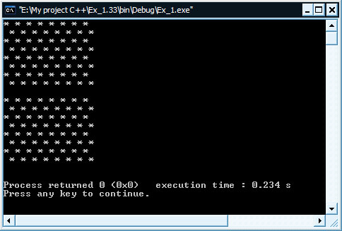

#### Задание № 11
Заглянем вперед. В предшествующих главах учебника вы узнали о целых числах и типе `int`. C++ может также представлять прописные и строчные буквы и значительное многообразие специальных символов. Для представления каждого отдельного символа С++ использует небольшие целые числа. Компьютер использует множество символов и соответствующие целые представления для этих символов называются набором символов компьютера. Вы можете напечатать символ, просто заключив его в одиночные кавычки

```cpp
cout << 'A';
```

Вы можете напечатать целочисленный эквивалент символа, записав перед ним (`int`) - это называется приведением к типу.

```cpp
cout << (int) 'A';
```

Когда выполняется предшествующий оператор, он печатает значение 65 (в системе, которая использует так называемый набор символов ASCII). Напишите программу, которая печатает целочисленные эквиваленты ряда прописных и строчных букв, цифр и специальных символов. Как минимум, определите целочисленные эквиваленты следующих символов: A B C a b c 0 1 2 $ * + / и пробела.

```cpp
// Программа печатает целочисленные эквиваленты ряда строчных и прописных симолов, а токже цифр и спецсимволов

#include <iostream>

using namespace std;

int main()
{
    cout << "A - " << (int) 'A' << endl;
    cout << "B - " << (int) 'B' << endl;
    cout << "C - " << (int) 'C' << endl;
    cout << "a - " << (int) 'a' << endl;
    cout << "b - " << (int) 'b' << endl;
    cout << "c - " << (int) 'c' << endl;
    cout << "0 - " << (int) '0' << endl;
    cout << "1 - " << (int) '1' << endl;
    cout << "2 - " << (int) '2' << endl;
    cout << "$ - " << (int) '$' << endl
         << "* - " << (int) '*' << endl
         << "+ - " << (int) '+' << endl
         << "/ - " << (int) '/' << endl
         << "Probel - " << (int) ' ' << endl;
    return 0;
}
```

Результат работы программы:

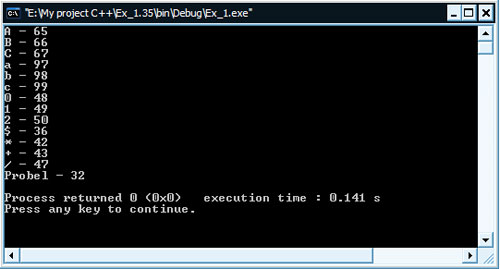

#### Задание № 12
Напишите программу, которая вводит число из пяти цифр, разделяет число на отдельные цифры и печатает их отдельно друг от друга с тремя пробелами между ними. Например, если пользователь вводит в программу 42339, то должно быть напечатано

```
4   2   3   3   9
```

```cpp
// Программа вводит число из пяти цифр,
// разделяет его на отдельные цифры и печатает их
// отдельно друг от друга с тремя пробелами между ними

#include <iostream>

using namespace std;

int main()
{
    int var;
    cout << "Vvedite chislo is 5 cifr: ";
    cin >> var;
    cout << var / 10000 << "   ";
    var %= 10000;
    cout << var / 1000 << "   ";
    var %= 1000;
    cout << var / 100 << "   ";
    var %= 100;
    cout << var / 10 << "   ";
    var %= 10;
    cout << var / 1 << "   ";
    return 0;
}
```

Результат работы программы:

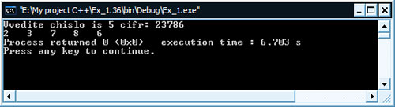

[Перейти ко второй части практики](practice-11-2.md)
