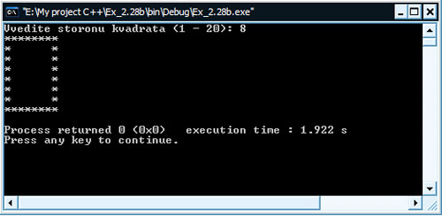

[Содержание](index.md)

# Практика программирования. Часть 2
Итак, первый этап практики программирования пройден, в нем мы решали задачи, связанные с управляющими структурами и операторами вывода. Во второй части нашей практики мы будем решать задачи, связанные в основном с циклическими структурами программирования. Ну что ж, приступим!

#### Задание № 1
Из-за высокой цены бензина водители озабочены затратами топлива своих автомобилей. Один водитель взял в рейс несколько емкостей бензина, записывая пройденные мили и бензин, использованный из каждой емкости. Разработайте программу на С++, которая вводила бы пробег в милях и бензин, использованный из каждой емкости. Программа должна рассчитывать и выводить на экран число миль на галлон для каждой емкости. После ввода исходных данных программа должна рассчитать и напечатать значение среднего числа миль на галлон, полученное для всех емкостей. Пример вывода:

```
Введите расход бензина (-1, если ввод закончен): 12.8
Введите пройденный путь: 287
Для этой емкости получено миль / галлон 22.421875

Введите расход бензина (-1, если ввод закончен): 10.3
Введите пройденный путь: 200
Для этой емкости получено миль / галлон 19.417475

Введите расход бензина (-1, если ввод закончен): 5
Введите пройденный путь: 120
Для этой емкости получено миль / галлон 24.000000

Введите расход бензина (-1, если ввод закончен): -1

Средний расход бензина 21.601423
```

```cpp
// Программа рассчитывает расход топлива на милю пройденного пути

#include <iostream>

using namespace std;

int main()
{
    int i;
    float rashod, rasstoyaniye, total, sum = 0;
    // начинаем цикл ввода
    // условие выхода из цикла задаем в самом цикле
    for (i = 0; ; i++)
    {
        // запрашиваем расход и сохраняем в переменную rashod
        cout << "Vvedite rashod benzina (dlya vihoda vvedite -1): ";
        cin >> rashod;
        // проверка введенного значения
        // если пользователь ввел нуль, то возвращаемся на начало цикла
        // если ввел -1, то выходим из цикла
        if (rashod == 0)
            continue;
        if (rashod == -1)
            break;
        // запрашиваем пройденный путь и сохраняем в переменную rasstoyaniye
        cout << "Vvedite proydenniy put': ";
        cin >> rasstoyaniye;
        // рассчитываем число миль на галлон бензина, выводим на экран
        total = rasstoyaniye / rashod;
        cout << "Dlya etoy emkosti policheno mil': " << total << endl << endl;
        // добавляем найденной значение в общую сумму, нужно для нахождения среднего
        sum += total;
    }
    // Рассчитываем среднее и выводим на экран
    cout << "\nSredniy rashod benzina: " << sum / i << endl;
    return 0;
}
```

Результат работы программы:


#### Задание № 2
Разработайте программу на С++, которая будет определять, не превысили ли расходы клиента, имеющего депозитный счет, предела кредита. Для каждого клиента известны следующие данные:

1. Номер счета (целое).
2. Баланс с начала месяца.
3. Сумма всех расходов данного клиента в течение месяца.
4. Сумма всех приходов на счет данного клиента в течение месяца.
5. Допустимый размер кредита.

Программа должна ввести все эти данные, рассчитать новый баланс (равный начальному балансу + расход - приход) и определить, не превысил ли новый баланс предела кредита клиента. Для того клиента, чей кредит превышен, программа должна вывести на экран номер счета клиента, предел кредита, новый баланс и сообщение «Предел кредита превышен». Например:

```
Введите номер счета (-1, если ввод закончен) :   100
Введите начальный баланс:   5394.78
Введите сумму расходов:   1000.00
Введите сумму прихода:   500.00
Введите предел кредита:   5500.00
Счет:   100
Предел кредита:   5500.00
Баланс:   5894.78
Предел кредита превышен

Введите номер счета (-1, если ввод закончен) :   200
Введите начальный баланс:   1000.00
Введите сумму расходов:   123.45
Введите сумму прихода:   321.00
Введите предел кредита:   1500.00

Введите номер счета (-1, если ввод закончен) :   300 
Введите начальный баланс:   500.00 
Введите сумму расходов:   274.73 
Введите сумму прихода:   100.00 
Введите предел кредита:   800.00

Введите номер счета (-1, если ввод закончен) :   -1
```

```cpp
// Программа определяет, не превысили ли расходы клиента, имеющего депозитный счет,
// кредит, который у него имеется.
// Входные данные: номер счета, баланс с начала месяца, сумма всех расходов,
// сумма всех приходов, допустимый размер кредита

#include <iostream>

using namespace std;

int main()
{
    int schet;
    float balans, rashod, prihod, predel;
    cout << "Vvedite nomer scheta (dlya okonchaniya vvedite -1): ";
    cin >> schet;
    while (schet != -1)
    {
        cout << "Vvedite nachalniy balans: ";
        cin >> balans;
        cout << "Vvedite summu rashodov: ";
        cin >> rashod;
        cout << "Vvedite summu prihoda: ";
        cin >> prihod;
        cout << "Vvedite predel kredita: ";
        cin >> predel;
        balans = balans + rashod - prihod;
        if (balans > predel)
        {
            cout << "Schet: " << schet << endl;
            cout << "Predel kredita: " << predel << endl;
            cout << "Balans: " << balans << endl;
            cout << "Predel kredita previshen!!!" << endl << endl;
        }
        cout << endl << "Vvedite nomer scheta (dlya okonchaniya vvedite -1): ";
        cin >> schet;
    }
    return 0;
}
```

Результат работы программы:


#### Задание № 3
Одна большая химическая компания платит своим продавцам на основе комиссионных. Продавец получает $200 в неделю плюс 9% от объема продаж за неделю. Например, продавец, который продал за неделю химикалий на $5000 получит $200 плюс 9% от $5000, то есть всего $650. Разработайте программу на С++, которая должна вводить для каждого продавца объем его продаж за последнюю не­делю, рассчитывать и выводить на экран его заработок. Данные вводятся поочередно для каждого продавца. Например:

```
Введите объем продаж в долларах (-1, если ввод закончен):
5000.00
Заработок:        $650.00

Введите   объем   продаж  в   долларах     (-1,   если  ввод    закончен):
1234.56
Заработок:        $311.11

Введите   объем   продаж  в   долларах    (-1,   если   ввод    закончен):
1088.89
Заработок:        $298.00

Введите объем продаж в долларах (-1, если ввод закончен):  -1
```

```cpp
// Работаем с циклом while (вариант с постусловием)

#include <iostream>

using namespace std;

int main()
{
    // объявляем необходимые переменные
    float prodashi, zarabotok;
    // запрашиваем ввод и сохраняем значение
    cout << "Vvedite ob'yom prodash (dlya vihoda vvedite -1): " << endl;
    cin >> prodashi;
    // начинаем цикл с постусловием
    do
    {
        // считаем заработок и выводим его на экран
        zarabotok = 200 + (prodashi * 9 / 100);
        cout << "Zarobotok: $" << zarabotok << endl << endl;
        // запрашиваем ввод и сохраняем значение
        cout << "Vvedite ob'yom prodash (dlya vihoda vvedite -1): " << endl;
        cin >> prodashi;
    }
    while (prodashi != -1);
    return 0;
}
```

Результат работы программы:


#### Задание № 4
Разработайте программу на С++, которая должна определять заработную плату для каждого из нескольких служащих. Компания выплачивает каждому служащему повременную зарплату за первые 40 часов работы и выплачивает в полуторном размере за все рабочие часы сверх 40. Вам дан список сотрудников компании, число часов, отработанных каждым за последнюю неделю, и почасовая ставка каждого сотрудника. Программа должна ввести эти данные для каждого сотрудника, рассчитать и вывести на экран его суммарную зарплату. Например:

```
Введите число рабочих часов   (-1,    если ввод закончен)    : 39 
Введите почасовую ставку работника    ($00.00) : 10.00 
Зарплата:        $390.00

Введите число рабочих часов   (-1,    если ввод закончен)    : 40 
Введите  почасовую ставку работника    ($00.00): 10.00 
Зарплата:        $400.00

Введите число рабочих часов   (-1,    если ввод закончен)    : 41 
Введите  почасовую ставку работника    ($00.00): 10.00 
Зарплата:        $415.00

Введите  число рабочих часов   (-1,   если ввод закончен)    : -1 
```

```cpp
// Программа для определения заработной платы служащих

#include <iostream>

using namespace std;

int main()
{
    float chasi, stavka, zarplata;
    cout << "Vvedite chislo rabochih chasov (-1, esli vihod): ";
    cin >> chasi;
    while (chasi != -1)
    {
        cout << "Vvedite pochasovuyu stavku rabotnika: $";
        cin >> stavka;
        if (chasi <= 40)
            zarplata = chasi * stavka;
        else
            zarplata = (40 * stavka) + (chasi - 40) * (stavka * 1.5);
        cout << "Zarplata: $" << zarplata << endl << endl;
        cout << "Vvedite chislo rabochih chasov (-1, esli vihod): ";
        cin >> chasi;
    }
    return 0;
}
```

Результат работы программы:


#### Задание № 5
Во многих компьютерных приложениях часто используется поиск максимального числа, (т.е. максимального из заданной группы чисел). Например, программа, которая определяет победителя соревнования продавцов, должна вводить объемы продаж каждого продавца. Тот, у кого объем продаж выше, является победителем. Напишите псевдокод программы (код на понятном человеку языке), а затем и саму программу на С++, которая вводит последовательно 10 чисел, определяет наибольшее из них и печатает его значение. Подсказка: ваша программа должна использовать следующие три переменные:

`counter`: счетчик для счета до 10 (для хранения количества введенных чисел и определения момента, когда введены все 10 чисел).
`number`: текущее введенное число.
`largest`: максимальное найденное число.

```cpp
// Программа последовательно запрашивает у пользователя десять чисел,
// находит максимальное и печатает результат

#include <iostream>

using namespace std;

int main()
{
    int counter;
    float number, largest;
    cout << "Inter: ";
    cin >> largest;
    for (counter = 1; counter <= 9; counter++)
    {
        cout << "Inter: ";
        cin >> number;
        if (number > largest)
            largest = number;
    }
    cout << endl << "Max: " << largest << endl;
    return 0;
}
```

Результат работы программы:


#### Задание № 6
Напишите программу на С++, использующую цикл и управляющую последовательность табуляции `\t` для печати следующей таблицы значений:

| N  | 1O\*N  | 100\*N  | 1000\*N  |
|----|--------|---------|----------|
| 1  | 10     | 100     | 1000     |
| 2  | 20     | 200     | 2000     |
| 3  | 30     | 300     | 3000     |
| 4  | 40     | 400     | 4000     |
| 5  | 50     | 500     | 5000     |

```cpp
// Программа, использующая цикл и управляющую последовательность табуляции \t для печати таблицы значений;

#include <iostream>

using namespace std;

int main()
{
    for (int i = 1; i <= 5; i++)
        cout << i << "\t" << i * 10 << "\t" << i * 100 << " \t" << i * 1000 << endl;
    return 0;
}
```

Результат работы программы:


#### Задание № 7
Используя подход задание № 5, найдите два наибольших значения из 10 чисел. Указание: вы можете ввести каждое число только один раз.

```cpp
// Программа последовательно вводит десять чисел,
// находит два максимальных из них и печатает результат

#include <iostream>

using namespace std;

int main()
{
    // счетчик для подсчета количества введенных чисел и
    // определения момента ввода последнего числа
    int counter;
    // выделяем область в памяти для переменных, которые хранят
    // введенное текущее число и максимально найденное
    float number, largest, largest2;
    cout << "Inter: ";
    cin >> largest;
    cout << "Inter: ";
    cin >> largest2;
    if (largest < largest2)
    {
        float tmp;
        tmp = largest;
        largest = largest2;
        largest2 = tmp;
    }
    for (counter = 1; counter <= 8; counter++)
    {
        cout << "Inter: ";
        cin >> number;
        if (number > largest)
        {
            largest2 = largest;
            largest = number;
        }
        else if (number > largest2)
            largest2 = number;
    }
    cout << endl << "Max1: " << largest << endl;
    cout << endl << "Max2: " << largest2 << endl;
    return 0;
}
```

#### Задание № 8
Напишите программу, которая читает размер стороны квадрата и затем печатает звездочками и пробелами пустой квадрат заданного размера. Ваша программа должна работать для любых размеров, заданных в интервале 1—20. Например, если программа прочла размер 5, она должна напечатать:

```
*****
*   *
*   *
*   *
*****
```

```cpp
// Программа читает длину стороны квадрата
// и печатает его звездочками и пробелами

#include <iostream>

using namespace std;

int main()
{
    int side;
    cout << "Vvedite storonu kvadrata (1 - 20): ";
    cin >> side;
    for (int i = 1; i <= side; i++)
    {
        for (int j = 1; j <= side; j++)
        {
            if (i == 1 || i == side)
                cout << '*';
            else
            {
                if (j == 1 || j == side)
                    cout << '*';
                else
                    cout << ' ';
            }
        }
        cout << endl;
    }
    return 0;
}
```

Результат работы программы:



#### Задание № 9
Палиндром — число или текст, который одинаково читается слева направо и справа налево. Например, каждое из следующих пятизначных целых чисел является палиндромом: 12321, 55555, 45554 и 11611. Напишите программу, которая читает пятизначные целые и определяет, являются ли они палиндромами. (Подсказка: используйте операции деление и вычисления остатка, чтобы выделить из числа отдельные разряды.)

```cpp
// Программа читает пятизначные целые числа и
// определяет, являются ли они палиндромами

#include <iostream>

using namespace std;

int main()
{
    int integer, a, b, c, d, e;
    cout << "Vvedite celoye 5-znachnoye chislo: ";
    cin >> integer;
    if (integer >= 10000 && integer <= 99999)
    {
        a = integer / 10000;
        integer %= 10000;
        b = integer / 1000;
        integer %= 1000;
        c = integer / 100;
        integer %= 100;
        d = integer / 10;
        integer %= 10;
        e = integer / 1;
        if (a == e && b == d)
            cout << "Eto Palindrom!" << endl;
        else
            cout << "Ne Palindrom!" << endl;
    }
    else
        cout << "Vi vveli nevernoye chislo\n";
    return 0;
}
```

Результат работы программы:


#### Задание № 10
Введите целые данные, содержащие только нули и единицы (т.е. «двоичные» целые), и напечатайте их десятичный эквивалент. (Подсказка. Используйте операции деление и вычисления остатка, чтобы «отрывать» разряды «двоичного» числа по одному справа налево. В десятичной системе самая правая цифра имеет позиционное значение 1, следующая цифра слева имеет позиционное значение 10, затем 100, затем 1000 и т.д.; в двоичной системе чисел самая правая цифра имеет позиционное значение 1, следующая цифра слева имеет позиционное значение 2, затем 4, затем 8 и т.д. Таким образом, десятичное число 234 может быть представлено как 4\*1 + 3\*10 + 2\*100. Десятичным эквивалентом двоичного 1101 является 1\*1 + 0\*2 + 1\*4 + 1\*8 или 1 + 0 + 4 + 8 или 13.)

```cpp
// Программа определяет десятичный эквивалент
// двоичного числа

#include <iostream>

using namespace std;

int main()
{
    int var, result = 0;
    cout << "Vvedite dvoichnoye chislo: ";
    cin >> var;
    for (int r = 1; var > 0; r *= 2)
    {
        result += (var % 10) * r;
        var /= 10;
    }
    cout << "Desyatichniy ekvivalent raven: " << result << endl;
    return 0;
}
```

Результат работы программы:


#### Задание № 11
Напишите программу, которая выводит на экран следующий шаблон шахматной доски:

```
*  *  *  *  *  *  *  *
 *  *  *  *  *  *  *  *
*  *  *  *  *  *  *  *
 *  *  *  *  *  *  *  *
*  *  *  *  *  *  *  *
 *  *  *  *  *  *  *  *
*  *  *  *  *  *  *  *
 *  *  *  *  *  *  *  *
```

Ваша программа может использовать только три оператора вывода:

один вида

```cpp
cout << "* ";
```

один вида

```cpp
cout << ' ';
```

и один вида

```cpp
cout << endl;
```

```cpp
// Программа выводит на экран шаблон шахматной доски.
// Эта программа использует только три оператора вывода:
// cout << "* ";
// cout << ' ';
// cout << endl;

#include <iostream>

using namespace std;

int main()
{
    for (int i = 1; i <= 10; i++)
    {
        for (int j = 1; j <= 10; j++)
            cout << "* ";
        cout << endl;
        if (i % 2 != 0)
            cout << ' ';
    }
    return 0;
}
```

Результат работы программы:


#### Задание № 12
Напишите программу, которая читает радиус (как значение типа `float`), рассчитывает и печатает диаметр, длину окружности и площадь круга. Для `p` используйте значение `3.14159`.

```cpp
// Программа читает радиус, рассчитывает и печатает
// диаметр, длину окружности и площадь круга

#include <iostream>

using namespace std;

int main()
{
    const float p = 3.14159;
    float radius;
    cout << "Vvedite radius kruga, metrov: ";
    cin >> radius;
    cout << endl << "Diametr: " << 2 * radius << " metrov" << endl;
    cout << "Dlina okrushnosti: " << p * 2 * radius << " metrov" << endl;
    cout << "Ploshad' kruga: " << p * radius * radius << " metrov kv." << endl;
    return 0;
}
```

[Перейти к третьей части практики](practice-11-3.md)
