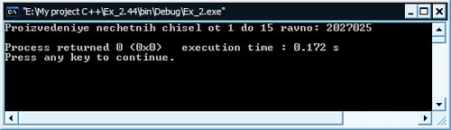

[Содержание](index.md)

# Практика программирования. Часть 3
Продолжаем проходить практику по программированию. В этой части практики продолжаем решать задачи на циклы и управляющие структуры, которые не вошли во вторую часть. Напомню еще раз золотые слова программиста: "Лучший способ научиться программировать - это программировать!" Поэтому на эти три части практики программирования вы должны потратить больше всего времени своих занятий. По мере возникновения вопросов по практике вы можете обращаться к теоретической части учебника. 

#### Задание № 1
Напишите программу, которая читает три ненулевых значения типа float, определяет и печатает, могут ли они представлять стороны треугольника.

```cpp
// Программа читает три ненулевых значения типа float,
// определяет и печатает могут ли они
// представлять стороны треугольника

#include <iostream>

using namespace std;

int main()
{
    float a, b, c;
    cout << "Vvedite tri nenulevih chisla: \n";
    cin >> a >> b >> c;
    if (a != 0 && b != 0 && c != 0)
    {
        if (a + b > c && b + c > a && a + c > b)
            cout << "\nEti chisla mogut bit' storonami treugolnika\n";
        else
            cout << "\nEti chisla NE mogut bit' storonami treugolnika\n";
    }
    else
        cout << "\nOshibka! Chisla ne mogut bit' nulevimi!\n";
    return 0;
}
```

Результат работы программы:


#### Задание № 2
Напишите программу, которая читает три ненулевых целых числа, определяет и печатает, могут ли они представлять стороны прямоугольного треугольника.

```cpp
// Программа читает три ненулевых числа и определяет
// могут ли они являться сторонами прямоугольного треугольника

#include <iostream>

using namespace std;

int main()
{
    int a, b, c;
    cout << "Vvedite tri nenulevih chisla: \n";
    cin >> a >> b >> c;
    if (a != 0 && b != 0 && c != 0)
    {
        if (a * a == b * b + c * c || b * b == a * a + c * c || c * c == b * b + a * a)
            cout << "\nEti chisla mogut bit' storonami pryamougol'nogo treugolnika\n";
        else
            cout << "\nEti chisla NE mogut bit' storonami pryamougol'nogo treugolnika\n";
    }
    else
        cout << "\nOshibka! Chisla ne mogut bit' nulevimi\n";
    return 0;
}
```

Результат работы программы:


#### Задание № 3
Компания хочет передавать данные по телефону, но она обеспокоена возможностью телефонного перехвата. Все передаваемые данные являются четырехзначными целыми числами.  Компания попросила вас написать программу,  которая должна шифровать эти данные так, чтобы они могли передаваться с большей безопасностью. Ваша программа должна читать целые четырехзначные числа и шифровать их следующим образом:  заменять каждую цифру значением остатка от деления: (сумма этой цифры плюс  7) / 10. Затем менять местами первую цифру с третьей и вторую с четвертой. Затем печатать полученное зашифрованное целое.  Затем напишите отдельную программу,  которая вводила бы  зашифрованные четырехзначные целые и дешифровала их, получая исходные числа.

```cpp
// Программа читает целые четырехзначные
// и шифрует их по определенному алгоритму

#include <iostream>

using namespace std;

int main()
{
    int kod;
    int a, b, c, d, temp;
    cout << "Vvedite peredavaemiy kod: ";
    cin >> kod;
    if (kod >= 1000 && kod < 10000)
    {
        a = kod / 1000;
        a = (a + 7) % 10;
        kod %= 1000;
        b = kod / 100;
        b = (b + 7) % 10;
        kod %= 100;
        c = kod / 10;
        c = (c + 7) % 10;
        kod %= 10;
        d = kod;
        d = (d + 7) % 10;
        temp = a;
        a = c;
        c = temp;
        temp = b;
        b = d;
        d = temp;
        kod = a * 1000 + b * 100 + c * 10 + d;
        cout << "Zashifrovannoye znacheniye: " << kod << endl;
    }
    else
        cout << "Oshibka! Chislo dolshno bit' 4-znachnim" << endl;
    return 0;
}
```

Результат работы программы:


```cpp
// Программа дешифрует телефонный код

#include <iostream>

using namespace std;

int main()
{
    int kod;
    int a, b, c, d, temp;
    cout << "Vvedite zashifrovanniy kod: ";
    cin >> kod;
    if (kod >= 1000 && kod < 10000)
    {
        a = kod / 1000;
        a = (a + 10 - 7) % 10;
        kod %= 1000;
        b = kod / 100;
        b = (b + 10 - 7) % 10;
        kod %= 100;
        c = kod / 10;
        c = (c + 10 - 7) % 10;
        kod %= 10;
        d = kod;
        d = (d + 10 - 7) % 10;
        temp = a;
        a = c;
        c = temp;
        temp = b;
        b = d;
        d = temp;
        kod = a * 1000 + b * 100 + c * 10 + d;
        cout << "Ishodniy kod: " << kod << endl;
    }
    else
        cout << "Oshibka! Chislo dolshno bit' 4-znachnim" << endl;
    return 0;
}
```

Результат работы программы:


#### Задание № 4
Факториал неотрицательного целого n записывается как n! (произносится «эн факториал») и определяется следующим образом:  
n! = n * (n - 1) * (n-2) * ... * 1 (для значений n, больших или равных 1)  
и  
n! = 1 (для n = 0).  
Например, 5! = 5 * 4 * 3 * 2 * 1 = 120.

Напишите программу, которая читает неотрицательное целое, рассчитывает и печатает его факториал. 

```cpp
// Программа, рассчитывающая факториал числа

#include <iostream>

using namespace std;

int main()
{
    int val, factorial = 1;
    cout << "Vvedite chislo: ";
    cin >> val;
    if (val > 1)
        while (val > 1)
            factorial *= (val--);
    else if (val == 0 || val == 1)
        factorial = 1;
    else
        cout << "\nChislo ne dolshno bit' otricatelnim" << endl;
    cout << "Factorial raven: " << factorial << endl;
    return 0;
}
```

Результат работы программы:


```cpp
// Программа, расчитывающая факториал числа (рекурсия)

#include <iostream>

using namespace std;

int factorial (int);

int main()
{
    int val;
    cout << "Vvedite chislo: ";
    cin >> val;
    if (val >= 0)
        cout << "\nFactorial raven: " << factorial(val) << endl;
    else
        cout << "\nChislo ne dolshno bit' otricatelnim" << endl;
    return 0;
}

int factorial(int f)
{
    if (f == 0 && f == 1)
        return 1;
    if (f > 1)
        return factorial(f - 1) * f;
    else
        return f;
}
```

Результат работы программы:


#### Задание № 5
Напишите программу, которая суммирует последовательность целых чисел. Полагайте, что первое прочитанное целое число указывает количество целых чисел, которые далее будут введены. Ваша про грамма должна читать только по одному значению в операторе ввода. Типичная входная последовательность может иметь вид  
5   100   200   300   400   500  
где 5 показывает, что будет введено последовательно 5 чисел, которые надо суммировать.

```cpp
// Программа суммирует последовательность целых чисел.
// Полагать, что первое прочитанное целое число будет указывать
// количество целых чисел, которые будут далее введены.
// Программа должна читать только по одному значению в операторе ввода

#include <iostream>

using namespace std;

int count(int);

int main()
{
    int counter;
    cout << "Vvedite celoye chislo, kotoroye ukashet na kol-vo chisel dlya vvoda: ";
    cin >> counter;
    cout << endl;
    cout << endl << "Summa " << counter
         << " vvedennih chisel ravna: " << count(counter) << endl;
    return 0;
}

int count(int x)
{
    int  integer, sum = 0;
    for (int i = 1; i <= x; i++)
    {
        cout << "Vvedite celoye chislo, kotoroye budet summirovat'sya: ";
        cin >> integer;
        sum += integer;
    }
    return sum;
}
```

Результат работы программы:


#### Задание № 6
Напишите программу, которая подсчитывает и печатает среднее зна чение нескольких целых чисел. Полагайте, что последняя читаемая величина является меткой 9999. Типичная входная последовательность может иметь вид  
10   8   11   7   9   9999  
показывающая, что должно быть посчитано среднее значение чисел, предшествующих 9999.

```cpp
// Программа подсчитывает и печатает среднее значение
// нескольких целых чисел

#include <iostream>

using namespace std;

int main()
{
    int integer, counter = 0;
    float sum = 0;
    cout << "Vvedite celoye chislo: ";
    cin >> integer;
    while (integer != 9999)
    {
        sum += integer;
        counter++;
        cout << "Vvedite celoye chislo: ";
        cin >> integer;
    }
    cout << "Srednee znacheniye: " << sum / counter << endl;
    return 0;
}
```

Результат работы программы:


#### Задание № 7
Напишите программу, которая находит наименьшее из нескольких целых. Полагайте, что первое прочитанное число задает количество последующих вводимых чисел.

```cpp
// Программа находит наименьшее из нескольких целых.
// Полагать, что первое введенное число задает
// количество далее вводимых чисел

#include <iostream>

using namespace std;

int main()
{
    int counter, number, small;
    cout << "Vvedite chislo: ";
    cin >> counter;
    cout << "Vvedite chislo: ";
    cin >> small;
    for(int i = 1; i < counter; i++)
    {
        cout << "Vvedite chislo: ";
        cin >> number;
        if (number < small)
            small = number;
    }
    cout << "\nNaimenshee chislo: " << small << endl;
    return 0;
}
```

Результат работы программы:


#### Задание № 8
Напишите программу, которая считает и печатает произведение нечетных целых от 1 до 15.

```cpp
// Программа считает и печатает произведение
// нечетных целых от 1 до 15

#include <iostream>

using namespace std;

int main()
{
    int proizv = 1;
    for (int i = 1; i <= 15; i++)
        if (i % 2 != 0)
            proizv *= i;
    cout << "Proizvedeniye nechetnih chisel ot 1 do 15 ravno: " << proizv << endl;
    return 0;
}
```

Результат работы программы:



#### Задание № 9
Напишите программу, которая печатает следующие трафареты один под другим. Используйте цикл `for` для генерации трафаретов. Все звездочки (\*) должны печататься одним оператором вида `cout << '*';` (в результате звездочки будут печататься рядами). Подсказка: два последних трафарета требуют, чтобы каждая строка начиналась с соответствующего числа пробелов. Задача повышенной сложности: объедините ваши коды для решения четырех отдельных задач в единую программу, которая печатала бы все четыре трафарета рядом с помощью вложенных циклов `for`.


Скажу лично от себя, что эта задача нелегкая для начинающего, поэтому нужно будет с ней поразмыслить, но оно стоит того: развивает воображение как нельзя лучше, поэтому, пожалуйста, не игнорируйте это задание, как и все остальные, оно вам даст ощутимую пользу)) Вторая программа, которая здесь присутствует в рамках девятого задания, еще сложнее предыдущей, и возможно вам потребуется не один час или день для размышлений, но вы конечно же напишете эту программу, не сомневайтесь... Одним словом, это задание развивает воображение на ура, которое так нужно грамотному и толковому программисту!

```cpp
// Программа печатает трафареты один под другим.
// Нужно использовать цикл for для генерации трафаретов.
// Все звездочки должны печататься одним оператором вида cout << '*'

#include <iostream>

using namespace std;

int main()
{
    int l = 10, m = 1;
    for (int i = 1; i <= 10; i++) // первый трафарет
    {
        for (int j = 1; j <= i; j++)
        {
            cout << '*';
        }
        cout << endl;
    }
    cout << endl;
    for (int i = 10; i >= 1; i--) // второй трафарет
    {
        for (int j = 1; j <= i; j++)
        {
            cout << '*';
        }
        cout << endl;
    }
    cout << endl;
    for (int i = 1; i <= 10; i++) // третий трафарет
    {
        for (int j = 2; j <= i; j++)
        {
            cout << ' ';
        }
        for (int k = 1; k <= l; k++)
        {
            cout << '*';
        }

        cout << endl;
        l--;
    }
    cout << endl;
    for (int i = 10; i >= 1; i--) // четвертый трафарет
    {
        for (int j = 2; j <= i; j++)
        {
            cout << ' ';
        }
        for (int k = 1; k <= m; k++)
        {
            cout << '*';
        }
        cout << endl;
        m++;
    }
    return 0;
}
```

Результат работы программы:


```cpp
// Программа печатает трафареты один под другим.
// Нужно использовать цикл for для генерации трафаретов.
// Все звездочки должны печататься одним оператором вида cout << '*';
// Трафареты находятся на одном уровне.

#include <iostream>

using namespace std;

int main()
{
    int m = 10;
    for (int i = 1; i <= 10; i++)
    {
        for (int j = 1; j <= i; j++)
        {
            cout << '*';
        }
        for (int k = 2; k <= m + 3; k++)
        {
            cout << ' ';
        }
        for (int l = 1; l <= m; l++)
        {
            cout << '*';
        }
        for (int p = 2; p <= i * 2 + 3; p++)
        {
            cout << ' ';
        }
        for (int q = 1; q <= m; q++)
        {
            cout << '*';
        }
        for (int x = 2; x <= m + 3; x++)
        {
            cout << ' ';
        }
        for (int y = 1; y <= i; y++)
        {
            cout << '*';
        }
        m--;
        cout << endl;
    }
    return 0;
}
```

Результат работы программы:


#### Задание № 10
Одно из интересных приложений компьютеров — рисование диаграмм и гистограмм.  Напишите программу, которая читает пять чисел (каждое между 1 и 30). Для каждого просчитанного числа ваша программа должна напечатать строку, содержащую соответствующее число смежных звездочек. Например, если ваша программа прочла число 7, она должна напечатать `*******`.

```cpp
// Программа читает пять чисел (каждое между 1 и 30).
// Для каждого просчитанного числа программа должна напечатать строку,
// содержащую соответствующее число смежных звездочек. Например, если
// ваша программа прочла число 7, она должна напечатать *******

#include <iostream>

using namespace std;

int main()
{
    int integer;
    // начинаем цикл ввода 5-ти целых чисел
    // счетчик вынесен с тело цикла, чтобы не считать итерации,
    // когда пользователь вводит число не из интервала 1 - 30
    // не забываем про синтаксис for ( ; ; )
    for (int i = 1; i <= 5; )
    {
        // выводим подсказку о вводе
        cout << "Vvedite celoye chislo v intervale ot 1 do 30: ";
        // ожидаем ввода и затем считываем число из потока в переменную
        cin >> integer;
        // проверка на правильность ввода
        // если все Ок, то переходим дальше
        if (integer >= 1 && integer <= 30)
        {
            // печатаем столько, сколько нужно
            for (int j = 1; j <= integer; j++)
            {
                cout << '*';
            }
        }
        // если ввод неверный, то переходим на начало цикла
        else
        {
            cout << "Error! Ne sobluden interval ot 1 do 30!\n";
            continue;
        }
        // переводим курсор на новую строку для удобства
        cout << endl;
        // счетчик итераций цикла
        i++;
    }
    return 0;
}
```

Результат работы программы:


#### Задание № 11
Торговый дом продает пять различных продуктов, розничная цена которых:  продукт 1   —  $2.98, продукт 2 —  $4.50, продукт 3 — $9.98, продукт 4 — $4.49 и продукт 5 — $6.87. Напишите программу, которая читает последовательность пар чисел, означающих:

1. номер продукта;
2. количество, проданное за день.

Ваша программа должна использовать оператор `switch`, который помогает определить розничную цену каждого продукта. Программа должна рассчитать и вывести на экран общую розничную стоимость всех проданных за неделю продуктов.

Примечание: в программе подключается с помощью директивы препроцессора новая, не рассмотренная ранее нами, инклуда (заголовочный файл) `iomanip.h`. Нужен он для того, чтобы можно было использовать, описанную в нем функцию табуляции `setw()` в потоке вывода `cout`. В скобках указывается размер, выделяемый под вывод.

```cpp
// Программа читает последовательность пар чисел:
// номер продукта, количество, проданное за день.
// Программа должна рассчитать и вывести на экран
// общую розничную стоимость всех проданных за неделю продуктов


#include <iostream>
#include <iomanip>

using namespace std;

int main()
{
    int id, kol;
    float sum1 = 0, sum2 = 0, sum3 = 0, sum4 = 0, sum5 = 0;
    while (id != 0)
    {
        cout << "1 - $2.98; 2 - $4.50; 3 - $9.98; 4 - $4.49; 5 - $6.87\n" << endl;
        cout << "Vvedite nomer produkta (vihod - 0): ";
        cin >> id;
        if (id == 0)
            break;
        if (id < 0 && id > 5)
            continue;
        cout << endl << "Vvedite kolichestvo, prodannoye za den': ";
        cin >> kol;
        cout << endl;
        switch(id)
        {
        case 1:
            sum1 = sum1 + 2.98 * kol;
            break;
        case 2:
            sum2 = sum2 + 4.50 * kol;
            break;
        case 3:
            sum3 = sum3 + 9.98 * kol;
            break;
        case 4:
            sum4 = sum4 + 4.49 * kol;
            break;
        case 5:
            sum5 = sum5 + 6.87 * kol;
            break;
        }
    }
    cout << "Nomer produkta" << setw(30) << "Stoimost' za nedelyu"
         << endl << "1" << setw(30) << sum1 * 7
         << endl << "2" << setw(30) << sum2 * 7
         << endl << "3" << setw(30) << sum3 * 7
         << endl << "4" << setw(30) << sum4 * 7
         << endl << "5" << setw(30) << sum5 * 7 << endl;
    return 0;
}
```

Результат работы программы:


#### Задание № 12
(Тройки Пифагора) Прямоугольный треугольник может иметь все стороны,  выраженные целыми числами.  Множество троек целых значений сторон прямоугольного треугольника называется тройками Пифагора. Эти три стороны должны удовлетворять соотношению, по которому сумма квадратов двух сторон (катетов) равна квадрату третьей стороны (гипотенузы). Найдите все тройки Пифагора, в которых и катеты, и гипотенуза не больше 100. Используйте трижды вложенные циклы for, которые перебирают все возможности. Это пример вычисления «в лоб», сводящегося к перебору. Вы узнаете в более продвинутых курсах компьютерных вычислений, что есть много интересных проблем, для которых неизвестно других алгоритмов, кроме решения «в лоб».

```cpp
// Тройки Пифагора

#include <iostream>
#include <iomanip>

using namespace std;

int main()
{
    cout << setw(7) << "Katet_1" << setw(15) << "Katet_2" << setw(15) << "Gipotenuza" << endl << endl;
    for (int katet1 = 1; katet1 <= 100; katet1++)
        for (int katet2 = 1; katet2 <= 100; katet2++)
            for (int gipotenuza = 1; gipotenuza <= 100; gipotenuza++)
                if ((katet1 * katet1 + katet2 * katet2) == (gipotenuza * gipotenuza))
                    cout << setw(7) << katet1 << setw(15) << katet2 << setw(15) << gipotenuza << endl;
    return 0;
}
```

Результат работы программы:


[Глава 12. Использование функций в С++](chapter-12.md)
