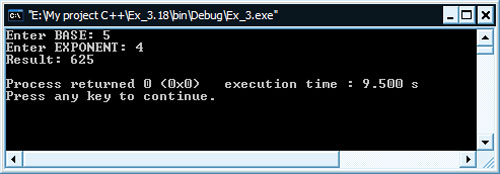
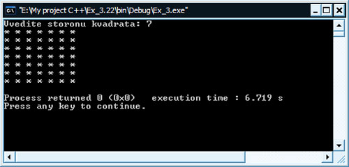
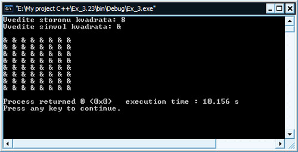
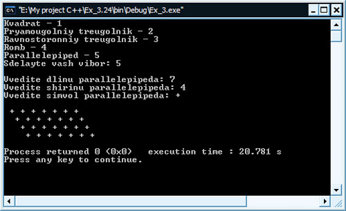

[Содержание](index.md)

# Функции. Практические упражнения
Вот мы и получили базовые знания о функциях в программировании и теперь вы знаете, что функция - это отдельный логический элемент программы, выполняющий свою задачу. Знаете, что функции служат для лучшей структуризации программ, особенно больших и сложных, также позволяют избежать многочисленного повторения одного и того же кода в тех программах, где есть такая необходимость. Теперь мы переходим к "золотому" моменту программирования - практике, которая позволит закрепить знания о функциях. Даже будет правильнее сказать не "закрепить", а "усвоить" знания, т.к. после выполнения практических заданий вы еще очень много чего узнаете, а самое главное - это научитесь это все практически делать. Еще раз напомню "золотые" слова программиста: "Лучший способ научиться программировать - это программировать!". Поэтому как обычно экспериментируйте с кодом, пробуйте видоизменять задание и писать программу, добавляйте свои новые функции и т.д. Все, как говориться, зависит от вашего полета мысли, ну а я, в свою очередь, привожу в конце каждого из заданий свои варианты реализации программ, которые я писал в свое время. Итак приступим к практике.

#### Задание № 1
За стоянку до 3-х часов парковочный гараж запрашивает плату минимум $2.00. В случае стоянки более трех часов гараж дополнительно запрашивает $0.50 за каждый полный или неполный час сверх трех часов. Максимальная плата за сутки составляет $10.00. Допустим, что никто не паркуется более, чем на сутки за раз. Напишите программу расчета и печати оплаты за парковку для каждого из трех клиентов, которые парковали свои автомобили вчера в этом гараже. Вы должны вводить длительность парковки для каждого клиента. Ваша программа должна печатать результаты в аккуратном табулированном формате и должна рассчитывать и печатать общий вчерашний доход. Программа должна использовать функцию `calculateCharges`, чтобы определять плату для каждого клиента. Результаты работы должны представляться в следующем формате:

| Автомобиль | Часы | Плата |
|------------|------|-------|
| 1          | 1.5  | 2.00  |
| 2          | 4.0  | 2.50  |
| 3          | 24.0 | 10.00 |
| Итого      | 29.5 | 14.50 |

```cpp
// Расчет платы за стоянку в автогараже

// подключаем необходимые заголовочные файлы
#include <iostream>
#include <iomanip>
#include <math.h>

// подключаем пространство имен std
using namespace std;

// объявляем прототип функции
float calculateCharges(float);

// главная функция программы
int main()
{
    // объявляем необходимые переменные
    // time* - запоминают ввод времени стоянки автомобиля
    // totalTime - хранит общее время стоянки всех автомобилей
    // sum* - запоминают плату за стоянку автомобиля
    // totalSum - хранит общую сумму платы за стоянку автомобилей
    float time1, time2, time3, totalTime;
    float sum1, sum2, sum3, totalSum;
    // начинаем цикл ввода времени стоянки
    for (;;)
    {
        cout << "Vvedite vremya stoyanki 3-h avtomobiley: " << endl;
        cin >> time1 >> time2 >> time3;
        // проверяем правильность ввода
        // если время стоянки меньше 0 или больше 24, то переход на начало цикла
        if (time1 < 0 || time1 > 24 || time2 < 0 || time2 > 24 || time3 < 0 || time3 > 24)
        {
            cout << "Oshibka! Povtorite vvod" << endl;
            continue;
        }
        // если ввод был правильным, то выходим из цикла и идем далее
        break;
    }
    totalTime = time1 + time2 + time3;
    // вызываем функцию calculateCharges и возвращенное ею
    // значение присваиваем переменным sum*
    sum1 = calculateCharges(time1);
    sum2 = calculateCharges(time2);
    sum3 = calculateCharges(time3);
    totalSum = sum1 + sum2 + sum3;
    // печатаем шапку, используя табуляцию
    cout << setw(10) << "Avtomobil'" << setw(10) << "Chasi" << setw(10) << "Plata" << endl;
    // выводим результат
    cout << setw(10) << "1" << setw(10) << time1 << setw(10) << sum1 << endl;
    cout << setw(10) << "2" << setw(10) << time2 << setw(10) << sum2 << endl;
    cout << setw(10) << "3" << setw(10) << time3 << setw(10) << sum3 << endl;
    // печатаем Итого
    cout << setw(10) << "Total: " << setw(10) << totalTime << setw(10) << totalSum << endl;
    return 0;
}

// определяем функцию
float calculateCharges(float timeSt)
{
    // принимаем в качестве аргумента функции переменную time* из главной функции
    // программы main() и идентифицируем ее в функции как переменную timeSt
    // также объявляем переменную sum, которая будет содержать плату за стоянку
    float sum;
    // если стоянка до 3-х часов
    if (timeSt > 0 && timeSt <= 3)
        sum = 2.00;
    // иначе если стоянка более 3-х часов, но менее суток
    else if (timeSt > 3 && timeSt < 24)
    {
        // за каждый час свыше начисляем доплату $0.50
        // если час неполный, то кругляем до полного с помощью ф-ции ceil (math.h)
        sum = ceil(timeSt - 3) * 0.50 + 2.00;
        // максимальная плата составляет не более $10.00
        if (sum > 10)
            sum = 10;
    }
    // иначе если стоянка ровно сутки
    else if (timeSt == 24)
        sum = 10.00;
    // иначе сумма равна нуля (попадаем сюда, если на входе в ф-цию был ноль
    else
        sum = 0;
    // возвращаем в main() результат работы функции
    return sum;
}
```

#### Задание № 2
Функция `floor` может использоваться для округления значения до ближайшего целого. Оператор

```cpp
y = floor (x + 0.5);
```

округляет значение `х` до ближайшего целого и присваивает результат переменной `у`. Напишите программу, которая читает несколько чисел и использует указанный выше оператор для округления каждого из этих чисел до ближайшего целого. Для каждого обрабатываемого числа напечатайте исходное число и его округленное значение.

```cpp
// Программа округляет введенные пользователем числа
// до ближайшего целого и печатает результат

#include <iostream>
#include <iomanip>
#include <math.h>

using namespace std;

double work(double);

int main()
{
    double y;
    cout << "Enter X (vihod - 0): ";
    cin >> y;
    while (y != 0)
    {
        cout << setw(10) << y << setw(10) << work(y) << endl;
        cout << "Enter X (vihod - 0): ";
        cin >> y;
    }
    return 0;
}

double work(double x)
{
    return floor(x + 0.5);
}
```

#### Задание № 3
Функция `floor` может использоваться для округления значения до ближайшего целого. Оператор

```cpp
y = floor (x * 10 + 0.5) / 10;
```

округляет `х` с точностью до одной десятой (первая позиция справа от десятичной точки). Оператор

```cpp
y = floor (x * 100 + 0.5) / 100;
```

округляет `х` с точностью до одной сотой (вторая позиция справа от десятичной точки). Напишите программу, которая определяет четыре функции для округления `х` различными способами:

- `roundToInteger (number)`
- `roundToTenths (number)`
- `roundToHundredths (number)`
- `roundToThousandths (number)`

Для каждого прочитанного значения ваша программа должна печатать исходное значение, число, округленное до ближайшего целого; число, округленное до ближайшей десятой; число, округленное до ближайшей сотой; число, округленное до ближайшей тысячной.

```cpp
// Программа, определяющая четыре функции для округления Х различными способами

#include <iostream>
#include <iomanip>
#include <math.h>

using namespace std;

// определяем и описываем наши четыре функции
double roundToInteger(double integer)
{
    return floor(integer * 1 + .5) / 1;
}

double roundToTenths(double tenths)
{
    return floor(tenths * 10 + .5) / 10;
}

double roundToHundredths(double hundredths)
{
    return floor(hundredths * 100 + .5) / 100;
}

double roundToThousandths(double thousandths)
{
    return floor(thousandths * 1000 + .5) / 1000;
}

// главная функция программы
int main()
{
    double number;
    cout << "Enter number: ";
    cin >> number;
    // выводим результаты работы в табулированном формате
    cout << number << setw(10) << roundToInteger(number) << setw(10) << setprecision(1)
         << setiosflags (ios::fixed | ios::showpoint) << roundToTenths(number)
         << setw(10) << setprecision(2) << setiosflags (ios::fixed | ios::showpoint)
         << roundToHundredths(number) << setw(10) << setprecision(3)
         << setiosflags (ios::fixed | ios::showpoint) << roundToThousandths(number) << endl;
    return 0;
}
```

#### Пояснения по коду программы
Хочу внести некоторые пояснения по коду, т.к. в этой программе был использован немного нестандартный подход в описании функций и выводе результатов работы программы на экран, который небыл описан в предыдущей главе учебника. Итак, в самом начале программы до начала главной функции программы `main()` мы видим определение и описание функций сразу без использования прототипа. Вы, конечно же, спростите почему? ...ведь мы учили, что нужно в начале программы определить функцию с помощью прототипа, а затем уже описать саму функцию после блока `main()`. Отвечаю на вопрос ...в языке программирования С++ разрешается так делать, как мы следали в этом примере, а именно определять и описывать функцию сразу. Вы, конечно же, скажите "но почему мы не делали так изначально"? Отвечаю ...в данном случае у нас функции состоят всего-лишь из оной строки кода, т.к. они небольшие и поэтому мы в этой программе сделали именно так. Но когда функции становятся уже больше, то правильнее будет описывать ее после блока `main()`, а до него определять только лишь прототип, иначе сама главная функция программы `main()` затеряется где-то в конце листинга (исходного кода программы) и это будет не совсем красиво и правильно. А для чего же он так нужен, это прототип? ...т.к. мы используем функцию в программе (в блоке `main()`) раньше, чем она будет у нас описана (а это будет после блока `main()`), то программа должна знать о ее присутствии, поэтому используют прототип. Вот мы немного и дополнили свой багаж знаний по поводу функций. Постепенно будем узнавать все больше и больше...

Теперь рассмотрим второй новый для вас здесь момент - это вывод результатов работы программы на экран. Вот этот код

```cpp
// выводим результаты работы в табулированном формате
cout << number << setw(10) << roundToInteger(number) << setw(10) << setprecision(1)
     << setiosflags (ios::fixed | ios::showpoint) << roundToTenths(number)
     << setw(10) << setprecision(2) << setiosflags (ios::fixed | ios::showpoint)
     << roundToHundredths(number) << setw(10) << setprecision(3)
     << setiosflags (ios::fixed | ios::showpoint) << roundToThousandths(number) << endl;
```

Здесь используется табулированный вывод, т.е. сделано все красиво. Если данный код заменить на такой, все будет работать точно также, кроме "кравивого вывода"

```
// выводим результаты работеы
cout << number << "   " << roundToInteger(number) << "   " << roundToTenths(number)
     << "   " << roundToHundredths(number) << "   " << roundToThousandths(number) << endl;
```

Можете попробовать такой код вместо табулированного. Пронаблюдайте за выводом - вы заметите различные сдвиги, которые визуально хуже воспринимаются. Для табулирования используются специальные операторы, которые пока что нами не рассматриваются, хотя один из них мы уже встречали - это оператор `setw()`, который форматирует поток вывода, предоставляя ему определенную рабочую область, которую мы указываем в скобках. В нашем примере этот оператор форматирования потока вывода принимает в качестве аргумента число 10 (`setw(10)`), значит под следующее за ним значение будет выделено пространство в 10 ячеек (одна ячейка - это одно перемещение курсора). Остальные операторы будем рассматривать позже. Итак, основные моменты мы разобрали, теперь пробуйте и эксперементируйте с кодом - добавляйте свои функции, меняйте значения, попробуйте вводить не одно число, а запрашивать в цикле, пока не будет введена метка (вспоминаем завершение цикла по метке из [Главы 9](chapter-9.md))

#### Задание № 4
Напишите функцию `integerPower (base, exponent)`, которая возвращает значение

`base`<sup>`exponent`</sup>

Например, `integerPower (3, 4) = 3 * 3 * 3 * 3`. Считайте, что `exponent` положительное, не равное нулю, целое число, а `base` - целое число. Функция `integerPower` должна использовать для управления вычислениями `for` или `while`. Не используйте никаких математических функций.

```cpp
// Работа с функцией, возводящей число в степень
// (число и степень принимает в качестве аргументов)
// и возвращающей результат возведения

#include <iostream>

using namespace std;

// объявляем прототип функции
int integerPower(int, int);

int main()
{
    int base, exponent;
    cout << "Enter BASE: ";
    cin >> base;
    cout << "Enter EXPONENT: ";
    cin >> exponent;
    // проверяем: exponent должно быть положительным и не ноль
    if (exponent <= 0)
        cout << "Error! Exponent no cant NULL";
    else
        // если проверка прошла удачно, то вызываем функции, которая
        // отработав, возвращает результат возведения в степень
        cout << "Result: " << integerPower(base, exponent) << endl;
    return 0;
}

// описываем фукнцию
int integerPower(int bs, int exp)
{
    int total = 1;
    for(int i = 1; i <= exp; i++)
        total = total * bs;
    return total;
}
```

Результат работы программы:



#### Задание № 5
Определите функцию `hypotenuse`, которая вычисляет длину гипотенузы правильного треугольника, когда две другие стороны известны. Используйте эту функцию в программе для определения длины гипотенузы каждого из следующих треугольников. Функции должны иметь два аргумента типа `double` и возвращать значение гипотенузы как `double`.

| Треугольник | Сторона 1 | Сторона 2 |
| ----------- | --------- | --------- |
| 1           | 3.0       | 4.0       |
| 2           | 5.0       | 12.0      |
| 3           | 8.0       | 15.0      |

```cpp
// Работа с функцией hypotenuse, вычисляющей гипотенузу
// правильного треугольника

#include <iostream.h>
#include <iomanip.h>
#include <math.h>

using namespace std;

// определяем прототип функции
double hypotenuse(double, double);

int main()
{
    cout << setw(10) << "Treugolnik" << setw(10) << "Storona1" << setw(10) << "Storona2" << setw(12) << "Hypotenuse" << endl
         << setw(10) << "1" << setw(10) << "3.0" << setw(10) << "4.0" << setw(12) << hypotenuse(3.0,4.0) << endl
         << setw(10) << "2" << setw(10) << "5.0" << setw(10) << "12.0" << setw(12) << hypotenuse(5.0,12.0)<< endl
         << setw(10) << "3" << setw(10) << "8.0" << setw(10) << "15.0" << setw(12) << hypotenuse(8.0,15.0) << endl;

    return 0;
}

// описываем функцию
double hypotenuse(double a, double b)
{
    return sqrt(a * a + b * b);
}
```

#### Задание № 6
Напишите функцию `multiply`, которая определяет для пары целых чисел, кратно ли второе число первому. Функция должна воспринимать два целых аргумента и возвращать 1 (истина), если второе число кратно первому, и 0 (ложь), если нет. Используйте эту функцию в программе, котороя вводит последовательность пар целых чисел.

```cpp
// Работа с функцией, которая должна воспринимать два целых аргумента
// и возвращать 1(истина), если второе число кратно первому,
// и 0(ложь), если нет

#include <iostream>

using namespace std;

// объявляем прототип функции
// функция принимает два аргумента типа int (целые числа)
// и возвращает значение типа bool (логическое - истина или ложь)
bool multiple(int, int);

int main()
{
    int int1, int2;
    // запрашиваем у пользователя первое число (для выхода - ноль)
    cout << "Vvedite pervoye chislo (vihod - 0): ";
    cin >> int1;
    // если первое число не ноль, то входим в цикл
    while(int1 != 0)
    {
        // запрашиваем у пользователя второе число, сохраняем в int2
        cout << "Vvedite vtoroye chislo: ";
        cin >> int2;
        // в условии if вызываем функцию: если она отработала и вернула
        // true (истину), то выводим соответствующее сообщение
        if (multiple(int1, int2) == true)
            cout << "Vtoroye chislo kratno pervomu!" << endl;
        // иначе выводим сообщение что второе число не кратно первому
        else
            cout << "Vtoroye chislo ne kratno!!!" << endl;
        // опять запрашиваем ввод, чтобы определить нужно ли
        // начинать новую итерацию цикла while
        cout << endl << "Vvedite dva chisla (vihod - 0): ";
        cin >> int1;
    }
    return 0;
}

// определяем функцию multiply
bool multiple(int x, int y)
{
    bool bl;
    float z;
    z = y % x;
    // если делится без остатка, значит кратно
    if (z == 0)
        bl = true;
    else
        bl = false;
    // возвращаем в программу результат работы логического типа bool
    return bl;
}
```

#### Задание № 7
Напишите программу, которая вводит последовательность целых чисел и передает их по одному функции `even`, которая использует операцию вычисления остатка для определения четности числа. Функция должна принимать целый аргумент и возвращать 1, если аргумент - четное число, и 0 в противном случае.

```cpp
// Работа с функцией even, определяющей четность числа

#include <iostream>

using namespace std;

// определяем прототип
bool even(int);

int main()
{
    int integer;
    cout << "Enter integer (vihod - 0): ";
    cin >> integer;
    while(integer != 0)
    {
        if (even(integer))
            cout << "Chislo chetnoye!" << endl;
        else
            cout << "Chislo nechetnoye!!!" << endl;
        cout << "Enter integer (vihod - 0): ";
        cin >> integer;
    }
}

// определяем функцию
bool even(int i)
{
    if (i % 2 == 0)
        return true;
    else
        return false;
}
```

#### Задание № 8
Напишите программу, которая отображает у левого края экрана сплошной квадрат из звездочек, сторона которого указана целым параметром `side`. Например, если `side` равна 4, функция должна отображать следующую картинку:

```
* * * *
* * * *
* * * *
* * * *
```

```cpp
// Работа с функцией, печатающей квадрат, заданного размера

#include <iostream>

using namespace std;

void print(int);

int main()
{
    int side;
    cout << "Vvedite storonu kvadrata: ";
    cin >> side;
    print(side);
    return 0;
}

void print(int side)
{
    for(int i = 1; i <= side; i++)
    {
        for(int j = 1; j <= side; j++)
            cout << "* ";
        cout << endl;
    }
}
```

Результат работы программы:



#### Задание № 9
Модифицируйте функцию, созданную в предыдущем задании так, чтобы формировать квадрат из каких угодно символов, указанных в символьной (`char`) переменной `fillCharacter`. Таким образом, если `side` равна 5 и `fillCharacter` равен `#`, то эта функция должна напечатать:

```
# # # # #
# # # # #
# # # # #
# # # # #
# # # # #
```

```cpp
// Программа печатает квадрат из указанных символов

#include <iostream>

using namespace std;

void square(int, char);

int main()
{
    int side;
    char fillCharacter;
    cout << "Vvedite storonu kvadrata: ";
    cin >> side;
    cout << "Vvedite simvol kvadrata: ";
    cin >> fillCharacter;
    cout << endl;
    square(side, fillCharacter);
    return 0;
}

void square(int side, char fillCharacter)
{
    for(int i = 1; i <= side; i++)
    {
        for(int j = 1; j <= side; j++)
            cout << fillCharacter << " ";
        cout << endl;
    }
}
```

Результат работы программы:



#### Задание № 10
Используйте подход, развитый в предыдущих двух заданиях для создания программы, которая вычерчивает широкий диапазон форм.

```cpp
// Программа, вычерчивающая широкий диапазон форм

#include <iostream>

using namespace std;

void kvadrat(); // прототипы функций
void treyP();
void treyR();
void romb();
void parall();

int main()
{
    int variant;
    cout << "Kvadrat - 1" << endl << "Pryamougolniy treugolnik - 2" << endl
         << "Ravnostoronniy treugolnik - 3" << endl << "Romb - 4" << endl
         << "Parallelepiped - 5" << endl;
    cout << "Sdelayte vash vibor: ";
    cin >> variant;
    cout << endl;
    switch(variant)
    {
    case 1:
        kvadrat();
        break;
    case 2:
        treyP();
        break;
    case 3:
        treyR();
        break;
    case 4:
        romb();
        break;
    case 5:
        parall();
        break;
    case '\n':
    case ' ':
        break;
    default:
        break;
    }
    return 0;
}

void kvadrat()
{
    int side;
    char character;
    cout << "Vvedite storonu kvadrata: ";
    cin >> side;
    cout << "Vvedite simvol kvadrata: ";
    cin >> character;
    cout << endl;
    for(int i = 1; i <= side; i++)
    {
        for(int j = 1; j <= side; j++)
            cout << character << " ";
        cout << endl;
    }
}

void treyP()
{
    int weight, l = 1;
    char character;
    cout << "Vvedite visotu treugolnika: ";
    cin >> weight;
    cout << "Vvedite simvol treugolnika: ";
    cin >> character;
    cout << endl;
    for(int i = 1; i <= weight; i++)
    {
        for(int j = 1; j <= l; j++)
            cout << character;
        cout << endl;
        l++;
    }
}

void treyR()
{
    int weight;
    float l = 0.5;
    char character;
    cout << "Vvedite visotu treugolnika: ";
    cin >> weight;
    cout << "Vvedite simvol treugolnika: ";
    cin >> character;
    cout << endl;
    for(int i = weight; i >= 1; i--)
    {
        for(int j = 1; j <= i - 1; j++)
            cout << " ";
        for(int j = 1; j <= l * 2; j++)
            cout << character;
        cout << endl;
        l++;
    }
}

void romb()
{
    int height;
    float l = 0.5, m;
    char character;
    cout << "Vvedite visotu romba (nechetnoye chislo): ";
    cin >> height;
    cout << "Vvedite simvol romba: ";
    cin >> character;
    cout << endl;
    for(int i = (height + 1) / 2; i >= 1; i--)
    {
        for(int j = 1; j <= i - 1; j++)
            cout << " ";
        for(int j = 1; j <= l * 2; j++)
            cout << character;
        cout << endl;
        l++;
        m = l - 2;
    }

    for(int i = 1; i <= (height - 1) / 2; i++)
    {
        for(int j = 1; j <= i; j++)
            cout << " ";
        for(int j = m * 2; j >= 1; j--)
            cout << character;
        cout << endl;
        m--;
    }
}

void parall()
{
    int length, weight;
    char character;
    cout << "Vvedite dlinu parallelepipeda: ";
    cin >> length;
    cout << "Vvedite shirinu parallelepipeda: ";
    cin >> weight;
    cout << "Vvedite simvol parallelepipeda: ";
    cin >> character;
    cout << endl;
    for(int i = 1; i <= weight; i++)
    {
        for(int j = 1; j <= i; j++)
            cout << " ";
        for(int k = 1; k <= length; k++)
            cout << character << " ";
        cout << endl;
    }
}
```

Результат работы программы:



#### Задание № 11
Напишите фрагменты программ, которые бы выполняли следующее:  
а) Вычислить целую часть частного от деления целого числа `а` на целое число `b`.  
b) Вычислить целый остаток от деления целого числа `а` на целое число `b`.  
c) Использовать фрагменты программ, созданные в пунктах a) и b), для написания функции, которая вводит целое число из диапазона от 1 до 32767 и печатает его как последовательность цифр, каждая из которых отделена от соседней двумя пробелами. Например, целое число 4562 должно быть напечатано в виде

```
4  5  6  2
```

```cpp
// Работа с функцией, которая вводит целое число и печатает
// его как последовательность цифр с двумя пробелами между ними

#include <iostream>

using namespace std;

void abc(int);

int main()
{
    int integer;
    cout << "Enter integer (1 - 32767): " << endl;
    cin >> integer;
    if(integer >= 1 && integer <= 32767)
        abc(integer);
    else
        cout << "Error! Nevernoye chislo!" << endl;
    return 0;
}

void abc(int var)
{
    for (int i = 10000; i > 0; i /= 10)
    {
        if (var / i != 0)
            cout << var / i << "  ";
        var %= i;
    }
}
```

#### Задание № 12
Напишите функцию, которая воспринимает время как три целых аргумента (часы, минуты и секунды) и возвращает количество секунд, прошедших со времени, когда часы в последний раз показали полночь. Используйте эту функцию для вычисления интервала времени в секундах между двумя моментами, находящимися внутри двадцатичетырехчасового цикла.

```cpp
// Работа с функцией, вычисляющей интервал времени в секундах
// между двумя моментами в 24-ти часовом цикле

#include <iostream>

using namespace std;

int interval(int, int, int);

int main()
{
    int ch, min, sek;
    cout << "Vvedite vremya kak chasi, minuti i sekundi: " << endl;
    cin >> ch >> min >> sek;
    cout << "Proshlo sekund posle togo kak chasi pokazali 00:00:00 : " << endl;
    cout << interval(ch, min,sek) << endl;
    return 0;
}

int interval(int h, int m, int s)
{
    h = h * 3600;
    m = m * 60;
    s = s + h + m;
    return s;
}
```

[Практика по функциям. Часть вторая](practice-12-2.md)
