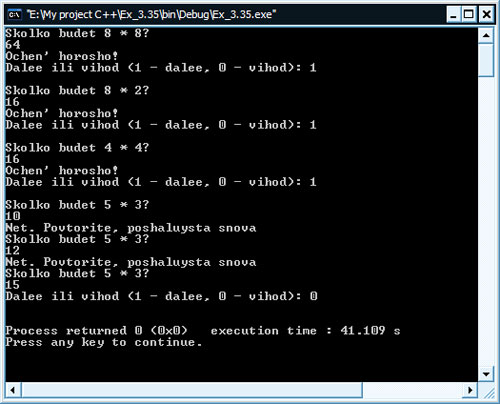

[Содержание](index.md)

# Функции. Практические упражнения. Продолжение...
В данной главе практических упражнений по программированию мы продолжим работать с функциями и не только с ними, по мере прохождения практики ваши знания по программированию в общем будут укрепляться и подниматься на одну ступеньку выше. Итак, приступим, но для начала немного рекламы, которая для вас может быть полезной...

### Задание № 13
Напишите функцию, которая возвращает наименьшее из трех чисел с плавающей запятой.

```cpp
// Работа с функцией, которая возвращает наименьшее
// из трех чисел с плавающей запятой

#include <iostream>

using namespace std;

float min(float, float, float);

int main()
{
    float a, b, c;
    cout << "Vvedite tri chisla c plavayushey zapyatoy: " << endl;
    cin >> a >> b >> c;
    cout << "Minimalnoye iz nih: " << min(a, b, c) << endl;
    return 0;
}

float min(float a, float b, float c)
{
    float minimum;
    minimum = a;
    if(b < minimum)
        minimum = b;
    if(c < minimum)
        minimum = c;
    return minimum;
}
```

Результат работы программы:


### Задание № 14
Говорят, что целое число является совершенным числом, если его сомножители, включая 1 (но не само число) в сумме дают это число. Например, 6 - это совершенное число, так как 6 = 1 + 2 + 3. Напишите функцию `perfect`, которая определяет, является ли параметр `number` совершенным числом. Используйте эту функцию в программе, которая определяет и печатает все совершенные числа в диапазоне от 1 до 1000. Напечатайте сомножители каждого совершенного числа, чтобы убедиться, что число действительно совершенное. Исседуйте мощность вашего компьютера проверкой чисел, много больших 1000.

```cpp
// Работа с функцией, определяющей свой принимаемый аргумент
// на возможность относить его к совершенным числам

#include <iostream>

// определяем прототип функции
// в качестве аргумента принимает целое числа
// ничего не возвращает, а просто определяет и печатает
void perfect(int);

using namespace std;

// главная функция программы main()
// с нее начинается выполнения программы
// и в ней же заканчивается
int main()
{
    // определяем необходимую переменную
    int number;
    // запрашиваем у пользователя число
    // и сохраняем его в контейнер number
    cout << "Enter number: " << endl;
    cin >> number;
    cout << endl;
    // вызываем вспомогательную функцию, определяющую
    // и печатающую совершенные числа
    perfect(number);
    // если выполение программы дошло до этой строки кода
    // то она возвращает windows "0" как сигнал о том,
    // что программа корректно завершила свою работу
    return 0;
}

// определяем функцию
void perfect(int num)
{
    // определяем локальную переменную, которая будет видно
    // только в данной функции. Служит в качестве сумматора
    // сомножителей числа, поэтому выставляем ее значение в ноль
    int sum = 0;
    // начинаем цикл, в котором для полученного функцией аргумента
    // будем находить его сомножители, путем деления его на все
    // целые числа в интервале от 1 до самого числа
    for(int j = 1; j < num; j++)
    {
        // если деление прошло без остатка, то значит j - сомножитель
        // значит накапливаем его в сумму
        if(num % j == 0)
            sum += j;
    }
    // если число и сумма его сомножителей равны,
    // значит число совершенное, иначе - обратное
    if(sum == num)
        cout << "Chislo " << num << " sovershennoye!" << endl;
    else
        cout << "Eto chislo nesovershennoye!" << endl;
}
```

Результат работы программы:


```cpp
// Работа с функцией, печатающей все совершенные
// числа в интервале от 1 до 1000

#include <iostream>

using namespace std;

void perfect();

int main()
{
    perfect();
    return 0;
}

void perfect()
{
    int sum = 0;
    for(int number = 1; number <= 1000; number++)
    {
        for(int j = 1; j < number; j++)
        {
            if(number % j == 0)
                sum += j;
        }
        if(number == sum)
        {
            cout << "Chislo " << number << " sovershennoye!!!" << endl;
            cout << "Ego somnoshiteli: ";
            for(int i = 1; i < number; i++)
                if(number % i == 0)
                    cout << i << "; ";
            cout << endl << endl;
        }
        sum = 0;
    }
}
```

Результат работы программы:


### Задание № 15
Говорят, что целое число является простым числом, если оно делится только на 1 и на само себя. Например, 2, 3, 5 - простые числа, а 4, 6, 8 - нет.  
а) Напишите функцию, определяющую, является ли число простым или нет.  
b) Используйте эту функцию в программе, которая определяет и печатает все простые числа, лежащие в диапазоне от 1 до 10000. Сколько из этих 10000 чисел вы должны действительно проверить, чтобы быть уверенным в том, что найдены все простые числа?  
c) Вначале вы могли бы подумать, что верхней границей, до которой вы должны проводить проверку, чтобы увидеть, является ли число n простым, является n / 2, но в действительности вам нужно проверить количество чисел, равное корню квадратному из n. Почему? Перепишите программу и запустите ее для обоих способов. Оцените улучшение производительности

Задание А

```cpp
// Написать функцию, определяющую, является ли
// введенное число простым

#include <iostream>
#include <math.h>

using namespace std;

// прототип функции
bool simple(int);

int main()
{
    int number;
    cout << "Enter number: ";
    cin >> number;
    if(simple(number))
        cout << "Number is a simple!\n";
    else
        cout << "Not a simple!\n";
    return 0;
}

/* Функция в качестве аргумента принимает введенное
пользователем число, затем определяет, является ли
оно простым или нет. В первом случае возвращает истину,
во втором ложь */
bool simple(int num)
{
    if(num < 2)
        return false;
    else
        for(int i = 2; i <= sqrt(num); i++)
            if(num % i == 0)
                return false;
    return true;
}
```

Задание B - C

```cpp
// Программа, используя функцию simple(), определяет
// и печатает все простые числа в диапазоне от 1 до 10000

#include <iostream>
#include <iomanip>
#include <math.h>

using namespace std;

// прототип функции
inline bool simple(int);

int main()
{
    for(int i = 1; i <= 10000; i++)
        if(simple(i))
            cout << setw(5) << setiosflags(ios::left) << i;
    return 0;
}

/* Функция в качестве аргумента принимает число в интервале
от 1 до 10000, затем определяет, является ли оно простым
или нет. В первом случае возвращает истину, во втором ложь */
inline bool simple(int num)
{
    if(num < 2)
        return false;
    else
        for(int i = 2; i <= sqrt(num); i++)
            if(num % i == 0)
                return false;
    return true;
}
```

### Задание № 16
Напишите функцию, которая воспринимает целое значение и возвращает число с обратным порядком цифр. Например, воспринимает число 7631, а возвращает число 1367.

```cpp
// The return order of figures

#include <iostream>

using namespace std;

int returnOrder(int);

int main()
{
    int number;
    cout << "Enter an integer: " << endl;
    cin >> number;
    cout << "Result: " << returnOrder(number) << endl;
    return 0;
}

int returnOrder(int number)
{
    int a, sum = 0, category, temp = number;
    // считаем количество разрядов введенного числа
    // допустим, если введено число 13245, то разрядов будет 10000,
    // т.е. category станет равным 10000
    for (category = 1; temp > 10; category *= 10)
        temp = temp / 10;
    // пока число не закончится "откалываем" от него разряды,
    // начиная с единиц, десятков, сотен и т.д.
    while (number > 0)
    {
        // "откалываем" разряд
        a = number % 10;
        // уменьшаем само число
        // если было 13245, то станет 1324, в следующей
        // итерации 132, затем 13 и т.д. пока на закончится
        number = number / 10;
        // формируем число с обратным порядком цифр
        // для этого мы в начале находили число разрядов,
        // чтобы сейчас последнее число переставить в начало
        sum += a * category;
        category /= 10;
    }
    // возвращаем число с обратным порядком цифр
    return sum;
}
```

Результат работы программы:


### Задание № 17
Наибольший общий делитель двух целых чисел - это наибольшее целое, на которое без остатка делится каждое из двух чисел. Напишите функцию `nod`, которая возвращает наибольший общий делитель двух целых чисел.

Если что-то будет не понятно, то смотрите в книге по алгебре основные правила нахождения НОД, тогда все станет на свои места.

```cpp
// Finding of the greatest general divider

#include <iostream>
#include <math.h>

using namespace std;

int nod(int, int);

int main()
{
    int int1, int2;
    cout << "//Finding of the greatest general divider" << endl << endl;
    cout << "Enter two whole numbers: " << endl;
    cin >> int1 >> int2;
    cout << "NOD: " << nod(int1, int2) << endl;
    return 0;
}

int nod(int x, int y)
{
    if(x == 0)
        return y;
    else if(y == 0)
        return x;
    else if(x == y)
        return x;
    else if(x == 1 || y == 1)
        return 1;
    else if(x % 2 == 0 && y % 2 == 0)
        return 2 * nod(x / 2, y / 2);
    else if(x % 2 == 0 && y % 2 != 0)
        return nod(x / 2, y);
    else if(x % 2 != 0 && y % 2 == 0)
        return nod(x, y / 2);
    else if(x % 2 != 0 && y % 2 != 0)
        return nod(y, abs(y - x));
}
```

Результат работы программы:


### Задание № 18
Напишите функцию `qualityPoints`, которая вводит среднюю оценку студентов и возвращает 4, если средняя оценка 90 - 100, 3, если средняя оценка 80 - 89, 2, если средняя оценка 70 - 79, 1, если средняя оценка 60 - 69, и 0, если средняя оценка меньше 60.

```cpp
// Average estimation of student

#include <iostream>

using namespace std;

int qualityPoints(int);

int main()
{
    int point;
    cout << "Enter a mean score: " << endl;
    cin >> point;
    if(point >= 0 && point <= 100)
        cout << "The mean score is equal " << qualityPoints(point) << endl;
    else
        cout << "Error! Interval 0 - 100" << endl;
    return 0;
}

int qualityPoints(int point)
{
    int result;
    if(point <= 100 && point >= 90)
        result = 4;
    if(point <= 89 && point >= 80)
        result = 3;
    if(point <= 79 && point >= 70)
        result = 2;
    if(point <= 69 && point >= 60)
        result = 1;
    if(point <= 59 && point >= 0)
        result = 0;
    return result;
}
```

Результат работы программы:


### Задание № 19
Напишите программу, моделирующую бросание монеты. Для каждого броска монеты программа должна печатать Орел или Решка. Промоделируйте с помощью этой программы бросание 100 раз и подсчитайте, сколько раз появилась каждая сторона монеты. Напечатайте результаты. Программа должна вызывать отдельную функцию `flip`, которая не принимает никаких аргументов и возвращает 0 для Орла и 1 для Решки. Замечание: если программа действительно моделирует бросание монеты, каждая сторона монеты должна появляться примерно в половине случаев.

```cpp
// Modelling throwing of a coin

#include <iostream>
#include <stdlib.h>
#include <time.h>

using namespace std;

bool flip();

int main()
{
    int orel = 0, reshka = 0;
    srand(time(NULL));
    for (int i = 1; i <= 100; i++)
    {
        if (flip() == false)
        {
            cout << "Orel" << endl;
            orel++;
        }
        else
        {
            cout << "Reshka" << endl;
            reshka++;
        }
    }
    cout << endl << "Orel vipal " << orel << " raz" << endl
         << "Reshka vipala " << reshka << " raz" << endl;
    return 0;
}

bool flip()
{
    int var = rand();
    if (var % 2 == 0)
        return false;
    else
        return true;
}
```

Результат работы программы:


Я вас поздравляю, на данный момент пройдено семь практических заданий, что есть уже очень хорошо. Следующие практические задания будут еще интереснее предыдущих в плане того, что мы будем использовать начальные познания в такую могучую науку как искусственный интеллект. Следующее задание будет предлагать нам написать программу, которая может быть полезной для ребенка, который пошел в школу - она ему поможет в изучении таблицы умножения. Эта, вскоре реализованная вами программа, будет лишь простым примером подобного рода программ. В дальшейшем, по мере получения опыта в программировании вы сможете уже сами ставить перед собой подобные задачи, которые вам не составит труда реализовать и на практике.

### Задание № 20
Компьютеры играют все возрастающую роль в образовании. Напишите программу, которая поможет слушателям начальной школы изучить умножение. Используйте rand для выработки двух положительных одноразрядных целых чисел. Программа должна печатать вопрос типа

```
Сколько будет 6 * 7?
```

Затем учащийся печатает ответ. Ваша программа проверяет этот ответ. Если он правильный, напечатайте `Очень хорошо!` и затем задайте следующий вопрос на умножение. Если ответ неправильный, напечатайте `Нет. Повторите, пожалуйста, снова` и затем задавайте тот же самый вопрос повторно до получения правильного ответа.

На мой взгляд программа интересная и практически применимая, например, в случае, если у вас есть маленький ребенок, который пошел в школу.

```cpp
// Программа, помогающая начальным слушателям
// изучать умножение

#include <iostream>
#include <stdlib.h>
#include <time.h>

using namespace std;

int main()
{
    int var1, var2, answer;
    bool label = true;
    srand(time(NULL));
    while (label)
    {
        var1 = rand() % 9;
        var2 = rand() % 9;
        cout << "Skolko budet " << var1 << " * " << var2 << "?" << endl;
        cin >> answer;
        if (var1 * var2 == answer)
            cout << "Ochen' horosho!" << endl;
        else
        {
            do
            {
                cout << "Net. Povtorite, poshaluysta snova" << endl;
                cout << "Skolko budet " << var1 << " * " << var2 << "?" << endl;
                cin >> answer;
            }
            while (var1 * var2 != answer);
        }
        cout << "Dalee ili vihod (1 - dalee, 0 - vihod): ";
        cin >> label;
        cout << endl;
    }
    return 0;
}
```

Результат работы программы:



### Задание № 21
Использование компьютеров в образовании относят к системам компьютерного обучения (СКО). Одной из проблем среды СКО является утомляемость учащихся. Этого можно избежать путем разнообразия компьютерных диалогов, удерживающих внимание ученика. Модифицируйте программу предыдущего задания № 20 так, чтобы для каждого правильного или неправильного ответов печатались разнообразные комментарии типа:

Отклики на правильные ответы

```
Очень хорошо!
Отлично!
Чудесная работа!
Продолжайте работать так же хорошо!
```

Отклики на неправильные ответы

```
Нет. Попытайтесь, пожалуйста, снова.
Неверно. Попытайтесь еще раз.
Не опускайте руки!
Нет. Продолжайте ваши попытки.
```

Используя генератор случайных чисел для выбора чисел от 1 до 4, выбирайте подходящую реплику для каждого ответа. Используйте структуру `switch` для представления отклика.

```cpp
// Программа, помогающая начальным слушателям
// изучать умножение

#include <iostream>
#include <stdlib.h>
#include <time.h>

using namespace std;

void answerYes();
void answerNo();

int main()
{
    int var1, var2, answer;
    bool label = true;
    srand(time(NULL));
    while (label)
    {
        var1 = rand() % 9;
        var2 = rand() % 9;
        cout << "Skolko budet " << var1 << " * " << var2 << "?" << endl;
        cin >> answer;
        if (var1 * var2 == answer)
            // заменяем здесь ответ вызовом соответствующей функции
            answerYes();
        else
        {
            do
            {
                // заменяем здесь ответ вызовом соответствующей функции
                answerNo();
                cout << "Skolko budet " << var1 << " * " << var2 << "?" << endl;
                cin >> answer;
            }
            while (var1 * var2 != answer);
        }
        cout << "Dalee ili vihod (1 - dalee, 0 - vihod): ";
        cin >> label;
        cout << endl;
    }
    return 0;
}

// функция, генерирующая правильный ответ на вопрос
void answerYes()
{
    switch (1 + rand() % 4)
    {
    case 1:
        cout << "Ochen' horosho!" << endl;
        break;
    case 2:
        cout << "Otlichno!" << endl;
        break;
    case 3:
        cout << "Chudesnaya rabota!" << endl;
        break;
    case 4:
        cout << "Prodolshayte rabotat' tak she horosho!" << endl;
        break;
    }
}

// функция, генерирующая неправильный ответ на вопрос
void answerNo()
{
    switch (1 + rand() % 4)
    {
    case 1:
        cout << "Net. Popitaytes', poshaluysta snova" << endl;
        break;
    case 2:
        cout << "Neverno. Popitaytes' eshe raz" << endl;
        break;
    case 3:
        cout << "Ne opuskayte ruki" << endl;
        break;
    case 4:
        cout << "Net. Prodolshayte vashi popitki" << endl;
        break;
    }
}
```

Результат работы программы:


### Задание № 22
Большинство серьезных систем компьютерного обучения осуществляют мониторинг учащегося в течение некоторого периода времени. Решение о начале новой темы часто основывается на успехе учащегося в изучении предыдущей темы. Модифицируйте программу из задания № 20 так, чтобы считать количество правильных и неправильных ответов, введенных учащимся. После того, как учащийся напечатал 10 ответов, ваша программа должна посчитать процент правильных ответов. Если он ниже 75%, ваша программа должна напечатать "Пожалуйста попросите срочно помощь у вашего преподавателя" и закончить свою работу.

```cpp
// Программа, помогающая начальным слушателям
// изучать умножение

#include <iostream>
#include <stdlib.h>
#include <time.h>

using namespace std;

int main()
{
    int var1, var2, answer, label = 0, ok = 0;
    bool variant;
    // для правильной работы функции rand()
    srand(time(NULL));
    // цикл, задающий десять вопросов ученику
    while (label != 10)
    {
        // генерируем случайные величины от 0 до 9
        var1 = rand() % 9;
        var2 = rand() % 9;
        // задаем вопрос
        cout << "Skolko budet " << var1 << " * " << var2 << "?" << endl;
        cin >> answer;
        // проверяем правильность ответа
        if (var1 * var2 == answer)
        {
            cout << "Ochen' horosho!" << endl;
            label++;
            ok++;
        }
        else
        {
            // задаем вопрос повторно, пока не получим правильный ответ
            do
            {
                label++;
                cout << "Net. Povtorite, poshaluysta snova" << endl;
                cout << "Skolko budet " << var1 << " * " << var2 << "?" << endl;
                cin >> answer;
            }
            while (var1 * var2 != answer);
        }
        // если было задано 10 вопросов
        if (label == 10)
        {
            // если количество правильных ответов менее 75%
            if ((double)ok / label * 100 < 75)
            {
                cout << "Poshaluysta poprosite srochno pomosh' u vashego prepodavatelya" << endl;
                break;
            }
            // если не вышли из цикла то запрашиваем опять продолжение работы
            cout << "Dalee ili vihod (1 - dalee, 0 - vihod): ";
            cin >> variant;
            // если выбрано продолжение работы, то обнуляем счетчики
            if (variant == 1)
            {
                label = 0;
                ok = 0;
            }
        }
        cout << endl;
    }
    return 0;
}
```

Результат работы программы:


### Задание № 23
Напишите программу, которая играет в игру "Угадай число" следующим образом: ваша программа выбирает случайное число, которое должно быть отгадано, в диапазоне от 1 до 1000. Затем программа печатает:

```
Мое число между 1 и 1000.
Вы можете его отгадать?
Пожалуйста, напечатайте свою первую догадку.
```

Затем игрок печатает свою первую догадку. Программа отвечает одним из следующих вариантов:

1. Отлично! Вы отгадали число!  
   Хотели бы вы сыграть еще раз (да или нет)?
2. Слишком мало. Попытайтесь снова
3. Слишком много. Попытайтесь снова

Если догадка игрока неверна, ваша программа должна работать циклически до получения верного ответа. Программа должна говорить игроку Слишком мало или Слишком много, чтобы помочь ему угадать правильный ответ. Замечание: Техника поиска, используемая в этой задаче, называется двоичный поиск.

Еще раз напомню вам, мои дорогие читатели, что мои программы - это лишь мой взляд на реализацию данного алгоритма программы, поэтому вы их можете писать используя свои собственные знания и навыки. И запомните одну вещь - сколько программистов, столько и различных вариаций реализации одной и той же программы - это правда жизни...

```cpp
// Программа "Угадай число"

#include <iostream>
#include <stdlib.h>
#include <time.h>

using namespace std;

int main()
{
    int x, variant;
    char label = 'y';
    srand(time(NULL));
    while (label == 'y')
    {
        // загадываем случайное число
        x = 1 + rand() % 1000;
        // выводим приглашение
        cout << "Moye chislo meshdu 1 i 1000." << endl
             << "Vi moshete ego otgadat'?" << endl
             << "Poshaluysta, napechatayte svoyu pervuyu dogadku." << endl;
        cin >> variant;
        // начинаем цикл без параметров из которого есть только один выход -
        // это отгадать загаданное компьютером число
        for (;;)
        {
            // выводим подсказку, соответственно ответу пользователя
            if (variant < x)
                cout << "Slishkom malo. Popitaytes' snova" << endl;
            if (variant > x)
                cout << "Slishkom mnogo. Popitaytes' snova" << endl;
            // если пользователь угадал, то предлагаем сыграть еще раз
            // и прерываем данный цикл for
            if (variant == x)
            {
                cout << "Otlichno! Vi otgadali chislo!" << endl;
                cout << "Hoteli bi vi sigrat' eshe raz (y - da, n - net): ";
                // если здесь не будет выбрано значение "y", то при выходе
                // из этого цикла for, новой итерации внешнего цикла
                // while тоже не будет - мы выйдем из игры
                cin >> label;
                break;
            }
            // заправиваем следующий вариант ответа
            else
            {
                cout << "Napechatayte svoyu novuyu dogadku" << endl;
                cin >> variant;
            }
        }
    }
    return 0;
}
```

Результат работы программы:


### Задание № 24
Модифицируйте программу из предыдущего задания № 23 так, чтобы она считала количество попыток игрока отгадать число. Если это число менее чем 10, напечатайте `Или вы знаете секрет, или вы счастливчик!` Если игрок отгадал число за 10 попыток, напечатайте `Ага! Вы знаете секрет!` Если игрок отгадывает больше чем за 10 попыток, то напечатайте `Вы должны развивать свои способности!` Почему отгадка не должна требовать более 10 попыток? Да потому, что каждая "хорошая догадка" должна исключать половину чисел. Теперь покажите, почему любое число от 1 до 1000 может быть отгадано не более чем за 10 попыток.

```cpp
// Программа "Угадай число"

#include <iostream>
#include <stdlib.h>
#include <time.h>

using namespace std;

void answer(int);

int main()
{
    int x, variant, counter;
    char label = 'y';
    srand(time(NULL));
    while (label == 'y')
    {
        counter = 0;
        // загадываем случайное число
        x = 1 + rand() % 1000;
        // выводим приглашение
        cout << "Moye chislo meshdu 1 i 1000." << endl
             << "Vi moshete ego otgadat'?" << endl
             << "Poshaluysta, napechatayte svoyu pervuyu dogadku." << endl;
        cin >> variant;
        counter++;
        // начинаем цикл без параметров из которого есть только один выход -
        // это отгадать загаданное компьютером число
        for (;;)
        {
            // выводим подсказку, соответственно ответу пользователя
            if (variant < x)
                cout << "Slishkom malo. Popitaytes' snova" << endl;
            if (variant > x)
                cout << "Slishkom mnogo. Popitaytes' snova" << endl;
            // если пользователь угадал, то предлагаем сыграть еще раз
            // и прерываем данный цикл for
            if (variant == x)
            {
                cout << "Otlichno! Vi otgadali chislo!" << endl;
                // вызываем функцию, добавляющую соответствующий текст
                answer(counter);
                cout << "Hoteli bi vi sigrat' eshe raz (y - da, n - net): ";
                // если здесь не будет выбрано значение "y", то при выходе
                // из этого цикла for, новой итерации внешнего цикла
                // while тоже не будет - мы выйдем из игры
                cin >> label;
                break;
            }
            // заправиваем следующий вариант ответа
            else
            {
                cout << "Napechatayte svoyu novuyu dogadku" << endl;
                cin >> variant;
                // счетчик попыток
                counter++;
            }
        }
    }
    return 0;
}

void answer(int k)
{
    if (k < 10)
        cout << "Ili vi znayete secret, ili vi schastlivchik!" << endl;
    else if (k == 10)
        cout << "Aga! Vi znayete secret!" << endl;
    else
        cout << "Vi dolshni razvivat' svoi sposobnosti!" << endl;
}
```

Результат работы программы:


[Глава 13. Куда же без массивов](chapter-13.md)
