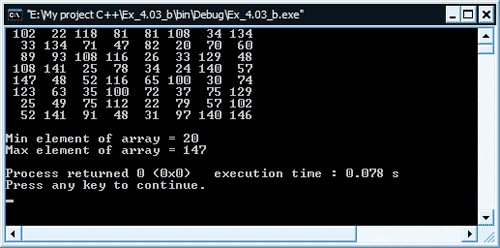

[Содержание](index.md)

# Задачи на массивы с подробными решениями
Надеюсь, что три теоретические главы о массивах вами были прочитаны. Вот ссылки на них: "[Куда же без массивов](chapter-13.md)" (общие сведения о массивах - что такое массив, типы массивов, работа с массивами в С++: объявление и инициализация), "[Одномерные массивы](chapter-14.md)", "[Двумерные массивы](chapter-15.md)". Если с теорией все понятно, то можно переходить к практической части, в которой мы будем решать задачи на массивы, а вернее писать программы, решающие эти задачи.

Для начала решим несколько несложных задач на массивы, так сказать для разминки.

#### Задача 1

Нужно написать программу, которая создает одномерный массив, размером в 12 элементов. Затем заполняет его либо с клавиатуры (разрешается вводить числа в интервале от 0 до 99), либо генерирует его содержимое с помощью генератора случайных чисел, в интервале от 0 до 99. Для выбора одного из двух вариантов заполнения, программа задает вопрос пользователю. Затем программа должна инвертировать массив, путем замены значения первого элемента на последний, второго на предпоследний и так далее. Вывод на экран должен происходить ровно два раза: до инверсии и после.

Как обычно, напомню, что все задачи на массивы вы должны попытаться выполнить абсолютно самостоятельно. Свое решение в конце каждой задачи я буду приводить лишь для сравнения и помощи в крайних ситуациях, когда после долгих попыток вы так и не сможете найти решение.

Решение задачи

```cpp
// Задачи на массивы

#include <iostream>
#include <iomanip>
#include <stdlib.h>
#include <time.h>

using namespace std;

void setRand(int[], const int);
void invertArray(int[], const int);
void printArray(int[], const int);

int main()
{
    const int length = 12;
    int array[length];
    bool label;
    srand(time(NULL));
    // каким образом будем заполнять массив
    cout << "Zapolnenie massiva: sluchajno - 0, rukami - 1 ";
    cin >> label;
    cout << endl;
    // если будем заполнять вручную, вводом с клавиатуры
    if(label)
        for(int i = 0; i < length; i++)
        {
            cout << "Vvedite " << i << " ]lement massiva v intervale ot 0 do 99: ";
            cin >> array[i];
            // если небыл соблюден интервал, то возвращаемся на начало итерации
            if(array[i] < 0 || array[i] >= 100)
            {
                cout << "Vyhod za dopustimyj interval! Povtorite vvod\n";
                i--;
            }
        }
    // иначе, заполняем рандомно
    else
        setRand(array, length);
    // заполнили массив - теперь выводим его на экран
    // затем инвертируем и опять выводим
    printArray(array, length);
    invertArray(array, length);
    printArray(array, length);
    return 0;
}

// рандомное заполнение массива
void setRand(int arr[], const int len)
{
    for(int i = 0; i < len; i++)
        arr[i] = rand() % 100;
}

// инверсия массива
void invertArray(int arr[], const int len)
{
    int temp;
    for(int i = 0; i < len / 2; i++)
    {
        temp = arr[i];
        arr[i] = arr[len - i - 1];
        arr[len - i - 1] = temp;
    }
}

// печать массива
void printArray(int arr[], const int len)
{
    for(int i = 0; i < len; i++)
        cout << setw(3) << arr[i];
    cout << endl;
}
```

#### Задача 2
В качестве второго задания, предлагаю вам сделать предыдущее задание, но уже использовать не одномерный массив, а двумерный, размером 12 х 12 (матрицу). Единственное, что не нужно делать из предыдущего задания - это предлагать заполнение массива с клавиатуры, т.к. тяжело себе представить ввод пользователем 12 * 12 = 144 значений. Проделанное задание позволить закрепить навыки работы с двумерными массивами. Как вы, наверное, помните из теории, для прохода по двумерному массиву, удобнее всего использовать два вложенных цикла `for`.

Решение задачи

```cpp
// Задачи на массивы

#include <iostream>
#include <iomanip>
#include <stdlib.h>
#include <time.h>

using namespace std;

void setRand(int[][12], const int);
void invertArray(int[][12], const int);
void printArray(int[][12], const int);

int main()
{
    const int length = 12;
    int array[length][length];
    srand(time(NULL));
    setRand(array, length);
    printArray(array, length);
    invertArray(array, length);
    printArray(array, length);
    return 0;
}

// рандомное заполнение массива
void setRand(int arr[][12], const int len)
{
    for(int i = 0; i < len; i++)
        for(int j = 0; j < len; j++)
            arr[i][j] = rand() % 100;
}

// инверсия массива
void invertArray(int arr[][12], const int len)
{
    int temp;
    for(int i = 0; i < len / 2; i++)
        for(int j = 0; j < len; j++)
        {
            temp = arr[i][j];
            arr[i][j] = arr[len - i - 1][len - j - 1];
            arr[len - i - 1][len - j - 1] = temp;
        }
}

// печать массива
void printArray(int arr[][12], const int len)
{
    for(int i = 0; i < len; i++)
    {
        for(int j = 0; j < len; j++)
            cout << setw(3) << arr[i][j];
        cout << endl;
    }
    cout << endl;
}
```

#### Задача 3
Если вы успешно справились с двумя предыдущими задачами, то далее решим вот такую несложную задачу на массивы. Создайте двумерный массив, размером 8 х 8. Заполните его случайными величинами в интервале от 20 до 150. Напишите программу, которая находит максимальный и минимальный элементы массива, используя функции `minElement()` и `maxElement()`.

```cpp
// Задачи на массивы

#include <iostream>
#include <iomanip>
#include <stdlib.h>
#include <time.h>

using namespace std;

void setRand(int[][8], const int);
void printArray(int[][8], const int);
int minElement(int[][8], const int);
int maxElement(int[][8], const int);

int main()
{
    const int length = 8;
    int array[length][length];
    srand(time(NULL));
    setRand(array, length);
    printArray(array, length);
    cout << "Min element of array = " << minElement(array, length) << endl;
    cout << "Max element of array = " << maxElement(array, length) << endl;
    return 0;
}

void setRand(int arr[][8], const int len)
{
    for(int i = 0; i < len; i++)
        for(int j = 0; j < len; j++)
            arr[i][j] = 20 + rand() % 130;
}

void printArray(int arr[][8], const int len)
{
    for(int i = 0; i < len; i++)
    {
        for(int j = 0; j < len; j++)
            cout << setw(4) << arr[i][j];
        cout << endl;
    }
    cout << endl;
}

int minElement(int arr[][8], const int len)
{
    int min = arr[0][0];
    for(int i = 0; i < len; i++)
        for(int j = 0; j < len; j++)
            if(arr[i][j] < min)
                min = arr[i][j];
    return min;
}

int maxElement(int arr[][8], const int len)
{
    int max = arr[0][0];
    for(int i = 0; i < len; i++)
        for(int j = 0; j < len; j++)
            if(arr[i][j] > max)
                max = arr[i][j];
    return max;
}
```

#### Задача 4
Измените предыдущую программу так, чтобы для нахождения минимального и максимального элементов массива, использовалась лишь одна функция `searchElement()`. Функция будет принимать в качестве аргументов массив, его размер и логическое значение, указывающее, что нужно найти: `min` или `max`.

```cpp
// Задачи на массивы

#include <iostream>
#include <iomanip>
#include <stdlib.h>
#include <time.h>

using namespace std;

void setRand(int[][8], const int);
void printArray(int[][8], const int);
int searchElement(int[][8], const int, const bool);

int main()
{
    const int length = 8;
    int array[length][length];
    srand(time(NULL));
    setRand(array, length);
    printArray(array, length);
    cout << "Min element of array = " << searchElement(array, length, 0) << endl;
    cout << "Max element of array = " << searchElement(array, length, 1) << endl;
    return 0;
}

void setRand(int arr[][8], const int len)
{
    for(int i = 0; i < len; i++)
        for(int j = 0; j < len; j++)
            arr[i][j] = 20 + rand() % 130;
}

void printArray(int arr[][8], const int len)
{
    for(int i = 0; i < len; i++)
    {
        for(int j = 0; j < len; j++)
            cout << setw(4) << arr[i][j];
        cout << endl;
    }
    cout << endl;
}

int searchElement(int arr[][8], const int len, const bool label)
{
    int search = arr[0][0];
    for(int i = 0; i < len; i++)
        for(int j = 0; j < len; j++)
            if(label)
            {
                if(arr[i][j] > search)
                    search = arr[i][j];
            }
            else
            {
                if(arr[i][j] < search)
                    search = arr[i][j];
            }
    return search;
}
```

Результат работы программы



На этом решение разминочных задач на массивы закончим, а в следующей главе уже будем решать более сложные и интересные задачи.

[Задачи на массивы. Часть вторая](practice-15-2.md)
