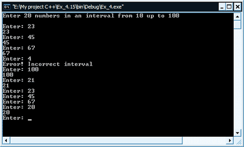
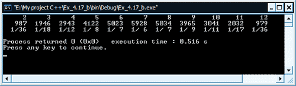

[Содержание](index.md)

# Продолжаем решение задач на массивы! Практика: продолжение...
Надеюсь, что первую часть [практики по массивам](practice-15-1.md) вы полностью прошли. Если да, то можно смело продолжать решение задач на массивы. Для начала решим вот такую вот задачу. Смотрим ниже.

#### Задача 5
Данную задачу мы будем решать с использованием одномерного массива. Нужно запросить у пользователя последовательно 20 чисел, каждое из которых должно быть в интервале от 10 до 100 включительно. После того, как программа прочла очередное число, она должна определить: было ли такое число уже введено ранее или нет. Если оно не дублирует ранее прочитанные числа, то напечатайте его, в противном случае не печатайте. Предусмотрите в своей программе "наихудший случай", когда все 20 чисел будут разными. Напишите программу, используя как можно меньшего размера массив.

Ниже привожу в качестве одного из возможных решений, свой вариант решения этой задачи на массив. Ваш вариант реализации, естественно, может быть и не таким, поэтому свой вариант привожу лишь для ознакомления. Настоятельно рекомендую не смотреть и не изучать программу, пока не напишите свою. Это будет большим плюсом для получения вами опыта в решении подобных задач.

```cpp
// Работа с одномерным массивом

#include <iostream>

using namespace std;

int main()
{
    // объявляем необходимые переменные
    const int size = 20;
    int array[size], var;
    bool label = true;
    // выводим подсказку пользователю
    cout << "Enter 20 numbers in an interval from 10 up to 100" << endl << endl;
    // начинаем ввод 20-и чисел в цикле
    for(int i = 0; i < size; i++)
    {
        // запрашиваем число, запоминаем его в переменную var
        cout << "Enter: ";
        cin >> var;
        // если число находится в нужном интервале
        if(var >= 10 && var <= 100)
        {
            // записываем его в массив
            array[i] = var;
            // проверяем, не дублирует ли оно
            // введенное ранее число
            for(int j = 0; j < i; j++)
            {
                // если найдено соответствие, то меняем флаг переменной label
                if(array[j] == array[i])
                    label = false;
            }
            // если соответствия не было найдено, то печатаем число
            if(label == true)
                cout << array[i] << endl;
        }
        // в случае, если было введено число не из интервала 10 - 100
        else
        {
            cout << "Error! Incorrect interval" << endl;
            i--;
        }
        // меняем флаг перед входом в новую итерацию
        label = true;
    }
    return 0;
}
```

Результат работы программы

В приведенном скрине нет всех двадцати запросов, но видна сама суть работы программы.



#### Задача 6

Следующая задача на массивы будет более интересная. Надеюсь, что вам она тоже покажется именно такой. Нужно написать программу, моделирующую бросание двух костей. Думаю, что все знают, что такое кости. Кто забыл, то напомню, что кости - это шестигранные кубики, каждая грань которых имеет значение очков от 1 до 6 включительно. Соответственно, когда мы бросаем две кости, то количество выпавших очков может быть в интервале от 2 до 12 включительно. По логике вещей и теории вероятностей, количество очков, равное 7, должно выпадать чаще других. Т.к. у обеих костей по шесть значений, то всего может быть 36 различных комбинаций бросков.

Как видите, примерно в 1/6 всех случаев, у нас должно выпадать 7 очков. Вернемся к нашей задачи. Как я сказал выше, нужно написать программу, моделирующую бросание двух костей. Для моделирования бросания обоих костей, программа должна использовать генератор случайных чисел `rand()`. Естественно, что поочередно, т.е. один раз получаем рандомное число от 1 до 6 включительно и присваиваем его первой кости, а затем генерируем с помощью `rand()` второе рандомное число и присваиваем его второй кости. Далее программа подсчитывает сумму их значений. Ваша программа должна бросать две кости ровно 36000 раз. Используйте одномерный массив для подсчета количества раз выпадения той или иной суммы. В конце работы программы выведите результаты в табулированном формате. Определите приемлемость полученных результатов, ориентировочно сравнив их с теоретической вероятностью выпадения того или иного значения.

Мой вариант реализации этого алгоритма

```cpp
// Моделирование бросания двух костей

#include <iostream>
#include <iomanip>
#include <stdlib.h>
#include <time.h>

using namespace std;

void printPoints(int pt[], const int len, const int val)
{
    for(int i = 0; i < len; i++)
        cout << setw(6) << i + 2;
    cout << endl;
    for(int i = 0; i < len; i++)
        cout << setw(6) << pt[i];
    cout << endl;
    for(int i = 0; i < len; i++)
        cout << setw(4) << "1/" << setw(2) << val / pt[i];
    cout << endl;
}

int main()
{
    const int length = 11, value = 36000;
    int points[length] = {0};
    int var;
    srand(time(NULL));
    for(int i = 1; i <= value; i++)
    {
        var = 1 + rand() % 6;
        var += 1 + rand() % 6;
        points[var - 2]++;
    }
    printPoints(points, length, value);
    return 0;
}
```

Результат работы программы

В первом ряду выводятся выпавшие сочетания очков, во втором ряду выводятся количества выпавших сочетаний, а в третьем - общее отношение всех моделирований к выпавшим данного типа. Как видите, для сочетания из 7 очков у нас отношение 1 / 6, значит все нормально работает.



#### Задача 7
Продолжаем решение задач на массивы. Следующая задача, которую я предлагаю вам решить, а вернее написать программу для ее решения, называется "Система резервирования билетов авиакомпании". Вот ее суть:

Небольшая авиакомпания купила компьютеры для реализации своей идеи по резервированию билетов. Вы устроились в эту компанию работать программистом и вас попросили написать программу, которая сможет бронировать места для каждого полета одного единственного самолета. Вместимость этого самолета, работающего на линии этой авиакомпании, составляет 10 мест.

Ваша программа должна отображать следующее меню выбора:

```
Введите, пожалуйста, 1 для "курящих"
Введите, пожалуйста, 2 для "некурящих"
```

Если клиент ввел 1, то программа должна забронировать для него место в салоне для курящих (это места с 1 по 5 включительно). Если ввел 2, то должна бронировать место в салоне для некурящих (это места с 6 по 10 включительно). Ваша программа должна печатать посадочный талон, в котором будет указываться номер посадочного места и тип салона (для курящих или для некурящих).

Для реализации данной программы используйте одномерный массив, который будет представлять расположение 10 мест самолета. Присвойте всем элементам массива нулевые значения, чтобы показать, что все места свободны. После бронирования места в салоне самолета, выставляйте его в единицу, чтобы показать, что оно уже занято.

Естественно, что ваша программа не должна продавать клиентам уже занятые места. Если салон для курящих уже заполнен, а клиент выбрал первый пункт (салон для "курящих"), то программа должна спросить у клиента "приемлем ли для него салон для некурящих". Если да, то забронируйте для него место, если нет, то программа должна напечатать, что "следующий полет состоится через 3 часа".

Мой вариант решения этой задачи

```cpp
// Система резервирования билетов авиакомпании

#include <iostream>
#include <iomanip>

using namespace std;

bool checkEmployment(int bk[], const int pl)
{
    for(int i = 0; i < pl; i++)
        if(bk[i] == 0)
            return true;
    return false;
}

void printTichet(int place, int salonType)
{
    cout << "Vash posadochnyj talon\n\n";
    cout << "nomer posadochnogo mesta - " << place << endl;
    cout << "tip salona - " << (salonType == 1 ? "dlya kuryaschih\n" : "dlya nekuryaschih\n") << endl;
}

int main()
{
    const int places = 10;
    int booking[places] = {0};
    int salonType, move;
    // пока в самолете есть свободные места
    while(checkEmployment(booking, places))
    {
        cout << "Vvedite, pozhalujsta, 1 dlya \"kuryaschih\"" << endl;
        cout << "Vvedite, pozhalujsta, 2 dlya \"nekuryaschih\"" << endl;
        cin >> salonType;
        // если выбран салон для курящих
        if(salonType == 1)
        {
            // ищем свободное место в подходящем салоне
            for(int i = 0; i < 5; i++)
            {
                // если место свободно
                if(booking[i] == 0)
                {
                    // помечаем место, как занятое и запоминаем его
                    booking[i] = 1;
                    printTichet(i + 1, salonType);
                    break;
                }
                // если все места заняты
                if(i == 4 && booking[i] == 1)
                {
                    // предлагаем место из салона для некурящих
                    cout << "Priemlem li dlya vas salon dlya nekuryaschih? (da - 1, net - 0)";
                    cin >> move;
                    // если клиент согласен, то присваиваем нужный тип салона
                    if(move == 1)
                        salonType = 2;
                    else
                        cout << "Sleduyuschij polet sostoitsya cherez 3 chasa\n\n";
                }
            }
        }
        // если выбран салон для некурящих
        if(salonType == 2)
        {
            for(int i = 5; i < 10; i++)
            {
                if(booking[i] == 0)
                {
                    booking[i] = 1;
                    printTichet(i + 1, salonType);
                    break;
                }
                if(i == 9 && booking[i] == 1)
                    cout << "Sleduyuschij polet sostoitsya cherez 3 chasa\n\n";
            }
        }
        // если было введено неверное число
        if(salonType != 1 && salonType != 2)
            cout << "Nevernyj vvod! Povtorite vvod esche raz\n";
    }
    cout << "Vse mesta zanyaty!\n";
    return 0;
}
```

Пожалуй, на сегодня хватит задач на массивы. В этой практической главе, мы решали задачи на одномерные массивы, в следующей будем решать задачи на двумерные массивы.

[Вопрос 1: как заполнить двумерный массив](practice-15-3.md)
