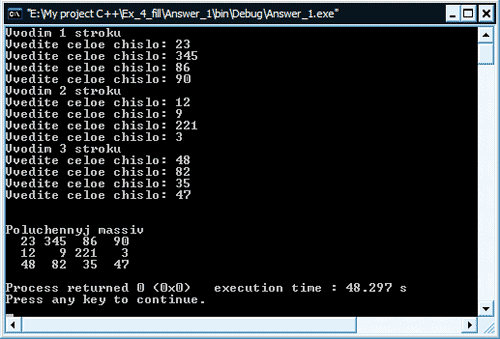
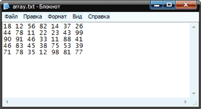

[Содержание](index.md)

И вновь мы возвращаемся к двумерным массивам в С++, а именно к практике с ними. Эту главу учебника хотелось бы построить несколько иным образом. Прежде, чем приступать к более сложным задачам с использованием двумерных массивов, хотелось бы дать ответы на относительно простые, часто задаваемые, вопросы от новичков. Итак, все по порядку, приступим.

# Вопрос 1: как заполнить двумерный массив
Да, действительно очень многие новички задают вот такой вопрос: как заполнить двумерный массив. Хочу сказать, что вариантов заполнения массива может быть несколько: это и заполнение массива с клавиатуры, когда пользователь вводит значения, которые необходимо поместить в ячейки массива; это и рандомное заполнение массива, когда в ячейки помещаются псевдослучайные величины, генерируемые с помощью генератора случайных чисел; это и заполнение массива из файла, в этом случае значения считываются из текстового файла. Начнем с заполнения, путем ввода значений с клавиатуры

#### Как заполнить двумерный массив с клавиатуры
Довольно часто приходится заполнять массивы с клавиатуры, поэтому подробно рассмотрим этот момент на примере следующей программы

```cpp
// Как заполнить двумерный массив с клавиатуры

#include <iostream>
#include <iomanip>

using namespace std;

// функция выводит массив на экран
void printArray(int array[][4], const int row, const int column)
{
    cout << "\n\nPoluchennyj massiv\n";
    for(int i = 0; i < row; i++)
    {
        for(int j = 0; j < column; j++)
            cout << setw(4) << array[i][j];
        cout << endl;
    }
}

int main()
{
    const int row = 3, column = 4;                 // размеры массива
    int array[row][column];                        // двумерный массив
    for(int i = 0; i < row; i++)                   // строки массива
    {
        cout << "Vvodim " << i + 1 << " stroku\n"; // подсказка
        for(int j = 0; j < column; j++)            // столбцы массива
        {
            cout << "Vvedite celoe chislo: ";      // выводим подсказку
            cin >> array[i][j];                    // запоминаем введенное значение
        }
    }
    printArray(array, row, column);                // печатаем полученный массив
    return 0;
}
```

Результат работы программы



Как видите, ничего сложного в заполнении двумерного массива с клавиатуры нет. Мы просто проходим двумя циклами `for` (один вложен в другой) по массиву. Первый цикл считает строки, второй столбцы. Когда все столбцы (значения) первой строки пройдены, то основной цикл переходит на вторую строку, а вложенный цикл опять начинает проходить по строке с начала, считая ее столбцы.

P.S. Не устаю напоминать, что нумерация элементов (ячеек) массива начинается с нуля. Следите за этим, чтобы не было ошибок.

#### Как заполнить двумерный массив случайными числами
Иногда приходится рандомно заполнять массив. На примере следующей программы мы разберем то, как заполнять двумерный массив случайными числами. Смотрим код

```cpp
// Как заполнить двумерный массив случайными числами

#include <iostream>
#include <iomanip>
#include <stdlib.h>
#include <time.h>

using namespace std;

// функция выводит массив на экран
void printArray(int array[][4], const int row, const int column)
{
    cout << "Poluchennyj massiv\n";
    for(int i = 0; i < row; i++)
    {
        for(int j = 0; j < column; j++)
            cout << setw(4) << array[i][j];
        cout << endl;
    }
}

int main()
{
    const int row = 5, column = 4;          //размеры массива
    int array[row][column];                 //двумерный массив
    srand(time(NULL));
    for(int i = 0; i < row; i++)            //строки массива
        for(int j = 0; j < column; j++)     //столбцы массива
            array[i][j] = 1 + rand() % 100; //заполняем текущую ячейку
    printArray(array, row, column);         //печатаем полученный массив
    return 0;
}
```

Для генерации случайных величин в С++ служит функция `rand()`. В данном случае она генерирует псевдослучайные величины в интервале от 1 до 100, т.к. началом у нас задана величина 1, а смещением величина 100.

#### Как заполнить двумерный массив из файла
Рассмотрим последний вариант заполнения - это заполнение двумерного массива из файла. Естественно, что в папке с проектом у нас должен быть заранее подготовленный текстовый файл array.txt, с которого мы будем читать числа в массив. У меня был подготовлен файл следующего содержания



Смотрим код

```cpp
// Как заполнить двумерный массив из файла

#include <iostream>
#include <fstream>
#include <iomanip>

using namespace std;

// функция выводит массив на экран
void printArray(int array[][7], const int row, const int column)
{
    cout << "Poluchennyj massiv\n";
    for(int i = 0; i < row; i++)
    {
        for(int j = 0; j < column; j++)
            cout << setw(4) << array[i][j];
        cout << endl;
    }
}

int main()
{
    const int row = 5, column = 7;
    int array[row][column];
    // создаем объект класса ifstream
    // и сразу указываем файл, с которого будем читать
    ifstream f("array.txt");
    // читаем файл и прочитанное запоминаем в массив
    for(int i = 0; i < row; i++)
        for(int j = 0; j < column; j++)
            f >> array[i][j];
    // печатаем полученный заполненный массив
    printArray(array, row, column);
    return 0;
}
```

Как видите, стандартное чтение из файла выполняется достаточно просто. Для этого мы используем класс `ifstream`, на основе которого создаем объект `f` и указываем файл, с которого будем выполнять чтение. Далее в циклах (они нужны, как вы знаете, для похода по двумерному массиву и, соответственно, по файлу) мы с помощью уже привычного оператора (`>>`) "взять из потока", берем из потока (в потоке у нас находится очередное считанное из файла значение) значение и сохраняем его в очередную ячейку массива.

[Содержание](index.md)
